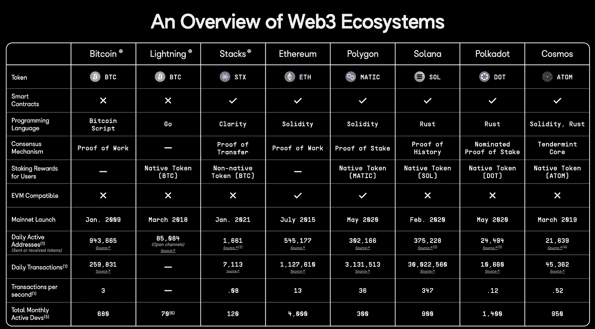
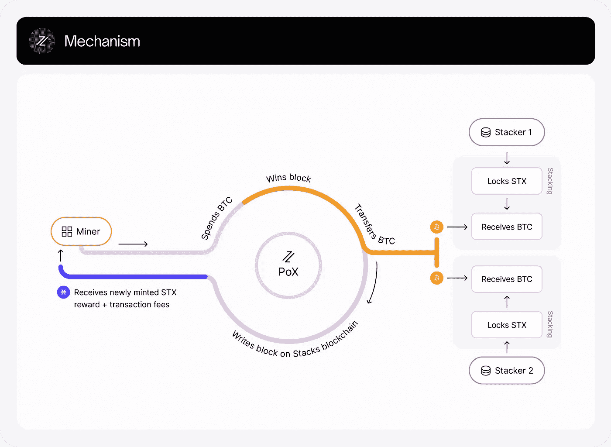

# Stacks Blockchain:在比特币之上构建 web3 生态系统

> 原文：<https://medium.com/coinmonks/stacks-blockchain-a-deep-dive-62b46c18fa1e?source=collection_archive---------22----------------------->

**什么是书库？**

你有没有想过为什么今天有这么多不同的区块链？不是指硬币，而是像比特币，ETH 这样的网络和链条。比特币已经存在，它的市值一直是最高的；那为什么还有其他的区块链存在，他们的目的是什么？

简单的答案是，他们正试图解决比特币作为区块链所缺乏的任何东西。以以太坊为例，它不仅仅是像比特币一样的价值储存手段，还可以做更多的事情。你不能在比特币上建立一个去中心化的 Spotify 或 twitter，但你可以在以太坊、索拉纳和其他连锁店上这样做。Lens protocol 和 Audius 是上述参考的两个例子，你根本无法在比特币上构建。

比特币生态系统中有一个需要填补的空白，即利用比特币的共识和安全性在比特币上创建应用程序(去中心化应用程序)的能力。

填补这一空白的是与比特币并肩作战的区块链。它没有完全脱离 OG 链，而是致力于“释放比特币的力量”。这是区块链的**栈**，以前被称为 Blockstacks。

栈到底是做什么的？嗯，几乎所有比特币不能和许多其他网络可以做到的事情。但 Stacks 这样做并没有脱离比特币生态系统。相反，Stacks 的成功很大程度上取决于比特币提供的分配以及它在未来如何被采用。

栈可以被认为是去中心化 web 的应用层，就像以太坊或 Solana 一样。如果你还不熟悉这些，这是一个你可能已经注意到的由科技巨头如谷歌、脸书主导的领域。与这些巨头不同的是，Stacks 使得构建 dapps(分散式应用程序)成为可能，在这种应用程序中，你的隐私完全由你掌握。正如 Stacks 创始人穆尼布所说——这不应该是第三方的事。 **Web3 让你成为自己数据的主人**。

The thread explains Stacks in ELI5 fashion

Stacks 在许多方面都很独特，它使用比特币的安全性和交易结算，它还使用 BTC 作为自己令牌的储备货币，这就是 **STX** 令牌。Stacks 增加了智能合约功能和比特币的隐私，而没有改变比特币(截至目前)。它不是像 Polygon 那样的第二层扩展解决方案，而是锚定在比特币上的第一层生态系统。让我们深入了解下面发生了什么。

**在这一点上，你一定很好奇堆栈与比特币到底有什么关系，它们是如何协同工作的，我们正在谈论的比特币的安全性是什么？**

就像我们上面讨论的，Stacks 和比特币有很大关系。

Stacks 遵循一个新的共识，即与比特币并行运行的**转移证明(POX)** 挖掘协议。这为其块报头提供了可靠的广播媒体。

什么是块头？块头是块其余部分的总结。它是由一些有用的数据组成的，比如开采这个区块花了多长时间，开采的难度有多大；除此之外，它还包含更有用的[元数据](https://academy.binance.com/en/glossary/metadata)。

堆栈区块链状态不同于比特币，由堆栈节点维护，堆栈交易完全独立于比特币交易。

在这种情况下，矿工选择使用存储的元数据实现独立于比特币的中本聪共识的变体。这是通过选择一个获胜块来完成的，该获胜块的概率与利用 POW 在比特币链上记录它所花费的 BTC 的数量成比例。

但是我们为什么要做这些呢？好吧，Stacks 将智能合约引入比特币，与比特币并行运行。智能合同基本上是引入业务逻辑的协议，例如，决策是基于智能合同中预先定义的条件自动做出的。基本上使你能够在区块链上制作复杂的应用程序，如以太坊、栈和其他链。比特币缺少这个功能。尽管它有一些智能契约特性，比如**对等密钥哈希(P2PKH)** 。比特币使用脚本来实现这些基本的(但安全的)逻辑，但脚本不是图灵完整的——这基本上意味着不能解决非常复杂的计算问题。

Stacks 使用了一种不同的编程语言，顺便说一句，这也不是一种图灵完全语言。但这是因为它提供了一些巨大的优势(前面已经讨论过)。这种语言就是 **Clarity 智能合约语言**。本文前面已经对此进行了深入讨论。

Source — [https://twitter.com/castig/status/1550805898519511040?s=20&t=aS9fP2NyXeGhJ5jnQVyrXg](https://twitter.com/castig/status/1550805898519511040?s=20&t=aS9fP2NyXeGhJ5jnQVyrXg)

**人们经常把斯塔克斯的 POX 和利益相关者(POS)共识混淆，更不用说，他们还经常把斯塔克斯误认为是 L2·区块链而不是 L1。**

Stacks 是一个独立的第一层区块链，它只利用比特币的安全性、稳定性和生态系统。

如前所述，堆栈的状态不同于比特币。它由 Stacks 节点维护并用于 Stacks 节点。Stacks 交易与比特币的第二层交易系统(如 Lightning)是分开的，后者只能在许多方面帮助增强比特币支付体验。

转移证明是一种挖掘机制，是 PoB 机制的扩展，最初是作为区块链堆栈的共识机制提出的。然而，他们进一步发展了这一想法——矿工们不是燃烧代币，而是将代币转移给其他参与者。PoX 回收功的证明能量，为连接的链/层提供中本聪式的共识。

另一方面，证明股份也有一些缺点。举个例子，

**PoS 的限制包括—**

*   ***历史变更:*** 在 PoS 中，如果一个节点长时间断开连接，并且呈现两个冲突的交易历史，那么它不可能在没有一些外部输入的情况下确定“真正的”链。(R [此处阅读更多内容](https://forum.stacks.org/t/pos-blockchains-require-subjectivity-to-reach-consensus/762))。在 PoS 硬分叉和重写历史花费很少的能源生产。选择真实历史需要用户端的认同。
    如果发生了一些事情，节点离线太久，攻击者可以强制接受他们选择的历史。这对于试图引入区块链客户的物联网产品也很重要，因为出于安全目的，断开连接的操作很常见。在这种情况下，攻击者可以尝试欺骗用户接受他们的备用历史记录。像比特币和以太坊这样的攻击在战俘区块链是不可能的。在独立的 L1 PoS 中，确定正确 PoS 历史记录的外部输入应来自电源链历史记录，以使其更加安全。
*   ***初始流动性不足:*** 开采与押下的代币成正比，因此最初没有人愿意转让代币。
*   ***51%风险:*** 如果有人拥有 51%或更多的令牌，他们就可以破坏区块链。

PoX 是 Stacks 在深入研究了 PoS 和 PoB(燃烧证明)的缺点后发明的。

Stacks 计算每个块的一致散列，帮助用户选择正确的事务历史。

在 Stacks 中，挖掘过程是节能的，因为它使用了现有 PoW 区块链(在这种情况下是比特币)的共识。

采矿通过以下步骤完成:

*   验证节点将比特币转移到协议定义的地址(堆栈)。硬币保存在不属于共识网络的单独地址中。
*   比特币数量被用作可验证随机函数(VRF)的输入
*   VRF 的输出被用来选举一个领头的矿工，他把新的块附加到链上并获得 STX 作为奖励

一个领导者被选出，而不是燃烧令牌，它们被转移到由协议本身指定的堆叠者那里。

A depiction of the mechanism from the official Stacks docs page —read [here](https://docs.stacks.co/docs/understand-stacks/proof-of-transfer)

**所有的乐趣和游戏，直到有人在实用程序上问，栈真的对比特币有好处吗**🤔**如果是这样的话，它真的会带来任何效用吗？**

好吧，让我们从比特币的明显局限性说起——**我们无法在比特币上制作 dapps(直到 Stacks)** 。这已经是一个很大的问题了，这也是以太坊成为焦点的原因。Vitalik 创立了以太坊来解决这个主要问题。同样，Solana 也参与了 ETH 网络的功能，但也指出了它的缺点。

如上所述，Stacks 通过带来其他新链所具有的任何功能，显然为比特币生态系统带来了真正的价值。Stacks 这样做的同时是比特币原生的，是并行运行的。

**这会给比特币带来几个新的使用案例**

这些特征为比特币这个价值 6000 亿美元的货币/结算层打开了一片机会之海。堆栈有助于释放比特币的潜在价值，其他 L1 区块链公司由于向用户提供了这种杠杆而获得了大量市场资本。到目前为止，比特币似乎被严格限制在其有限的能力范围内，主要被用作价值储存手段。Stacks 生态系统的增长可能对比特币非常有利，想象一下能够使用比特币交易 NFT，或者能够从锁定的比特币中获得收益。使用 ENS 对应物发送和接收比特币支付，并堆叠一个 5 美元的 ID，也称为 BNS。

先说 BNS 本身，就是区块链命名系统。在这种情况下，用户可以注册一个. BTC 域名，该域名可以作为用户的支付 ID(与相同的方式。eth 在以太坊工作)。在不久的将来，人们可以使用这个域发送和接收 STX 和 BTC。像这样的服务已经存在了一段时间，但是与众不同的是。btc 域名通过 Stacks 层的智能合同注册，并由比特币进一步保护。每个 BNS。btc 用比特币区块链的散列来表示。

Stacks 允许在比特币区块链的一次交易中结算数千笔交易。从而避免堆栈变大时可能导致的瓶颈情况。

栈可以为比特币带来的另一个重要用途是 DLCs，即**谨慎日志契约**。将 DLC 与可信的 oracle 解决方案(如 chainlink)结合使用，以非托管方式解决了释放比特币流动性的问题。对于 Alex defi 这样的 Stacks 应用程序上的不可信的 defi UX，对可靠的链上价格 oracle 的需求是一个关键组成部分。这将允许用户以真正不可信的方式使用比特币作为抵押品，保留比特币程序的不变性。这仍在开发中，很快就会推出👀

**现在让我们跳到代码方面，从比特币脚本的局限性开始**

Stacks 的存在是因为比特币在其[脚本](https://wiki.bitcoinsv.io/index.php/Script)中有一些限制。BTC 脚本基于几种脚本类型；

*支付到公钥哈希(p2pkh)，*用于支付比特币地址。

*Pay to Multisig(p2ms)——*允许几个用户在一个钱包里控制比特币(就像 Gnosis safe 一样)。

*支付给脚本哈希(p2sh)——*待定事务必须提供一个与脚本哈希和数据匹配的脚本，使脚本评估为真*。*

比特币脚本语言缺乏循环，但它不需要循环指令，它有一个非常基本的用例。

为了更好地理解，我们可以直接探究以太坊存在的原因。**引用以太坊白皮书(** [**此处阅读**](https://github.com/ethereum/wiki/wiki/White-Paper/08e9d07781f50dac264314a551b5ba060a07c06a) **)，比特币脚本有这些限制** —

(UTXO 的意思是“未用的交易输出”)

> **缺乏** [**图灵完整性**](https://en.wikipedia.org/wiki/Turing_completeness)——也就是说，虽然比特币脚本语言支持大量的计算，但它并不支持所有的东西。缺少的主要类别是循环。这样做是为了避免交易验证期间的无限循环；理论上，这对于脚本程序员来说是一个可以克服的障碍，因为任何循环都可以通过简单地用 if 语句多次重复底层代码来模拟，但这确实会导致脚本空间效率非常低。例如，实现另一种椭圆曲线签名算法可能需要 256 次重复的乘法循环，所有循环都单独包含在代码中。
> 
> **值盲**—UTXO 脚本无法提供对可提取金额的细粒度控制。例如，oracle 合约的一个强大用例是对冲合约，其中 A 和 B 投入价值 1000 美元的 BTC，30 天后脚本将价值 1000 美元的 BTC 发送给 A，其余发送给 B。这将需要 oracle 确定 1 BTC 的美元价值，但即使如此，就信任和基础架构要求而言，这也是对目前完全集中式解决方案的巨大改进。然而，由于 UTXO 是全有或全无的，实现这一点的唯一方法是通过非常低效的黑客行为，即拥有许多不同面值的 UTXO(例如，每 k 到 30 就有一个 2k 的 UTXO ),并让 O 挑选哪个 UTXO 发送给 A，哪个发送给 b。
> 
> **状态缺失**——UTXO 可以被耗尽也可以不被耗尽；没有机会让多阶段契约或脚本保持任何其他内部状态。这使得多阶段期权合约、分散交易要约或两阶段加密承诺协议(安全计算奖金所必需的)难以实现。这也意味着 UTXO 只能用于构建简单的、一次性的契约，而不能构建更复杂的“有状态的”契约，比如分散的组织，这使得元协议很难实现。二进制状态结合价值盲也意味着另一个重要的应用，取款限额，是不可能的。
> 
> **区块链盲** — UTXO 对区块链数据(如随机数、时间戳和以前的块哈希)是盲的。这严重限制了赌博和其他几个类别的应用，因为它剥夺了脚本语言潜在的有价值的随机性来源。

以太坊是专门为解决这些限制而设计的。是区块链上的图灵完全虚拟机(以太坊虚拟机)。它可以运行任何语言的程序。以太坊让应用成为可能，而比特币天生不允许任何这样的功能。

这为开发者在以太坊区块链上开发应用打开了闸门。但是 Stacks 和它的智能合同语言——Clarity 有能力给这个领域带来戏剧性的变化。

我们提到 Clarity 已经有一段时间了，但是什么是 Clarity 语言，它给栈带来了什么功能？

这是用于在栈链上编写智能契约的语言。它是一种**可判定的编程语言**，被设计为图灵不完全语言，也**不打算编译**。

比特币的脚本语言也经常被称为图灵不完整，指出了它的局限性。然而，在 Clarity 的案例中，这是基于栈的智能合约的一个优势。

智能合同是我们正在谈论的这种去中心化的核心。它们或多或少像一个普通的契约，只是在代码上，当条件满足时它会自动执行。

以太坊使用 Solidity 语言进行智能合约开发。在过去的几年里，我们已经见证了它们是多么有用，然而带有漏洞的智能合约可能是一个真正的大威胁。有很多例子可以说明这个问题有多严重。

The snippet explains how Clarity Smart contract language can help prevent exploitation

例如，Solidity 是一种静态类型的语言；然而，在许多情况下，它的图灵完备性也是一个限制。不幸的**像 ETH DAO 黑客事件可以避免，如果做的清晰。**其他类似重入攻击的实例，以及 txn 费用的事先预测是很难做到的。

清晰的图灵不完全性允许静态分析预先确定 txn 费用。**清晰是一种被诠释的语言，坚实不是**。清晰的智能合同对于审计人员来说是易于阅读的，可以理解或识别任何错误。它不打算编译。然而，在 solidity 中，人们只能在区块链上读取源代码的编译版本，这使得部署后的审计有点困难。可以检查特定智能合约的整个调用图的静态分析。

Clarity 是一种函数式语言，比如——Scala、LISP 等等。Rust 和 Solidity 是面向对象的语言，支持继承、库和用户定义的类型。 **Clarity 优先考虑精确、清晰和果断的语法，使开发人员能够理解他们正在部署的智能合同的执行情况。**它本质上是明确的，有助于避免对同一事物的多种解释。

Trevor explaining why Clarity is better than Solidity as a Smart Contract Language to warn users of wallet draining contracts or other exploits. Clarity is decidable, Solidity is not.

从清晰文档中——

> 一些关键的清晰语言规则和限制是—
> 
> —唯一的基本类型是布尔值、整数、缓冲区和主体。
> 
> —递归是非法的，并且没有匿名函数。
> 
> —仅通过`map`、`filter`或`fold`执行循环。
> 
> —支持列表，但是，该语言中唯一的可变长度列表显示为函数输入；不支持像追加或连接这样的列表操作。
> 
> —变量是不可变的。

**堆栈如何促进比特币的经济，带来新的案例，以及它如何增加 req 功能-**

栈上的智能合约为比特币及其采纳者带来了非常高的杠杆作用。许多国家已经允许比特币作为法定货币，比特币的应用越来越多，但更多的是作为一种价值储存手段(因为目前它提供的东西很少)。Stacks 将智能合约带入场景的能力可以带来新一波希望用比特币在 web3 中做更多事情的开发者和爱好者。

尽管这项技术已经存在了很长时间，但我们在这个领域仍然处于早期。恐惧、随机骗局、市场崩溃，这些都是导致目前入职速度变慢的原因。

堆栈可以直接进入并利用比特币的大规模分布，为比特币用户带来 NFTs、defi、game-fi。

## **参考文献** —

1.  【https://docs.stacks.co/docs/intro 号
2.  【https://en.wikipedia.org/wiki/Halting_problem 
3.  [https://github.com/stacks-network](https://github.com/stacks-network)
4.  [https://www . coin desk . com/learn/2016/06/25/understanding-the-Dao-attack/](https://www.coindesk.com/learn/2016/06/25/understanding-the-dao-attack/)
5.  [https://medium.com/@sweethari89](/@sweethari89)
6.  [https://eprint.iacr.org/2016/1007.pdf](https://eprint.iacr.org/2016/1007.pdf)
7.  [https://twitter.com/TO](https://twitter.com/TO)
8.  [https://twitter.com/castig](https://twitter.com/castig)

> 加入 Coinmonks [电报频道](https://t.me/coincodecap)和 [Youtube 频道](https://www.youtube.com/c/coinmonks/videos)了解加密交易和投资

# 另外，阅读

*   [CoinFLEX 评论](https://coincodecap.com/coinflex-review) | [AEX 交易所评论](https://coincodecap.com/aex-exchange-review) | [UPbit 评论](https://coincodecap.com/upbit-review)
*   [AscendEx 保证金交易](https://coincodecap.com/ascendex-margin-trading) | [Bitfinex 赌注](https://coincodecap.com/bitfinex-staking) | [bitFlyer 审核](https://coincodecap.com/bitflyer-review)
*   [Bitget 评论](https://coincodecap.com/bitget-review)|[Gemini vs block fi](https://coincodecap.com/gemini-vs-blockfi)cmd |[OKEx 期货交易](https://coincodecap.com/okex-futures-trading)
*   [AscendEx Staking](https://coincodecap.com/ascendex-staking)|[Bot Ocean Review](https://coincodecap.com/bot-ocean-review)|[最佳比特币钱包](https://coincodecap.com/bitcoin-wallets-india)
*   [霍比审核](https://coincodecap.com/huobi-review) | [OKEx 保证金交易](https://coincodecap.com/okex-margin-trading) | [期货交易](https://coincodecap.com/futures-trading)