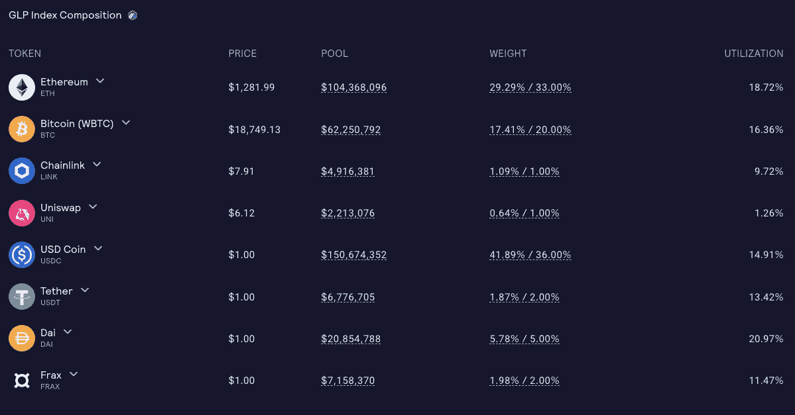

# 以 30%的年利率下注并赢取以太坊

> 原文：<https://medium.com/coinmonks/stake-and-earn-ethereum-at-30-apr-bcc8b0c8b007?source=collection_archive---------22----------------------->

一些漂亮项目仍然在熊市中，老实说，它们在熊市中表现最好。

一个是 [GMX](https://coincodecap.com/gmx-review) : GMX 是一个分散化的永久交易所，允许你下注一个叫做 GLP 的硬币，根据你使用的网络，在 ETH 或 AVAX 赚取你 20-30%的利润。这并不新鲜，许多狗屎硬币给你提供高收益，但如果你的投资变成 0，50%的年利率就没有价值了。但是就不一样了:它有一堆“安全”的密码做后盾，50%在 stables (USDT、、戴、法克斯)，50%在 major (BTC、ETH、UNI、LINK):这是什么意思？

当你买 GLP 时，你买的是一个硬币组合，50%稳定，50%更“安全”:这意味着，是的，你会受到市场波动的影响，但比正常情况下少 50%。此外，没有人会给你一个高 APR 的股份你的 BTC。高 APR 的钱来自于交易所因赌注而提供的低廉费用。

如果你喜欢这个项目，你甚至可以选择 GMX 治理令牌。你可以在 [Messari](https://messari.io/asset/gmx) 上查看 GMX tokenomics，用这个[大教程](https://youtu.be/VhddfPVJRnk)表格 [Miles Deutscher](https://twitter.com/milesdeutscher) 深化项目。

> 交易新手？尝试[加密交易机器人](/coinmonks/crypto-trading-bot-c2ffce8acb2a)或[复制交易](/coinmonks/top-10-crypto-copy-trading-platforms-for-beginners-d0c37c7d698c)
> 
> 加入 Coinmonks [电报频道](https://t.me/coincodecap)和 [Youtube 频道](https://www.youtube.com/c/coinmonks/videos)获取每日[加密新闻](http://coincodecap.com/)

## 另外，阅读

*   [复制交易](/coinmonks/top-10-crypto-copy-trading-platforms-for-beginners-d0c37c7d698c) | [加密税务软件](/coinmonks/crypto-tax-software-ed4b4810e338)
*   [网格交易](https://coincodecap.com/grid-trading) | [加密硬件钱包](/coinmonks/the-best-cryptocurrency-hardware-wallets-of-2020-e28b1c124069)
*   [密码电报信号](/coinmonks/top-3-telegram-channels-for-crypto-traders-in-2021-8385f4411ff4) | [密码交易机器人](/coinmonks/crypto-trading-bot-c2ffce8acb2a)
*   [最佳加密交易所](/coinmonks/crypto-exchange-dd2f9d6f3769) | [印度最佳加密交易所](/coinmonks/bitcoin-exchange-in-india-7f1fe79715c9)
*   [开发者最佳加密 API](/coinmonks/best-crypto-apis-for-developers-5efe3a597a9f)
*   最佳[密码借贷平台](/coinmonks/top-5-crypto-lending-platforms-in-2020-that-you-need-to-know-a1b675cec3fa)
*   [免费加密信号](/coinmonks/free-crypto-signals-48b25e61a8da) | [加密交易机器人](/coinmonks/crypto-trading-bot-c2ffce8acb2a)
*   杠杆代币的终极指南