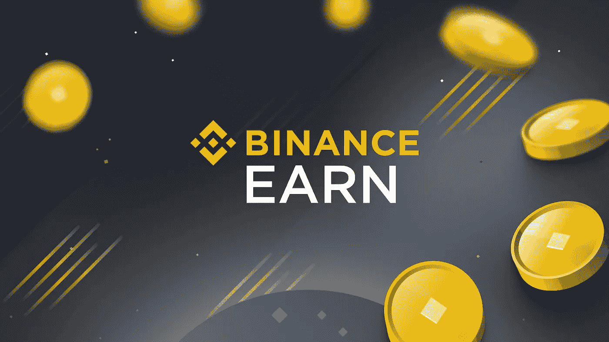

# 用币安挣得的钱来赌一把

> 原文：<https://medium.com/coinmonks/stake-your-way-to-profits-with-binance-earn-c62664567659?source=collection_archive---------47----------------------->

如果你还没有进入加密的赌注世界，你可能会错过一些额外收入的稳定来源。是的，被动的。币安赚是给你黄金机会的平台，你的硬币赌注和赚取利息。币安是最大的加密货币交易所；还有比这更好的吗？

如果你碰巧是一个霍德勒，你可以通过赌注在你的硬币上使用一些漂亮的 APY，而不是简单地把它们放在一个加密钱包里。听起来很棒，对吧？

## 什么是赌注？

首先，最重要的是，赌注不仅仅是一个可以用一个定义来概括的词。赌注本身可以在很多地方练习。通常的方法是通过网络的共识机制或 Defi 协议来下注。

***桩和 Defi 桩的证明***

与工作证明机制不同，利害关系证明是一种共识机制，其资源密集程度较低。赌注证明本质上包括将你的加密资产锁在钱包里，以协助区块链的运作，作为回报，用户将获得赌注奖励。

Defi Staking 是区块链上的一种点对点金融模式，允许用户下注硬币并获得奖励。本质上，用户向流动性池提供流动性，并获得额外回报。Defi staking 凭借其多样化的机会慢慢受到欢迎。

## 与打桩相关的风险和收益

尽管赌注可能是一项利润丰厚的投资，但它也伴随着一些不可避免的风险。因此，用户在投资前了解潜在的风险程度至关重要。标桩涉及的一些风险包括:

1.  砍人——砍人恰好是区块链邮政普遍存在的问题。假设一个 POS 验证器无法进行相应的验证；这导致验证者和删除者都失去了一大块奖励。如果验证程序在网络上遇到停机或双重标记，也可能出现这种情况。
2.  恶意攻击——在 Defi 领域，钱包攻击和诈骗经常发生。因此，在下注时，总是建议用户注意外部钱包和平台带来的风险。
3.  技术要求——在打桩时，通常会发现一些区块链有复杂的技术要求。不幸的是，设置不正确的钱包可能会导致用户由于配置不当而丢失他们的加密资产。
4.  不可持续的记号经济学——研究记号经济学模型并理解你的回报受波动性影响是非常必要的。代币价值的波动是一个常见的特征，这可能意味着损失一部分甚至全部投资。

跑马圈地币安，为用户提供了一个安全、规范的平台。尽管你仍然容易受到一些风险的影响，但在币安下注会给你在这个平台上下注所需要的信心。

*以下是币安提供解决方案的一些风险:*

1.  削减风险——虽然削减风险是其他跑马圈地平台的主要问题，但币安渴望消除这种风险。因此，这意味着将返回用户下注的确切金额。然而，币安无法控制可能出现在赌注硬币上的波动。
2.  钱包攻击和诈骗风险-在币安下注不太容易受到钱包攻击和诈骗，因为它是一个集中和受管制的加密交换。
3.  在币安，技术风险赌注就像点击一个按钮一样简单。你还可以在 100 多种加密货币上下注。此外，用户可以轻松地接收、删除和重新投资他们想要的加密资产。

*币安新的自动获取功能正是该平台自动化标桩流程所需要的。激活此功能后，一旦锁定期结束，用户可以自动将其数字/加密资产再次添加到锁定池中。用户只需点击“钱包”、“收入”、“锁定赌注”，然后点击“自动提取”，即可开始自动提取。但是，用户应在利息结束日期之前完成此操作。*

除了交易和购物，币安是让你的数字资产发挥作用的最佳平台之一。虽然赌注伴随着许多风险，但在币安下注可以保证你的安全和保护。你得到了在一个安全、受监管的交易平台上运营的额外好处。赌注你的方式与币安赚取利润。

[***与今日币安的> >***](https://www.binance.com/en/staking?ref=431277160)

[***在这里打开您的币安账户> >***](https://accounts.binance.com/en/register?ref=431277160)

***关联披露:*** *本帖包含关联链接。如果您使用这些链接购买一些东西，我们可能会赚取佣金，对您没有额外的费用。感谢*。

> 交易新手？尝试[加密交易机器人](/coinmonks/crypto-trading-bot-c2ffce8acb2a)或[复制交易](/coinmonks/top-10-crypto-copy-trading-platforms-for-beginners-d0c37c7d698c)