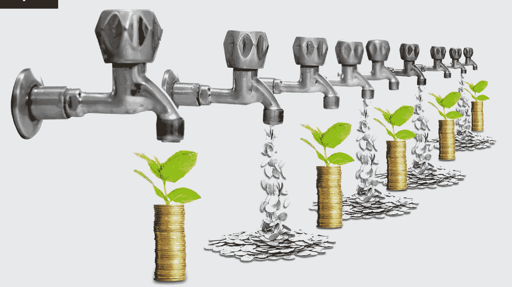

# 两种不同风险类型的被动年金的借贷

> 原文：<https://medium.com/coinmonks/staking-and-lending-two-passive-annuities-with-different-types-of-risk-ef367d04fddb?source=collection_archive---------23----------------------->

自古以来，最伟大的远见卓识者都知道，获得被动收入的一个绝佳方法就是让钱“工作”。这种想法今天仍然有效，即使在 2009 年的上次经济危机后，为了刺激经济，利率已经降低。