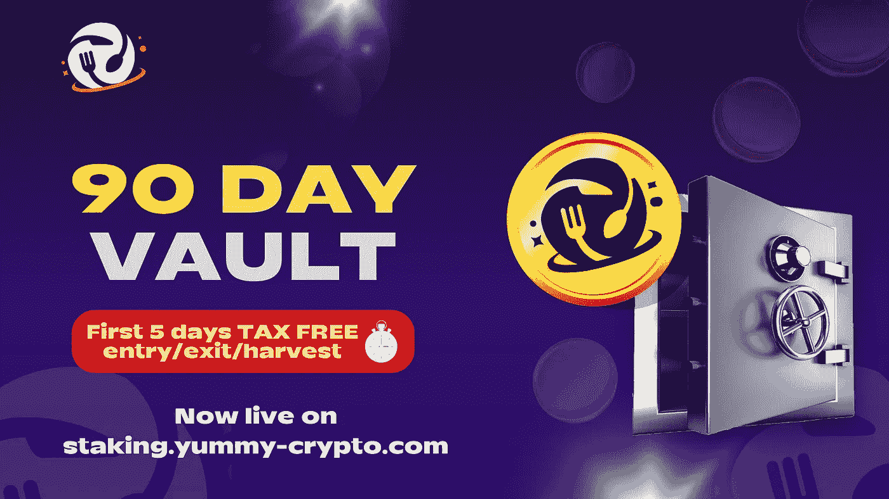
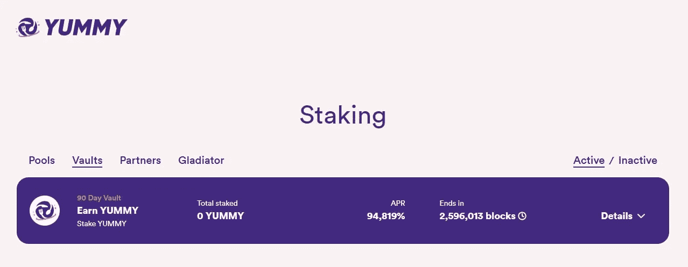

# 标桩公告:90 天跳马

> 原文：<https://medium.com/coinmonks/staking-announcement-90-day-vault-410756a9eee6?source=collection_archive---------7----------------------->

最亲爱的美味社区，

我们很荣幸为您带来新的“90 天跳马”。'' 🎉

这个为期 90 天的保险库在其最初的 5 天内将有一个免税的进入-退出-收获期。这给了早期进入者一个独特的机会来增加他们的回报，并获得相对于后来加入金库的投资者的竞争优势。

金库将包括下注美味，赚取美味，根据设计，与美味-美味池相比，金库将有更高的基础 APR。

这个金库没有完全锁定，用户可以在运行期间进入、退出和收获，只有在第一个 5 天后才会受到税收处罚。

在进入 90 天保险库之前，请阅读并理解以下规则

*   从最初的奖励区开始，保险库的运行时间为 90 天。这意味着每个人的奖励将在同一时间开始，而不是在加入时单独开始。(奖励区块开始时间请见 Yummy 电报中的公告)。
*   9%的入场税(在最初的 5 天内，此税将被免除)。
*   9%的提前离境税(在最初的 5 天内，此税将被免除)。
*   收获奖励有 9%的税(在最初的 5 天内，此税将被免除)。
*   缴纳的税款将进入金库奖励池。

90 天后，保险库结束，合同进入白名单，用户可以在那时免税删除他们的本金和奖励。

点击此[链接](http://staking.yummy-crypto.com)可直接进入赌注平台。

关于如何使用我们的赌注平台的完整教程，请查看这个[教程](/@YummyCrypto/yummy-staking-tutorial-pools-2efa8750501a)。

如果您在使用我们的赌注平台时需要帮助，请联系我们的[电报](https://t.me/yummyfinance)，管理员会帮您解决问题。👍🏼

享受新的 90 天跳马。如果您在使用 Yummy staking 平台时需要帮助或有任何问题，请访问 Yummy telegram 并询问管理员。👍🏼👍🏼

最好的，

美味团队

> 加入 Coinmonks [电报频道](https://t.me/coincodecap)和 [Youtube 频道](https://www.youtube.com/c/coinmonks/videos)了解加密交易和投资

# 另外，阅读

*   [交易杠杆代币的最佳交易所](https://coincodecap.com/leveraged-token-exchanges) | [购买 Floki](https://coincodecap.com/buy-floki-inu-token)
*   [3Commas 对 Pionex 对 Cryptohopper](https://coincodecap.com/3commas-vs-pionex-vs-cryptohopper)|[Bingbon Review](https://coincodecap.com/bingbon-review)
*   [加密复制交易平台](/coinmonks/top-10-crypto-copy-trading-platforms-for-beginners-d0c37c7d698c) | [如何在 WazirX 上购买比特币](/coinmonks/buy-bitcoin-on-wazirx-2d12b7989af1)
*   [CoinLoan 评论](https://coincodecap.com/coinloan-review)|[Crypto.com 评论](/coinmonks/crypto-com-review-f143dca1f74c)
*   [如何在加拿大购买加密货币？](https://coincodecap.com/how-to-buy-cryptocurrency-in-canada)