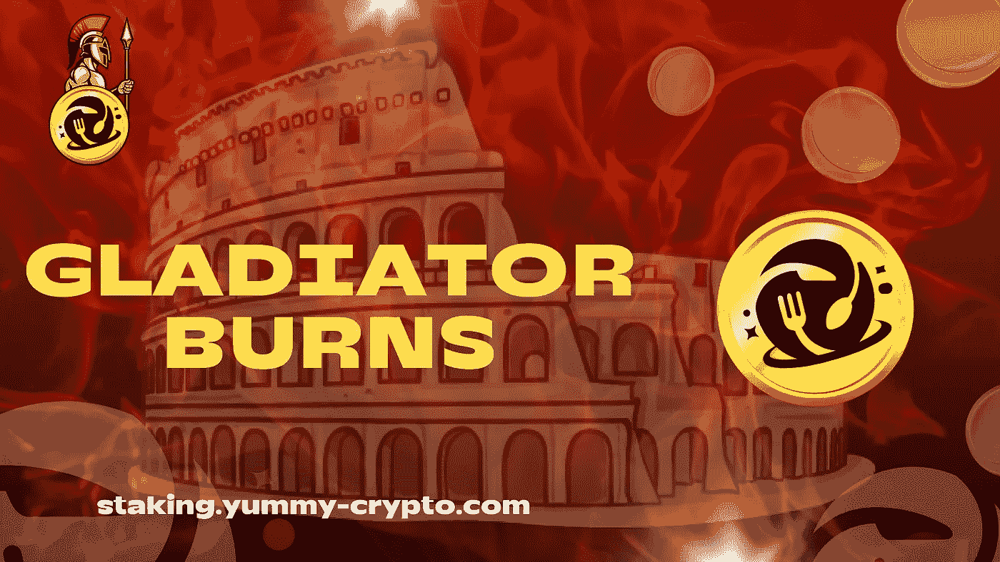
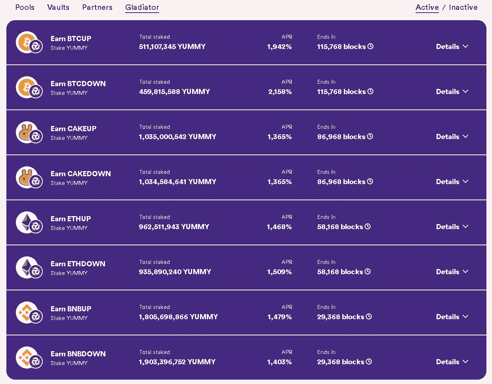

# 标桩公告:角斗士烧伤游戏攻略

> 原文：<https://medium.com/coinmonks/staking-announcement-gladiator-burns-introduction-908c5f843bae?source=collection_archive---------9----------------------->

亲爱的美味社区:

自从 Yummy V2 成立以来，超通货紧缩一直是我们最大的优势之一，回购和烧钱是每天都会发生的事情。

不幸的是，由于市场下跌，我们通过增长基金使用的 LP 农业产量不足以提供赌注奖励和烧伤。因此，美味计划的烧伤部分停止了。从那时起，该团队一直在寻找通过我们的 staking 平台实现 burn 机制的方法。

所以，这就是说，这是我们绝对高兴地正式介绍我们的角斗士上下池的最新技工🎉

**角斗士烧伤**🔥

展望未来，团队将播种所有角斗士池，而不是提供直接奖励。播种将如何工作？

1.  一旦创建了一个池，收益将从第一个块开始调整，以反映向上和向下池的最低 10 亿。播种是为了鼓励人们尽快加入池中，以便在最初的几个小时/几天内获得更高的产量。
2.  在第 2 天结束时(即剩余的 86，400 块附近)，团队将注入所需数量的美味令牌，以将上下两个池带到 1B。例如:上池有 357 米，下池有 486 米。团队将增加 643 米的上池和 514 米的下池，使其成为 1B 总赌注。
3.  播种在第 2 天完成，以确保团队赌注不会获得任何较高的初始奖励收益，同时确保池参与者将从团队赌注中获得全部 9%的贡献。同样，这是为了鼓励高池活动，因为那些第一次下注的人只是保证了 1B 等值赌注的最低奖金池。
4.  如果在第二天结束时，金额已经高于 1B，那么团队将添加足够的令牌，使其达到下一个 10 亿，如果金额低于 5 亿。例如:上池第 2 天结束时押了 1.2 亿英镑，下池押了 1.65 亿英镑。团队没有向池中添加任何内容，而是向池中添加了 350 米。为什么要这么做？它鼓励“逆着纹理”的场景，同时确保“顺着纹理”的池仍然获得与其他情况下相同数量的奖励。这给风险状况增加了另一个层面。如果两个池都高于 1.5 亿欧元，那么两个池都将接受注入，使其各自成为 2B。当然，同样的事情也发生在 2B，3B，4B 等等
5.  然后，我们将从每个池中抽取 5%的奖励作为燃烧收集。例如，如果你的上下赌注总额为 5B，那么我们将有 5 * 0.09 * 0.05 = 22.5 米被烧掉。我们将根据需要调整这一费用，并记住这适用于每个池，所以不需要太多的参与，就可以让这一费用大幅增长，所有池都是每周一次。
6.  我们的目标是引入一个绝对烧伤地址很快。创建这个地址是为了让人们容易地知道，任何到达绝对烧录的令牌都将 100%发送到烧录地址。对 240B 来说不是，不是免税销售或作为赌注奖励，它将被烧毁。

点击此[链接](http://staking.yummy-crypto.com/)可直接进入赌注平台。

如果你在使用我们的赌注平台时需要帮助，或者对“角斗士池”有任何疑问，请访问 Yummy [Telegram](https://t.me/yummyfinance) 并询问管理员。👍🏼

享受美味的角斗士池的刺激，让总供应量低于 4000 亿！🔥🔥

敬请关注更多更新。

最好的，

美味团队

> 免责声明:角斗士池来与更高的损失风险，由于他们的游戏性质。Yummy 团队成员、管理层、业主和整个项目不对任何损失负责。在进入角斗士池之前，请理解并阅读所有规则。这是由个人投资者来管理他们的投资和风险。请负责任地玩。

> 交易新手？试试[密码交易机器人](/coinmonks/crypto-trading-bot-c2ffce8acb2a)或[复制交易](/coinmonks/top-10-crypto-copy-trading-platforms-for-beginners-d0c37c7d698c)