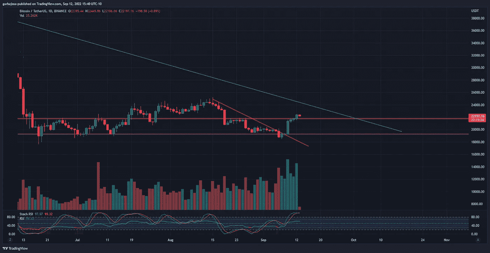
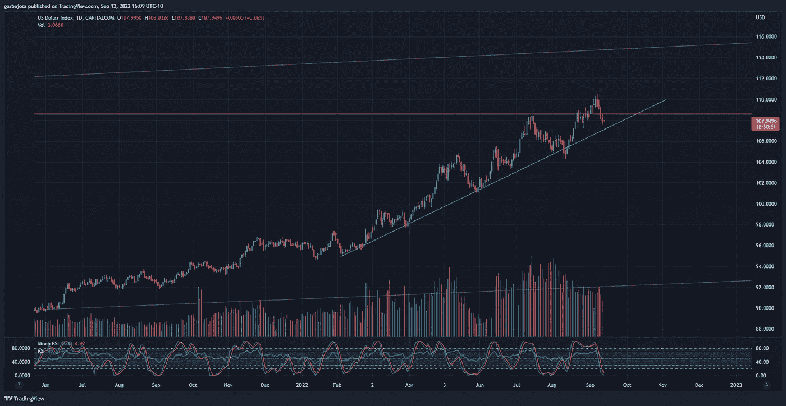

# 星巴克推出了一项突破性的 NFT 顾客忠诚度计划。

> 原文：<https://medium.com/coinmonks/starbucks-introduces-a-ground-breaking-nft-based-customer-loyalty-program-6191fe7a6055?source=collection_archive---------20----------------------->

## 每日征服#081

每日透视密码。

Photo by [Fahmi Fakhrudin](https://unsplash.com/@fahmipaping?utm_source=medium&utm_medium=referral) on [Unsplash](https://unsplash.com?utm_source=medium&utm_medium=referral)

密码市场是一个狂野、奇妙而令人生畏的地方；不要一个人跋涉！订阅加密征服者，让我们成为您的向导。

S [*订阅*](https://tradergabi.substack.com/subscribe?) *本刊每日快讯，永不错过一期。*

**概述**

*   CPI 指导。
*   市场:比特币攀升，低价位动摇。
*   Near Protocol 希望开发治理。
*   斯塔布克的 NFT 忠诚度计划。

早上好，家人，

以太坊合并和通货膨胀数据让我们迎来了重要的一周。到目前为止，我相信你已经听说了很多关于合并的事情，所以让我们把重点放在宏观数据上。

明天核心价格指数(CPI)将在美国交易时段前 30 分钟公布。普遍预测 CPI 为 8.1%。在燃油价格下降的背后，许多专家预测印数将低于 8 月份。

此外，市场似乎领先于这些数据。此外，富国银行(Wells Fargo)在通胀缓解的概念上跳了起来。

对 CPI 公布后的市场走向感到困惑？

@fewseethis 在下面为不同的场景提供了一些前瞻性的指导。

# 市场更新🌍

**BTC/USDT 1D**

当 altcoins 努力保持周末以来的涨幅时，比特币继续攀升。BTC 突破了关键的 21.7k 阻力位，并期待测试 24k 附近的阻力。BTC 交易的交易量大幅增加，可能会帮助 BTC 打破自 2021 年 11 月开始的长期下跌趋势(绿色)。BTC 收盘上涨 2.61%，至 22，395 美元。

*高清* [***图表***](https://www.tradingview.com/x/3D6yFwOd/)

**瑞士联邦理工学院/USDT 1D 分校**

乙醚(ETH)价格在前两周攀升 25%后，已经挣扎了三天。尽管如此，当 ETH 价格经历回撤时，上升趋势支撑(绿色)似乎仍然存在。随着合并计划在 9 月 14 日的某个时候进行，预计未来几天到几周以太坊的价格将会波动。最终，我们希望看到它在创造长期上升趋势的道路上突破 1700 美元的阻力(粉红色)。

*高分辨率* [***图表***](https://www.tradingview.com/x/Aa3oWaa7/)

**美元指数(DXY)**

美元指数(DXY)已经连续第五个交易日下跌。包括欧盟在内的所有人都祈祷美元能够打破自 2 月份开始的长达数月的上升趋势(绿色)。

*高清* [***图表***](https://www.tradingview.com/x/whKMpyZr/)

如果你喜欢这份报告，并且认为它值 20 分(0.01 美分)，请点击下面的鼓掌按钮来支持我的写作。(最多 50 次！)谢谢！

# 新闻观察📰

**MetaMask 集成了巴西支付。**这个加密钱包巨头已经[集成了](https://twitter.com/CoinDesk/status/1569448653177389057?s=20&t=XmxEs91642UgiaOndB7ytg)巴西政府支付系统 Pix，允许客户用巴西货币雷亚尔进行加密购物。Pix 支付系统拥有 1.26 亿用户。

**附近形成一个分散的治理集团。**区块链网络，Near 协议正在[开发](https://twitter.com/NEARProtocol/status/1569391702481244160?s=20&t=XmxEs91642UgiaOndB7ytg)一个工作组来构建自治标准。目的是分散链条上的决策权，最终产生一部宪法。这项名为“近距离数字集体(NDS)”的倡议旨在使用近距离令牌在链上移动提案和决策。

**USDT 在近议定书上。系绳已经发射了 T21 的 USDT 稳定器。按市值计算，USDT 是最稳定的地区，将有利于 Near 的生态系统和增长。USDT 现已在 13 个不同的区块链上市。**

**新闻花絮**

*   比特币基地内幕交易者[承认](https://www.coindesk.com/business/2022/09/12/first-guilty-plea-in-coinbase-related-insider-trading-charges/)有罪。
*   加密基础设施提供商 Wyre 和支付公司 Bolt Finance 之间价值 10 亿美元的交易告吹。

**NFT &元宇宙更新🐵**

*   **百无聊赖的猿 NFT 乐队以** [**搭档**](https://www.coindesk.com/business/2022/09/12/bored-ape-nft-band-to-make-music-with-beyonce-timberlake-linked-producers/) **与碧昂斯的前音乐制作人**
*   **星巴克向** [**顾客推出**](https://twitter.com/niftygateway/status/1569333882578784257?s=20&t=xqt-G4d1uSBruvo2nYbEzw) **多边形 NFT 支持的忠诚度计划。这个名为 Starbucks Odyssey 的计划将允许顾客购买与优惠和元宇宙体验相关的 NFT。顾客可以在这里加入等候名单[。](https://stories.starbucks.com/press/2022/starbucks-brewing-revolutionary-web3-experience-for-its-starbucks-rewards-members/)**

**我的五分钱……**

星巴克 NFT 忠诚度计划会比我们想象的更重要吗？

星巴克是一家市值 1050 亿美元、2022 年 TTM 收入近 300 亿美元的公司，正在向全球数百万咖啡爱好者推出 NFT 忠诚度计划。NFTs 将增加客户对其应用程序的参与度，为客户的不同数字活动授予用户印章。

现在，其他公司的决策者将不得不注意到这一点，否则很可能会被甩在后面。追随比领导更容易，这些公司会议将转向关注为他们的产品创造“web3 体验”

这只是一个小小的开始，但它会开始流行起来的。NFTs 的真实用例已经开始了！

我可以想象所有的足球妈妈把她们的手机交给她们的孩子，让他们喝免费咖啡。

我写这篇文章的灵感来源于:

**关注我* [*推特*](https://twitter.com/web3_gabri) *每日更新！**

*订阅这份每日简讯，不要错过任何一期。*

> *交易新手？尝试[加密交易机器人](/coinmonks/crypto-trading-bot-c2ffce8acb2a)或[复制交易](/coinmonks/top-10-crypto-copy-trading-platforms-for-beginners-d0c37c7d698c)*