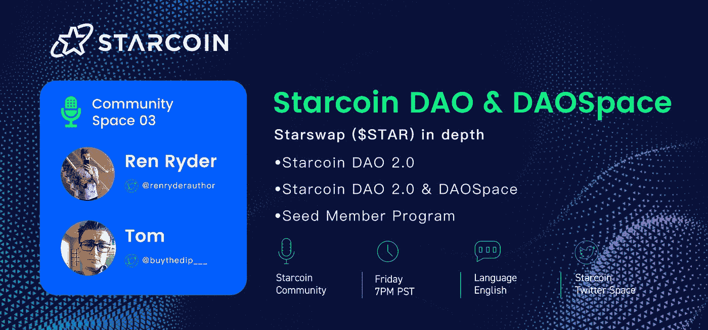
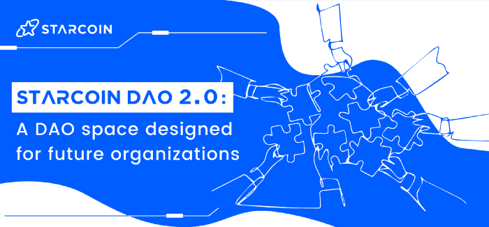
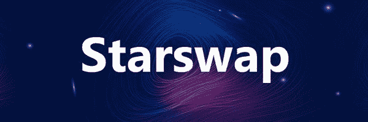
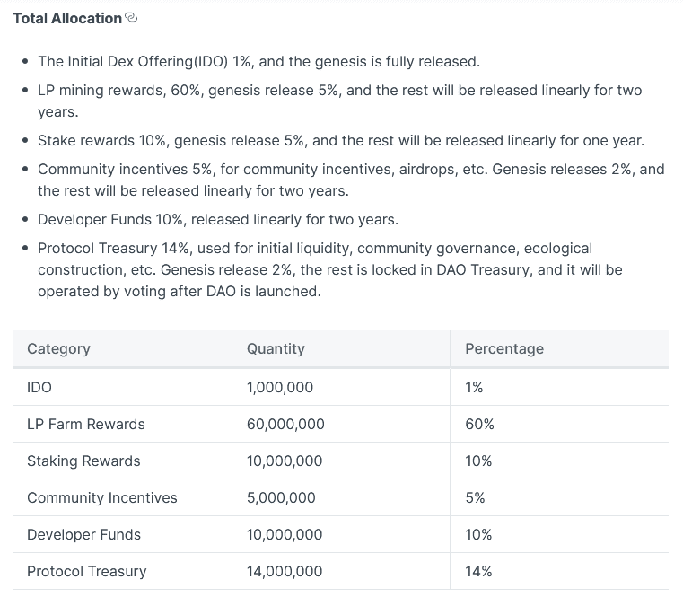
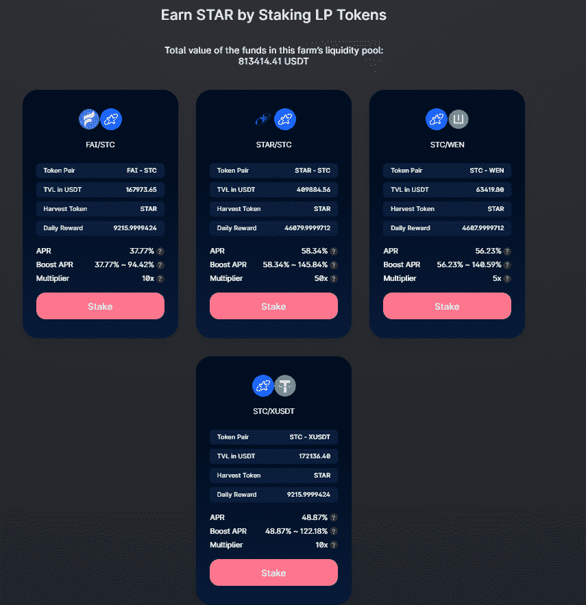
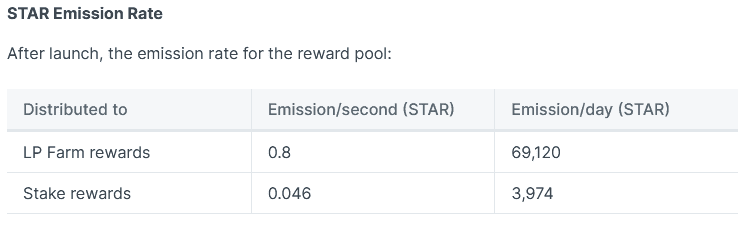
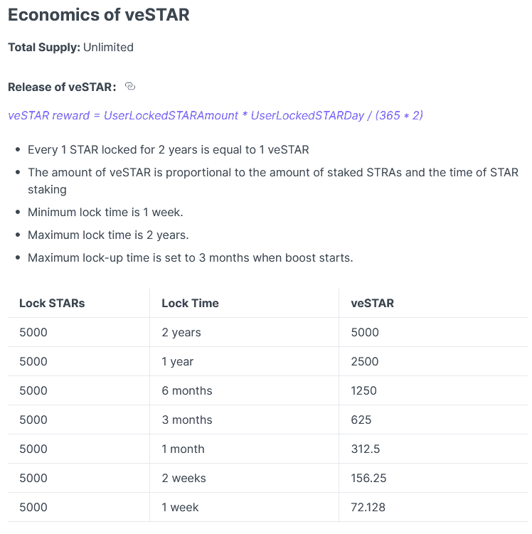
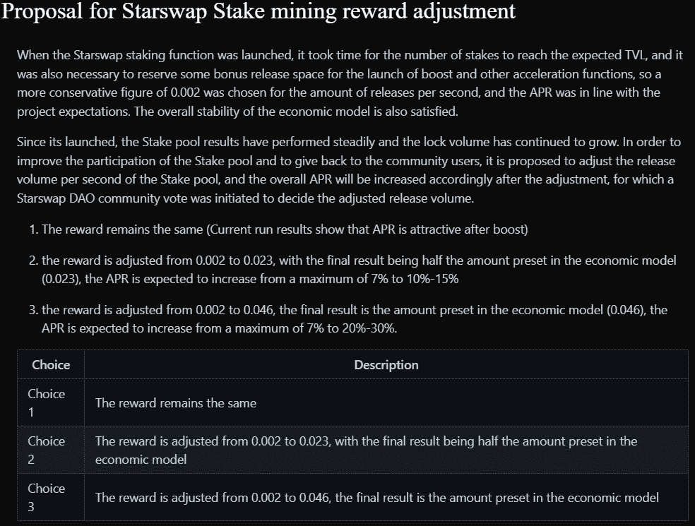

# ✨,✨Starcoin DAO 2.0 & DAOspace、Seed 会员计划和 star swap(star)深度报道:Twitter Space #3 摘要[2012 年 9 月 16 日]

> 原文：<https://medium.com/coinmonks/starcoin-blockchain-twitter-space-3-recap-9-16-22-fd036feceefc?source=collection_archive---------23----------------------->

# DAOs 简介

加密在很大程度上涉及到从集中的权威机构向分散的、不可信的框架的转变，任何人、任何地方都可以使用和参与。脱离由单个实体、组织或个人控制的自上而下的管理基础设施，使分散的社区能够为共同的目标而合作。将这一框架应用于区块链，最纯粹的表达就是 DAO(去中心化自治组织)。

**一个 DAO(去中心化自治组织)必须:**

*   *开放*——任何个人都可以加入、贡献并获得回报。
*   *包容性*–DAO 的设计通过激励措施与利益相关方保持一致&支持社区参与。
*   *不可信*–社区变更&提案可以在链上提出，无需集中干预。
*   *可扩展*–内置的易用性与低准入门槛相结合，为实现扩展奠定了基础。
*   *透明*——可验证的开源技术，可复制可迭代。

Dao 用治理过程取代了自顶向下的管理方法。治理流程以社区投票、民意调查和社区以及为成员提供获得声誉和影响力的途径的计划的形式表现出来。集体互动导致有效的决策，成功的治理导致共识，从而为分权组织提供合法性。

由于 DAO 的性质，中央权威的作用被取代，取而代之的是一套服务于更广泛社区意愿的流动治理流程。由于集体的潜在目标范围广泛，每个 DAO 都以一套定制的治理机制来表达自己，使其能够发挥作用并实现其成员确定的不同目标集。这种合作的灵活性将集体的意志转化为产出，同时避免了集权。

**基本原则**(一般概述):从高层次来看，每个“道”都必须首先了解其目标&目标，然后提供合作和治理流程的规则。贯穿治理模型的基本原则是贯穿任何 DAO 创建的关键输入。

*让我们将这一语境应用于 Starcoin 区块链及其 DAO 2.0: DAOspace。*

# 星币道 2.0:道空间

Starcoin 的核心理念围绕着去中心化，因此其 DAO 平台的开发是其原始 DAO 机制的自然发展，该机制通过$STC 投票在 mainnet 发布的第一天就实现了链上治理。作为一个社区所有的公共区块链，Starcoin 致力于建立一个以[“人(而不是权力)为核心的去中心化系统，基于由技术和工具提供的去中心化自治，以及在个人权利和利益信念的驱动下聚集在一起以实现组织价值最大化的自由。”](https://starcoin.medium.com/starcoin-design-intent-of-daospace-b130bd7e448b)

下面我们将深入探讨官方发布的关于 Starcoin 的 DAO 2.0 管理原则、模型和责任的信息。

# 星币道 2.0 治理设计

> 1)StarcoinDAO 2.0 治理原则
> 
> 最小治理原则，如果可以通过程序计算或市场博弈机制达到稳定均衡，则不需要治理。
> 
> 地方共识治理原则将全球治理最小化，将具体职能委托给其他专业 Dao 进行决策。
> 
> StarcoinDAO 2.0 的治理模式
> 
> 星币刀是一个开放的刀，没有访问限制。
> 
> Starcoin DAO 的成员由链上投票管理，每个成员在 DAO 中的 SBT 值代表其投票权重。
> 
> 3)星币道的治理责任
> 
> 对 Starcoin 公链的硬叉功能进行投票。
> 
> 关于星币公链共识参数调整的投票。
> 
> 星币公链的系统合约星币框架升级。
> 
> 生态建设用地的处置。
> 
> 公开募集资金的处理。

**星币道 2.0 上线计划**

> Starcoin Framework v12 版本升级后，系统 Genesis 账户 0x1 将升级为合约账户，代表 StarcoinDAO 的账户地址。此时，DAO 成员资格为空，Starcoin DAO 开始为期一周的推出准备阶段，在此期间，Starcoin DAO 无法执行链上治理。
> 
> 2)在 Starcoin 主网发布时保留的 R&D 和生态奖励代币，包括未发布的部分，将从基金会账户(0xA550C18)转移到 Starcoin DAO 账户地址(0x1)。
> 
> 3)星币道会员空投。星币道会员将在星币主线一周年之前通过一定的规则(见后文)为线上账号铸造。符合条件的账户在领取演员表后将自动成为星币道会员。
> 
> 4)开启星币道治理质押池。质押 Starcoin 以获得 StarcoinDAO governance SBTs，数量取决于质押的金额和期限。
> 
> 5)开放公共生态建筑项目，引入更多投资机构、生态建筑公司和团队，启动生态建筑项目: **Seed 会员项目。**
> 
> 6)治理共识谈妥一周后，Starcoin DAO 2.0 正式上线。

[【链接到直接引用的治理设计文章】](https://starcoin.medium.com/starcoin-dao-2-0-a-dao-space-designed-for-future-da96e2bf1fff)

[星币的道平台，道空间，可以在这里找到【链接】](https://daospace.starcoin.org/)

# 星币正在建造道空间的下一个边界

Starcoin 的 DAOspace 是对 Web3 中多样化和系统化治理工具的增长趋势的反应。虽然小规模应用程序使 DAO 能够保持灵活性，但是 DAO 越大，DAO 治理就越缺乏弹性。进入 DAOspace，这是一个 DAO 平台，配备了一套无代码工具和插件，通过提供一个不可信、无权限的 dapp，使开发人员能够减少官僚主义和成本。DAOspace 是一个链原生的一体化工具套件，结合了内置的系统智能契约，用于链上投票，自动对共识进行更改。

任何新的区块链项目都面临着一个巨大的挑战，那就是引导生态发展和为自身融资。灵光一现，由 Tim Yang 领导的 Westar labs 和核心$STC 团队[Westar Labs 联合创始人、Starcoin [$STC](https://twitter.com/search?q=%24STC&src=cashtag_click) 构建者、前微博(NASDAQ:WB)首席架构师和副总经理]在 DAOspace 的发展背后有一个更深层次的意图:为生态发展进行机构投资和项目孵化。

# **种子会员计划:双管齐下> > >【机构投资&生态系统发展项目孵化器】**

# **机构投资**

机构投资者有一套不同的合格投资标准，Starcoin 的 DAO 2.0 通过其 Seed 会员计划以自己独特的方式提供这些标准。重要的是要明白，机构投资的时间尺度比一般投资者要长得多，也更厌恶风险，因此 4 年、6 年和 8 年的赌注期(年利率为 2%)与这些利益密切相关。核心利益攸关方投票权提供给那些入股 STC 成为 DAO 主要成员的人，这是重要的考虑因素，特别是在瞄准机构投资的背景下。

SBT(soul bound token)用于交换 staked $STC，这是不可转让的治理令牌，将授权其持有者参与治理关键的生态系统项目和发展。总体而言，我认为 Starcoin 完美地为机构投资者设置了鱼钩和诱饵，特别是那些通过投资 L1 区块链 Aptos & Sui 股份有限公司而暴露出行动风险的机构投资者，这些公司仍处于早期发展阶段。

# **生态系统发展项目孵化器**

Starcoin 的 DAO 2.0 计划选择提交的最佳潜在项目，寻求发展不断增长的区块链生态系统。根据具体的项目限制，将在资金、交通、技术和运营方面提供全面支持。寻求机会的开发者将能够与 Starcoin 合作，建立或共享生态资源，以建立一个繁荣、可持续的生态系统。任何个人或组织都可以利用这种道式的孵化器，从而加入到实现区块链生态增长的开创性方法的第一线。

[申请星币道种子会员计划【链接】](https://forms.gle/FMDETFEM3z4JwarUA)

这就结束了 Starcoin 的 DAO 2.0 和 DAOspace 部分。接下来，我们将深入 Starswap 部分，以便深入了解关键指标，让每个人都了解幕后发生了什么。DeFi yield farming 是许多新社区成员的主要兴趣，但是当我们查看当前活动的 Starswap 治理提案时，我们也会将这一点与我们之前的讨论点联系起来。

[https://starswap.xyz/#/swap](https://starswap.xyz/#/swap)

# **STARSWAP(＄STAR)深度**

**令牌** : $STAR

**总供应量** : 1 亿

**初始供应量**:1500 万

**循环供给**(截至 2012 年 9 月 16 日):~ 14776259

[【链接】循环供应 API 终点](https://api.stcscan.io/v2/token/main/market_cap/0x8c109349c6bd91411d6bc962e080c4a3::STAR::STAR)

Starswap 中 Starcoin 的主要 dex/swap 的定义属性之一是 STAR 令牌中存在的精心制作的令牌组学和计算。1 亿的总供应量和较低的流通供应量使这种原生代币能够随着时间的推移产生较大的价格波动，特别是当总 TVL(锁定的总价值)增加以及独特钱包和代币持有者的数量增加时。

提供的所有信息都可以在 Starswap 提供的这些链接文档中独立找到[。但是，为了便于参考和理解关键概念，下面提供了一些摘录。](https://docs.starswap.xyz/)

# **提供流动性/产量农业**

目前，Starswap 上有四个可用的流动性对:$FAI-$STC、$STAR-STC、$STC-$WEN 和$STC-$XUSDT。APR 的变化是由于每个农场收到的不同部分的排放与每个个体农民应用的促进因素相匹配。每个个体农场的 TVL 告知 APR 需要分布到多远。随着 TVL 的增加，APR 线性下降。因此，举例来说，一个人可以实现的最高年利率为 145%左右。

农场奖励由流动资金提供者累积，以乘数计算，乘数与分配给所有活跃农场流动资金对的日排放量相关。这翻译成 DeFi 的农民所寻求的 APR。LP 农场的奖励高达总供应量的 60%,随着时间的推移，这些奖励会分发给参与 Starswap 上 DeFi 供应的农民。

# **veSTAR &助力特性**

# **灶神星特征**

1.  维斯塔是在单个代币下注时获得的，不能购买或转让。
2.  当单个代币被下注时，您可以立即获得相应数量的 veSTAR。当这些代币未堆叠时，您需要返回相同数量的 veSTAR。
3.  释放的灶神星的数量与标星的数量和标星的时间成正比。
4.  维斯塔未来将拥有社区治理的投票权。
5.  当在农场中启动助推时，维斯塔被锁定在农场的采矿池中。当 Boost 取消时，veSTAR 将从服务器场中解锁。
6.  在农场里，你必须先取消助推，然后才能卸下星星。
7.  拆除任何星星将会摧毁所有因拆除这些星星而释放的灶神星。

VEstar Boost

助推加速农场的流动性开采，并从更快的开采中获得更高的产量回报。提高产量是让你的农场获得最大收益的一个关键因素，但是 veSTAR 也有这个目的

1.  你使用越多的维斯塔来提升你的农场，你获得的采矿奖励就越多(提升范围是 1-2.5 倍)。
2.  Boost 用于农场指定的流动性挖掘池。请输入流动性挖掘池，检查是否使用了 Boost。以后可能会部署更多的养殖池。

# **主动 Starswap 管理提案【2012 年 9 月 18 日结束】**

希望每一个阅读这篇文章的人，都能在即将结束的治理提案中投票支持维斯塔，以调整明星股权奖励。像这样的提议是链上 DAOspace 参与的重要转折点，将随着时间的推移塑造 Starswap 的未来进程。

对于那些更倾向于阅读浓缩的书面信息而不是听现场 Twitter 空间的人，我希望你喜欢 Starcoin Blockchain 主办的空间#3 的回顾。我们感谢您与内容的互动，并希望能再见到您！

✨,✨

~任

> 交易新手？试试[加密交易机器人](/coinmonks/crypto-trading-bot-c2ffce8acb2a)或者[复制交易](/coinmonks/top-10-crypto-copy-trading-platforms-for-beginners-d0c37c7d698c)