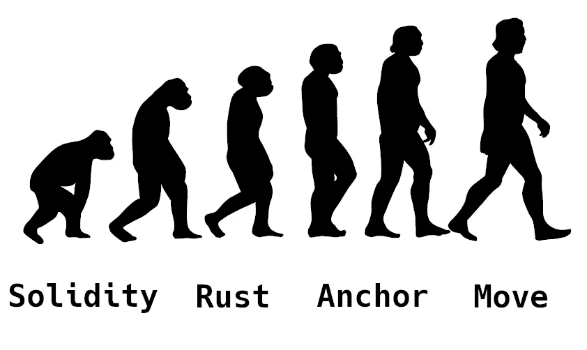
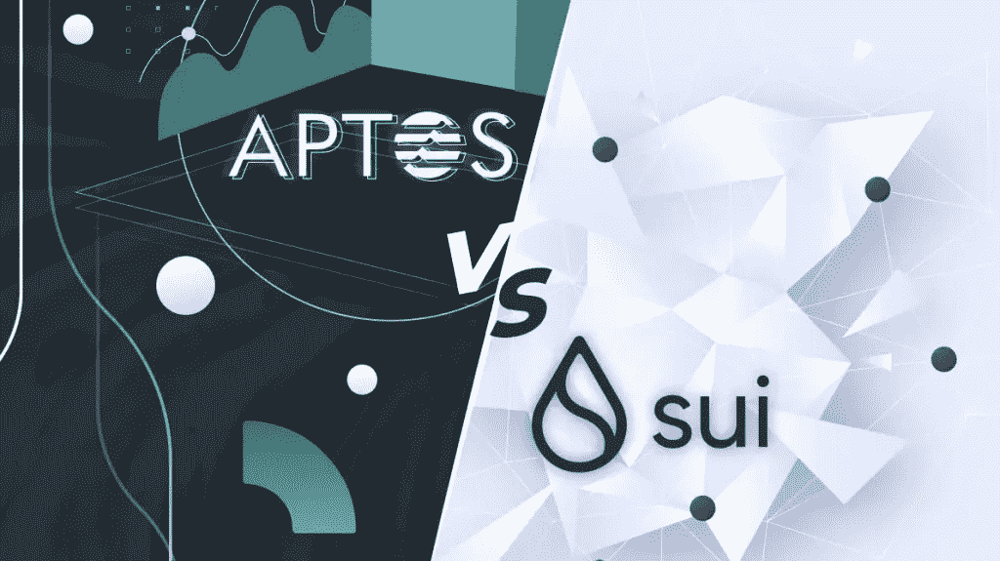

# ✨,✨Starcoin:区块链的未来是可互操作、可扩展的分层架构

> 原文：<https://medium.com/coinmonks/starcoin-the-future-of-blockchain-is-interoperable-scalable-layered-architecture-b3a7dbf0f1be?source=collection_archive---------16----------------------->

随着 EOY 2022 的临近，Starcoin 要求社区提交与过去一年在区块链的个人经历相关的内容。首先，在进入我想讨论的内容之前，我先在这里放上我的轶事。

> 我是在 2021 年 12 月牛市巅峰时期涉足星币的。在做了一些初步研究后，我发现 Starcoin 是一个最能体现 Vitalik 区块链三难问题解决方案的项目。我最终在一年中收购了十几个 ST 盒子，在我的 windows 电脑上启动了我自己的节点，并想出了如何单独采矿，其结果与池采矿相当。尽管如此，我最重视团队对权力下放的承诺，从区块链的基础“道”开始，贯穿其整个运营战略。你可以通过参与并为社区做贡献来参与 Starcoin，随着时间的推移，这将转化为个人的切实红利。根据你的技能组合，我绝对推荐这样做~这就是一个真正去中心化的社区是如何围绕一个共同的核心精神气质诞生的。凭借其在 Move 中的先发优势、工作一致性算法的证明、全新的交换构建、到$ETH 的桥接以及最近在 Move 生态系统中的互操作性，我对 Starcoin 的优质技术的持续输出非常满意。即使在熊市条件下，Starcoin 的表现也一直优于同行，甚至达到了 ATH。自从 Starswap 推出以来，我一直在进行 LP 养殖，并继续持有我以不同价格点开采或 DCA'ed 的每一个 STC & STAR。低迷的全球市场导致大量流动性逃离加密空间，大多数项目停止建设，但 Starcoin 继续在熊市中提供突破性的技术进步，而具有类似市场适应性的竞争对手已经停滞不前，并且随着时间的推移没有任何表现。在未来一年中，它可能会专注于 ZKrollup 和第 2 层开发，同时继续与 Move 生态系统进行互操作，该生态系统封装了近 10 亿美元的投资，我对 Starcoin 及其未来非常乐观。区块链的未来是可互操作、可扩展的分层架构，Starcoin 在这方面处于领先地位，坚定不移地致力于推出和构建区块链最好的技术。
> 
> ~任

Vitalik 的区块链三元悖论围绕速度、安全和稳定展开。我在以前的帖子中已经深入讨论过这个话题，所以你可以自由地参考它来获得更细致的解释。正如我在上面引用的帖子中提到的，我坚信区块链的未来是可互操作的、可伸缩的、分层的架构。

然而，任何区块链的一个重要组成部分都围绕着它的安全性。如果黑客利用大量漏洞将链条的流动性抽干为零，区块链及其用户当然会遭殃。这就是星币使用移动的原因。

Move 是由 Sam Blackshear 为脸书的(元)区块链项目 Diem 创建的下一代编程语言。Move 是区块链最安全的编程语言，具有本机智能合约功能。

自那以后，移动生态系统随着 Aptos 和 Sui 的市场进入者而爆炸式增长，这两家公司分别获得了大量风投资金的股权证明和权威项目。Aptos 筹集了 5 亿英镑资金，在 mainnet 上直接部署到包括比特币基地在内的知名交易所。Sui 自诩萨姆布莱克希尔(Sam Blackshear)为首席技术官，其项目也融资约 3 亿英镑。

这对 Starcoin 意味着什么？顺便说一句，许多用户对风险资本在孤立的种子轮中投资，然后以溢价出售的股权证明模式不太满意。Starcoin 诞生时是一个研究项目，由一个专注于基本面和最佳(开源)技术的小团队构建，此后一直忠于其根基。它的工作一致性模型的证明是从 cryptonight r(Monero 在转移到 RandomX 之前的原始算法)推断出来的，完全可靠，并且它没有风投。

在这一点上，毫无疑问，移动生态系统将继续增长，其市场参与者很可能在下一轮牛市中加冕区块链十大项目。很明显，Starcoin 是这一领域的先行者，它于 2021 年推出了 mainnet。它的第 1 层号称拥有 4600 TPS，堪比 Avalanche，但区块链从未打算就此止步。Starcoin 支持分层架构设计，其第二层将通过 ZKrollup 实现近乎即时的终结，速度比第一层快两个数量级。它甚至考虑了潜在的第三层，以获得近乎无限的扩展潜力。

顺便说一下，Starcoin 只会从 Move 生态系统的爆炸中受益。已经有越来越多的开发者聚集在这个领域，Starcoin 通过参与安全审计公司 Movebit，很好地利用了这一点。在我看来，这是一个天才之举，因为这么多开发人员的智慧结合将产生一个名副其实的小说 DAPPs 海洋，所有用户都将从中受益。

尽管全球宏观经济状况不佳，Starcoin 仍在继续迭代，通过将其 DEX star swap 部署到 Aptos 来确保整个 Move 生态系统的互操作性。一座桥梁已经在建设中，据我估计，几乎准备好连接两个生态系统，实现两个区块链之间资产的无缝转移。当平均 anon 被 Move 生态系统和它的区块链网住时，兔子洞直接通向 Starcoin。

如果你想进入一个完全去中心化的区块链，围绕它自己的“道”设计，在最前沿工作，建立区块链中最好的技术，同时避开风险投资，只有一个选择:Starcoin。

~任

> 交易新手？试试[加密交易机器人](/coinmonks/crypto-trading-bot-c2ffce8acb2a)或者[复制交易](/coinmonks/top-10-crypto-copy-trading-platforms-for-beginners-d0c37c7d698c)
> 
> 多样化的密码持有，了解[币安替代品](https://coincodecap.com/binance-alternatives)
> 
> 加入 Coinmonks [电报频道](https://t.me/coincodecap)和 [Youtube 频道](https://www.youtube.com/c/coinmonks/videos)获取每日[加密新闻](http://coincodecap.com/)

# 另外，阅读

*   [复制交易](/coinmonks/top-10-crypto-copy-trading-platforms-for-beginners-d0c37c7d698c) | [加密税务软件](/coinmonks/crypto-tax-software-ed4b4810e338)
*   [网格交易](https://coincodecap.com/grid-trading) | [加密硬件钱包](/coinmonks/the-best-cryptocurrency-hardware-wallets-of-2020-e28b1c124069)
*   [密码电报信号](/coinmonks/top-3-telegram-channels-for-crypto-traders-in-2021-8385f4411ff4) | [密码交易机器人](/coinmonks/crypto-trading-bot-c2ffce8acb2a)
*   [最佳加密交易所](/coinmonks/crypto-exchange-dd2f9d6f3769) | [印度最佳加密交易所](/coinmonks/bitcoin-exchange-in-india-7f1fe79715c9)
*   开发人员的最佳加密 API
*   最佳[密码借贷平台](/coinmonks/top-5-crypto-lending-platforms-in-2020-that-you-need-to-know-a1b675cec3fa)
*   [免费加密信号](/coinmonks/free-crypto-signals-48b25e61a8da) | [加密交易机器人](/coinmonks/crypto-trading-bot-c2ffce8acb2a)
*   [杠杆代币的终极指南](/coinmonks/leveraged-token-3f5257808b22)