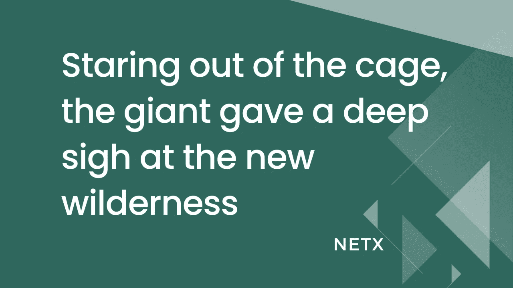

# 巨人凝视着笼子外面，对着新的荒野深深地叹了口气

> 原文：<https://medium.com/coinmonks/staring-out-of-the-cage-the-giant-gave-a-deep-sigh-at-the-new-wilderness-376a7b127426?source=collection_archive---------12----------------------->

传统互联网公司在追求 Web 3.0 时像笼中之兽一样被束缚，无处可逃。强大的手伸向这片蓝海，却发现自己处于一种听天由命的境地。

随着各国正在学习适应 Web 3.0，当地政策仍需要升级。在还不成熟的 Web 3.0 时代，大型应用程序并没有完全去中心化。在一个稍微包容的 Web 3.0 时代，由于缺乏深思熟虑的解决方案，有才华的人和应用程序发现很难完成过渡。

守旧的巨头们正在寻求搭上 Web 3.0 的快车，这是一块难以下咽的美味蛋糕。然而，Web 3.0 的建造者更喜欢在以太坊上开发新的智能合约，这是一个简单而有利可图的选择。因此，主要公共链的生态系统是这些互联网公司运行大型应用程序的潜在问题。

以以太坊为例，即使不考虑 Solidity 编程语言对传统应用开发生态系统的支持和对契约计算数量的限制，将应用中的所有计算逻辑都写入智能契约，任何逻辑执行最终都要在成千上万的节点之间达成共识。这项工作进行得很慢，但即使是一个链上计算也很昂贵。你能想象在元宇宙潜水时花十多分钟走一步和十几块钱去执行吗？没人喜欢那样。

我们都熟悉这个陷阱。多年的不断努力已经产生了各种快速的新技术，如碎片化、侧链、状态通道、第二层、新共识机制等。激增的吞吐量将像 DeFi 和 NFT 这样的应用程序从缓慢的交易和高费用的困境中拖了出来。随着福利买回用户，区块链的生态系统复苏了。

我们并不是说这不切实际。我们相信，有一天，当企业可以找到他们需要的东西时，大型应用程序可能会在公共链上从零开始构建，存储空间尽可能大，处理速度尽可能快。

如今，在游戏、电子商务和社交网络等传统的大规模、复杂和高频率计算应用方面，公共链似乎仍不成熟。如果所有的计算逻辑都在链上运行，那么现有的性能最佳的公共链可能甚至无法承载单个大型多玩家在线应用。

传统企业关注的是如何进入市场，用他们现有的产品和业务分一杯羹，而不是用新雇佣的 Web 3.0 团队开拓新的领域。

这解释了为什么我们说使用 Web 3.0 并不意味着放弃 Web 2.0 而进行链上重写。Web 3.0 创建了一个升级计划，将传统互联网企业的软件和应用程序与包含和增强的 Web 2.0 技术相集成。

NetX 和 Ethanim 的引入是为了确保这些应用程序能够顺利进入 Web 3.0 世界并实现可视化。我们渴望通过与当前区块链平台不同的技术，为大型分散式应用程序实现与集中式应用程序相似的性能和用户体验水平，同时保持安全性。这些不朽的区块链告别了低速事务、低并发、无法支持大规模复杂计算等。细节将在后面的文章中讨论。

笼中之兽总是渴望狂野的奔跑。一片新的荒野肯定会从 Web 3.0 中生长出来，拥抱狂热的传统互联网公司。技术壁垒一定会在打开牢笼的勇者 Ethanim 的帮助下得到解决。

# 📚必读

[乙亚胺系列-1](/coinmonks/metaverse-an-open-and-destined-future-b652734fbdf2) | [乙亚胺系列-2](/coinmonks/the-present-metaverse-doesnt-denote-decentralization-51cf038f6651) | [乙亚胺系列-3](/coinmonks/some-thoughts-on-metaverse-values-cd08a52f4e43) | [乙亚胺系列-4](/coinmonks/we-need-it-not-for-the-popularity-it-enjoys-8ef2fc7a235e)

***NetX，面向数字生活的可信可靠的智能自治系统链原生互联网(***[***Trias***](https://www.trias.one/)***)***

[***铁人三项***](https://www.triathon.space/#/)***|***[***Ethanim***](https://www.ethanim.network/)***|***[***tu Sima***](https://www.tusima.network/#/)***| behemotius | leviam | Divina***

> 交易新手？尝试[加密交易机器人](/coinmonks/crypto-trading-bot-c2ffce8acb2a)或[复制交易](/coinmonks/top-10-crypto-copy-trading-platforms-for-beginners-d0c37c7d698c)