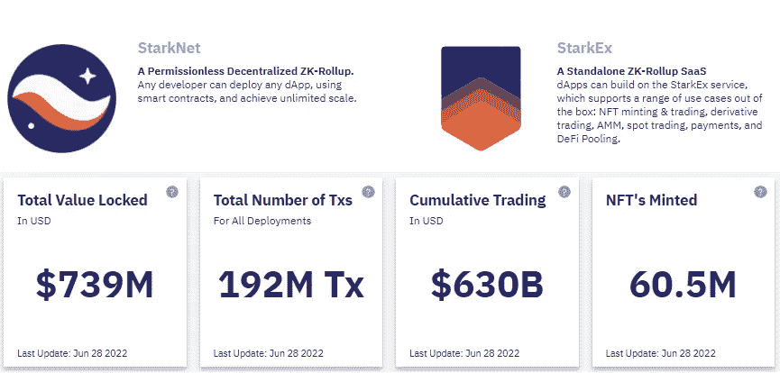
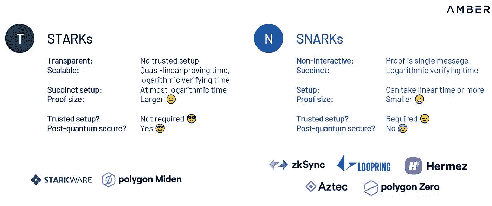
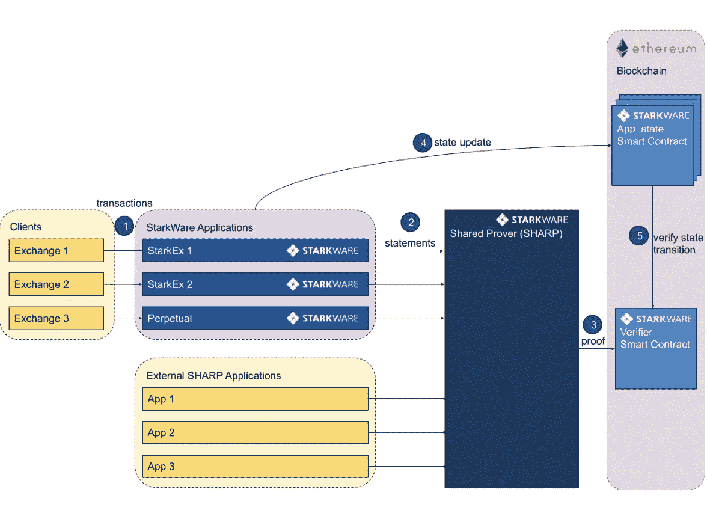
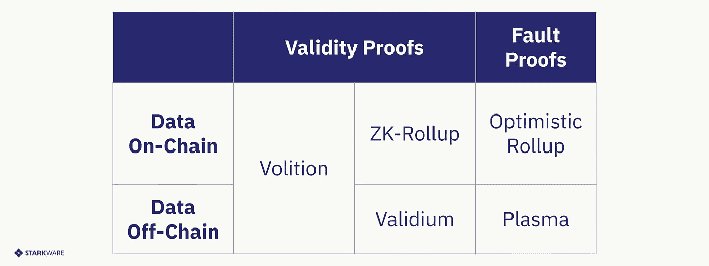
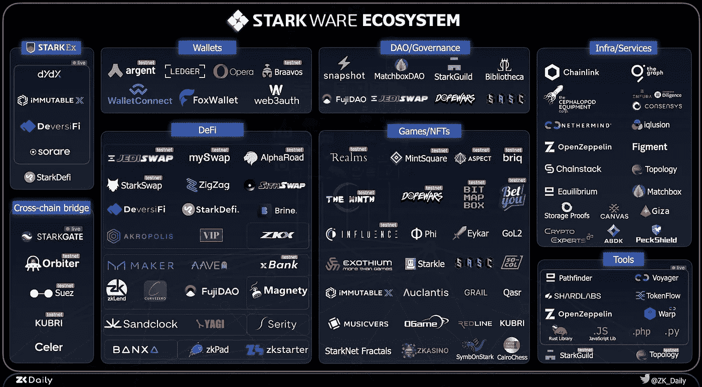
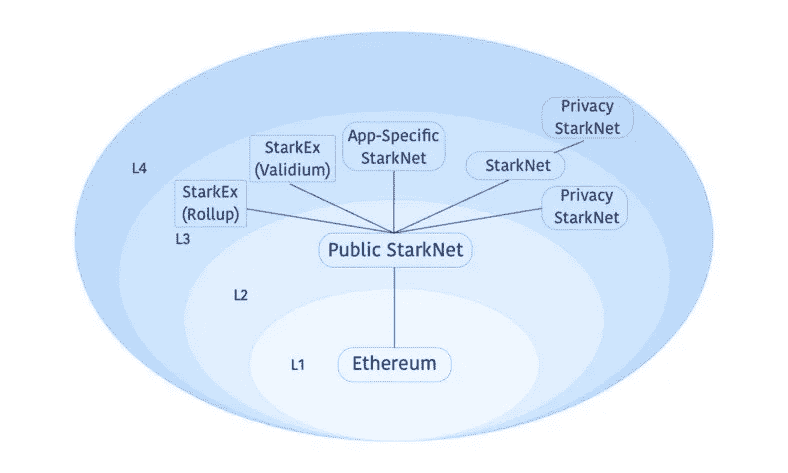

# Starkware:构建零知识扩展解决方案

> 原文：<https://medium.com/coinmonks/starkware-building-zero-knowledge-scaling-solution-c0b930faab6a?source=collection_archive---------9----------------------->

## 为以太坊带来可扩展性、安全性和隐私性。

# 概观

Starkware 是一家零知识公司，专注于为扩展以太坊构建基于零知识的汇总解决方案。他们的第一款产品 Starkex 于 2020 年推出，并于 2021 年 11 月发布了具有更多功能的 **Starknet** 。

**Starkex** 是一款独立的 Zk-roll SaaS 产品，通过智能合约为某些应用程序提供特定的用例，如交易( [DyDx](https://dydx.exchange/) )、NFTs ( [不可变](https://www.immutable.com/)、 [Sorare](https://sorare.com/) )和 Defi ( [DiversiFi](https://deversifi.com/) )。Starkent 是 zk-rollup 的下一个迭代——一个无许可的、分散的、完全可组合的网络，不同于 Starknet。可组合性指的是应用程序相互连接、协调和构建的能力。

[Starkware](https://starkware.co/)

# 技术

Starkware 建立了一种新技术，将数千笔交易压缩成一个名为 **STARK(可扩展的透明知识论证)**的有效性证明，提交给 L1 以太坊。STARK 与 SNARKs 相比主要有两个优势(用于 ZkSync、Hermez 等的 ZK-Rollups)。):

1)它不需要初始的可信设置。

2)比 SNARKs 更快的计算时间。由于所需的计算量更少，它可以将以太坊的可扩展性提高几个数量级

[STARK Vs SNARK](/amber-group/navigating-zero-knowledge-e944b21af71c)

## 体系结构

Starkware 栈由主要的关键特性组成**共享证明者(Shared Prover)(SHARP)**和**验证者(存在于 L1)** 。SHARP 捆绑来自不同 Dapps 的多个交易，并生成单个证明。然后，它与 L1 上的验证者共享证明。这节省了成本，因为计算在不同的应用程序之间共享。验证者检查清晰的证明是否有效。如果是这样，那么它们在事实注册中心被共享。该应用程序既可以与 Starkex 接口，也可以直接与 SHARP 接口(Starknet 应用程序)

[Starkware: Architecture](https://docs.starkware.co/starkex-v4/architecture/solution-architecture)

StarkNet 的 L2 节点(定序器)将执行每个事务，并定期更新以太坊主网的状态。值得注意的是 StarkNet 交易的终结性与 L1 相关，这意味着 L2 节点必须同时验证 StarkNet 和以太坊。StarkNet 引入了一个涉及以太坊主网检查点的解决方案，使其能够非常快速地在汇总端实现有效终结。因此，所有 L2 节点都包含一个 L1 完整节点。

> 交易新手？试试[加密交易机器人](/coinmonks/crypto-trading-bot-c2ffce8acb2a)或者[复制交易](/coinmonks/top-10-crypto-copy-trading-platforms-for-beginners-d0c37c7d698c)

此外，由于状态转换是由定序器“完全批准”的，所以在 mainnet Ethereum 上接受欺诈交易在密码学上是不可能的。这消除了 ORs 中存在的任何“挑战”期的需要。重建完整 StarkNet 状态所需的所有数据都在链上发布。

## 数据可用性

Starknet 使用 **Validium** 机制实现数据可用性。它与 ZK 汇总几乎相同，只是它将数据保持在链外，而 ZK 汇总和乐观汇总(或)将数据保持在链上。Validium 只在 L1 上发布有效性证明，而不让数据上链。这使得 Validium 能够实现相当高的吞吐量，同时也降低了每次交易的成本。

存储数据的代价是需要信任第三方，这可能会阻止用户访问他们的余额。Starkware 的目标是通过一个由 8 名独立成员组成的委员会**数据可用性委员会(DAC)**来解决这个问题，该委员会拥有交易的副本。他们还需要通过随时提供这些数据来维护这些数据。如果运营商阻止用户访问他们的资金，委员会成员可以推翻他们，以确认他们的请求是否有效。

Starkware 还计划实现一个**意志**机制，在这个机制中，用户可以选择数据是否需要在链上发送。它将数据可用性的决策从应用程序级转移到用户级，即使是对于单个事务。如果用户想发送一个包含所有数据的高价值 NFT，他们可以支付额外的费用来移动它。这将通过不可变和 Sorare 实现。

[Data Availability](https://mirror.xyz/0x3D5FE39342e661776bb5273521F52E99B624288c/NFOsWYCb2eVk612VSnrrCsoKcwI_EMObp_q9uNKa4uA)

## 开罗编程语言

新技术带来了新要求。Cairo 是一种专为 STARK 开发的图灵完全编程语言。它在性能和可伸缩性方面更好，但是非常新。许多开发人员不熟悉它，这使得现有的应用程序很难迁移到 Starkent。 **Warp** ，开发者 [Nethermind](https://nethermind.io/) 是一个 EVM 到开罗的运输者。Warp 允许 Solidity 契约无缝转换为 Cairo。

Cairo 语言的一个突破是，它允许一个验证者使用一个证明来确认许多不同程序执行的完整性。这具有在单独的 dApps 之间分配成本的效果。

# Starknet Vs OR's

与 or 的 7 天窗口相比，Starkent 不仅有更快的提款窗口，而且还有潜在的架构差异。Starknet 使用“**无状态**”，其中你只需在 L1 上存储整个州的州根，用户将需要提供 Merkle 证明来访问特定的州项目。或者遵循一个“**状态**解决方案，其中每个状态项都被记录在链上。这导致了更大的状态膨胀，并可能在将来被证明不能很好地扩展。

仅从可伸缩性的角度来看，ZK 汇总比 OR 的性能更高，因为它们更有效地压缩数据，这意味着它们在提交到 L1 时具有更小的“批量”。OR 的将每笔交易的数据发布到以太坊 L1，Starkex 实现(如 dYdX)只将数据发布到以太坊 L1 以反映每笔账户余额。由于这种方法，dYdX 与 L1 的互动只有乐观的 20%,相当于大约 90%的费用减少。

# 生态系统

starkware 生态系统正在成长。随着 Starknet 上的无许可部署，许多开发者表现出了兴趣。Starkex 凭借其开放的生态系统和丰富的文档，使得开发人员能够轻松实现。Starknet 上的 **Defi Pooling** 是可能的。它允许用户存在于 L2，而 DeFI 仍然留在它诞生的 L1，许多令人兴奋的东西正在建设中。它带来一笔 L1 交易，代表来自 L2 的大量买家，然后带着收益回到 L2 进行分配。许多游戏和 NFT 项目已经在 Starkent 上启动。

[Starkware Ecosystem](https://twitter.com/ZK_Daily/status/1532644112075067392)

Starknet 将遵循与乐观主义(OR)相似的道路:在早期用单个定序器和有限的 dApps 白名单启动网络，以控制启动并限制任何风险。最终，Starkware 希望将生态系统发展成一个 Starknet“宇宙”,同时分散网络、节点和基础设施。多个 L3 将骑在 L2 的上面。此外，附加层(L4 等。)可以建立在 L3 上，用于分形分层解决方案。

[Layered Ecosystem](/starkware/fractal-scaling-from-l2-to-l3-7fe238ecfb4f)

# 结论

Starknet 似乎已经解决了区块链的三难困境:可扩展性、去中心化和安全性；三个一起。它展示了使用 Zk-rollups 扩展以太坊的前景。以太坊已经拥抱了一个以汇总为中心的未来，用户在 L2 交易，L1 充当结算层。EIP-4488 将进一步降低交易成本。Starknet 有很多支持，看起来是 L2 未来的有力竞争者，但在目前的状态下，它是集中的，starkware 是唯一的证明者。由于 Cairo 是一种新的、在开发者中不太受欢迎的语言，Starkware 能吸引多少人才库还需要拭目以待。使用 Valadium，您必须信任 L2 的数据可用性。尽管存在这些挑战，Starkware 还是展示了如何使用 STARKS 提供一个有效的解决方案来扩展以太坊。这绝对是一个值得寻找的项目。

## 资源

[https://docs.starkware.co/starkex-v4/](https://docs.starkware.co/starkex-v4/)

[https://medium.com/starkware/fractal-scaling-from-l2-to-l3-7fe238ecfb4f](/starkware/fractal-scaling-from-l2-to-l3-7fe238ecfb4f)

[https://mirror.xyz/0x3D5FE39342e661776bb5273521F52E99B624288c/NFOsWYCb2eVk612VSnrrCsoKcwI_EMObp_q9uNKa4uA](https://mirror.xyz/0x3D5FE39342e661776bb5273521F52E99B624288c/NFOsWYCb2eVk612VSnrrCsoKcwI_EMObp_q9uNKa4uA)

[https://docs.starknet.io/docs/Intro](https://docs.starknet.io/docs/Intro)