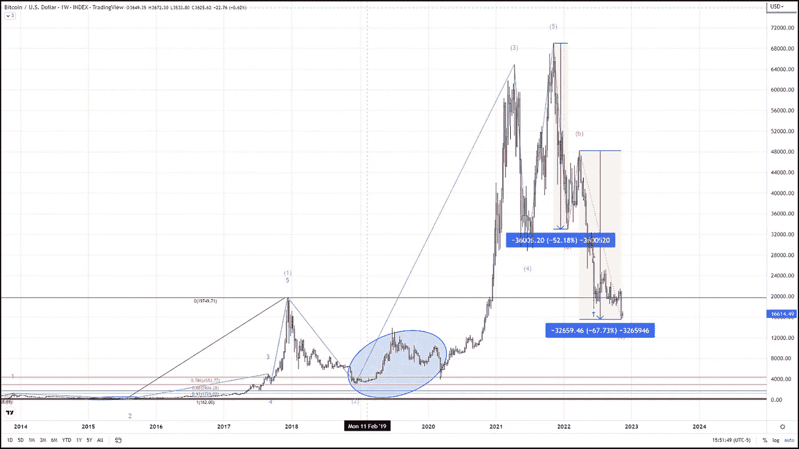
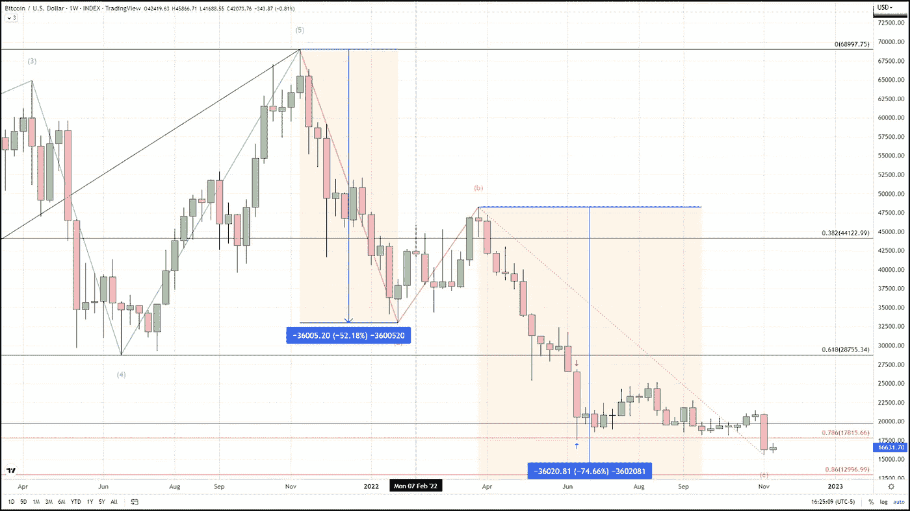

# 从底层开始现在我们在这里。

> 原文：<https://medium.com/coinmonks/started-from-the-bottom-now-were-here-953b36f0f46b?source=collection_archive---------44----------------------->

比特币终于见底了吗？如果不是，那么在哪里？我一直在说，比特币的底部将在 17，800 美元到 13，000 美元之间，这是自去年 11 月我们脱离历史新高以来的一整年。为了获得底部的这些数字，我简单地比较了比特币经历的所有其他抛物线周期及其随后的修正，有趣的是，它们都遵循了相同的基本准则。BTC 已经完成了其中的四个周期，目前正处于第五个周期的最后阶段。

这些序列包括突破前一个历史高点的爆发性反弹，随后是一次深度调整，调整幅度为上涨幅度的 78%至 96%。比特币在 6 月中旬触及了当前第五个抛物线周期的 78%的回撤。所以，我说 BTC 已经达到了它的最低回撤水平，现在可能正处于它的盘整阶段，这是周期中三个阶段的最后一个。

在查看之前的四个抛物线涨跌周期时，我意识到只有一次 78%的回撤标志着调整的结束(2013 年 4 月)。此外，在创下新高的同一个月，它触及了 78%的回撤位。这很奇怪，因为所有其他周期都有更长更深的修正，但它符合抛物线上升和下降的其余标准，所以我预测“至少”有 78%的修正。深入研究数据，似乎 78%的底部是一个异常值，是一个非常乐观的预测，因为其他 3 个完整的周期在 92%-96%的回撤之间触底，并花了 6 个月到 22 个月的时间触底。

现在，除了 2011 年的第一个抛物线周期，底部的范围在 78%到 92%之间。对于我们当前的周期，这是一个介于 17，800 美元和 9，000 美元之间的巨大范围，所以为了缩小范围，我们将使用另一种技术预测方法，埃利奥特波。

我认为最有可能的波数如上图所示。除了波浪计数，上面显示的周线蜡烛图还包含两个浅米色的蓝色箭头，简单显示了两点之间的距离。第一个价格距离是修正浪 A 的长度，第二个是浪 C 到目前为止走过的距离。波浪 A 和 C 之间最常见的关系是一对一的关系，这将使我们当前的波浪 C 以大约 12，500 美元结束。

然而，我坚持我的预测，比特币的底部将从 14k 美元(2018 年顶部)到 13k 美元(86%回撤)。从那时起，随着比特币进入或继续其安慰期，预计将看到持续的低波动性，直到 2023 年春天，我相信下一个抛物线周期将开始，并将比特币带到一个新的历史高点。

对于任何有兴趣查看更多关于比特币的文章的人，只需点击这个[链接](https://www.thegoldforecast.com/bitcoin)。

> 交易新手？试试[加密交易机器人](/coinmonks/crypto-trading-bot-c2ffce8acb2a)或者[复制交易](/coinmonks/top-10-crypto-copy-trading-platforms-for-beginners-d0c37c7d698c)