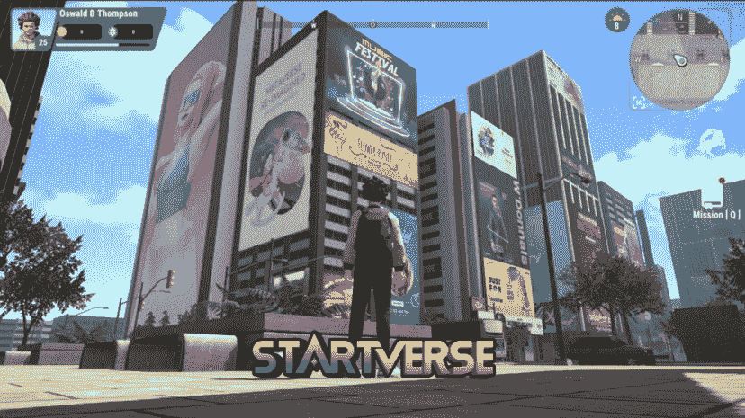
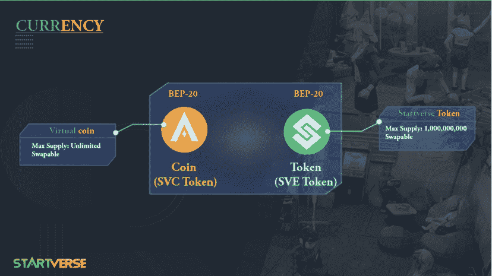

# Startverse —项目概述

> 原文：<https://medium.com/coinmonks/startverse-project-overview-3ed7937613e?source=collection_archive---------63----------------------->

在介绍了 Startverse 的市场&元宇宙宇宙之后，今天我们将向您简要介绍我们的项目“ **Startverse** ”。

**1。从想法到创作**

一年前，我们进行了大量与产品相关的头脑风暴。我们当时想为初创公司创造一个解决方案，因为我们自己也是一家初创企业，知道他们需要什么。我们意识到每个人对自己的成功和快乐都有不同的目标。我们也意识到，没有多少人有数百万美元来立即启动他们的想法。我们总是想办法用最少的钱满足人们的愿望。

自从 Meta(又名脸书)透露了它对元宇宙的设想，我们已经讨论了它可以为我们的用户提供朋友和同事的可能性。对业务有什么影响？是我们经常被问到的一个问题。如果你想创业，但缺乏必要的资源或知识，或者如果你失败了，你可能会没钱。如果是这样，《T4》绝对是你的答案。

**2。项目范围**

在这一阶段，我们将开发一个市场门户网站，允许用户交换 NFT，股份代币赚取利益。其他 NFT 游戏是基于玩家的贪婪，他们允许用户自己决定 NFT 的价格，所以有低级别的 NFT 但价格比市场上顶级 NFT 高几十倍。这导致通货膨胀，让新玩家更难进入游戏，也让市场看起来像没有价值的东西…

这就是为什么我们创建了具有以下特征的 Startverse 市场:

*   我们将按时间应用元宇宙的所有趋势动作，并在元宇宙销售每个动作的 NFT:移动挣钱的鞋子，唱歌挣钱的麦克风。
*   用户获得 NFT 后，玩家可以立即在游戏中使用。
*   我们不允许用户自己决定 NFT 的价格。NFT 的价格将根据他们的功能和等级自动计算，所以如果玩家希望他们的 NFT 变得更有价值，他们需要在游戏中花费时间和精力来升级他们的 NFT。当 NFTs 等级足够高，玩家想从中获利的时候，就可以去换别人。

**3。项目特点**

Startverse 是完全“免费玩”的，以下是它的特点:

*   **独特的概念:**我们的理念是让用户在我们的元宇宙建立自己的业务/创业，我们希望能帮助尽可能多的人实现他们致富和幸福的梦想。
*   **品牌特色:**我们欢迎并联系品牌加入 Startverse，为他们的产品做广告，参加展览，在我们的链条上创造他们自己的星球和他们自己的令牌。
*   在 Startverse 中，用户不仅仅是为了赚钱而移动，为了赚钱而学习，而且为了赚钱而做任何事情。我们不是只卖 NFT 一次，而是卖 NFT 多次，每个 NFT 类型将支持用户在元宇宙玩迷你游戏。
*   **免费玩:**用户可以零费用加入 Startverse，但他们仍然有机会享受它，并从中获得被动收入，然后当他们的投资足够大时，他们可以建立自己的业务。
*   **高品质&技术:**配合 HQ 3D 环境和角色，包括 VR 技术，带给用户最好的体验。
*   **NFT 的价格:**其他的 NFT 游戏都是基于玩家的贪婪，他们允许用户自己决定 NFT 的价格，所以市面上有低级的 NFT 但是价格却比顶级 NFT 高出几十倍。这导致通货膨胀，并使后来的玩家更难进入游戏，它使市场像一堆毫无价值的垃圾。

希望这篇文章给你提供了有用的信息。如果你想了解更多关于这个项目的信息，请点击下面的链接访问 Cardano 平台，查找信息，并通过赞和评论与这个项目互动！

**下面是提案链接:** [**链接**](https://cardano.ideascale.com/c/idea/414876) | [**链接**](https://cardano.ideascale.com/c/idea/414872)

最后，请在以下平台为 Startverse 项目投票，帮助项目发展并进一步向社区传播！

**下面是投票的具体步骤:** [**链接**](https://iohk.zendesk.com/hc/en-us/articles/900005679386-Catalyst-registration-and-voting-guide)

*在****Startverse****加入世界各地的创业公司、老板、土地持有者的社区，同时接收最新的项目消息，享受特别内容:*

[网站](https://startverse.io/) | [脸书](https://www.facebook.com/Startverse-Global-102077955725659/) | [推特](https://twitter.com/StartverseGame) | [不和](https://discord.gg/cfUSrHUvSz) | [电报](https://t.me/StarverseGlobal) | [白皮书](https://whitepaper.startverse.io/)

> 加入 Coinmonks [电报频道](https://t.me/coincodecap)和 [Youtube 频道](https://www.youtube.com/c/coinmonks/videos)了解加密交易和投资

# 另外，阅读

*   [如何获得自己的。XYZ 领域？](https://coincodecap.com/xyz-domain)
*   [最佳加密交换平台](https://coincodecap.com/best-crypto-swap-platforms) | [最佳加密交易所](https://coincodecap.com/crypto-exchange)
*   [购买比特币印度](/coinmonks/buy-bitcoin-in-india-feb50ddfef94) | [Pionex 评论](/coinmonks/pionex-review-exchange-with-crypto-trading-bot-1e459d0191ea) | [加密交易机器人](/coinmonks/crypto-trading-bot-c2ffce8acb2a)
*   [n 零复习](/coinmonks/ngrave-zero-review-c465cf8307fc) | [Phemex 复习](/coinmonks/phemex-review-4cfba0b49e28) | [PrimeXBT 复习](/coinmonks/primexbt-review-88e0815be858)
*   最佳[区块链分析](https://bitquery.io/blog/best-blockchain-analysis-tools-and-software)工具| [赚比特币](/coinmonks/earn-bitcoin-6e8bd3c592d9)
*   [Cloudbet 赌场评论](https://coincodecap.com/cloudbet-casino-review) | [点火赌场评论](https://coincodecap.com/ignition-casino-review)