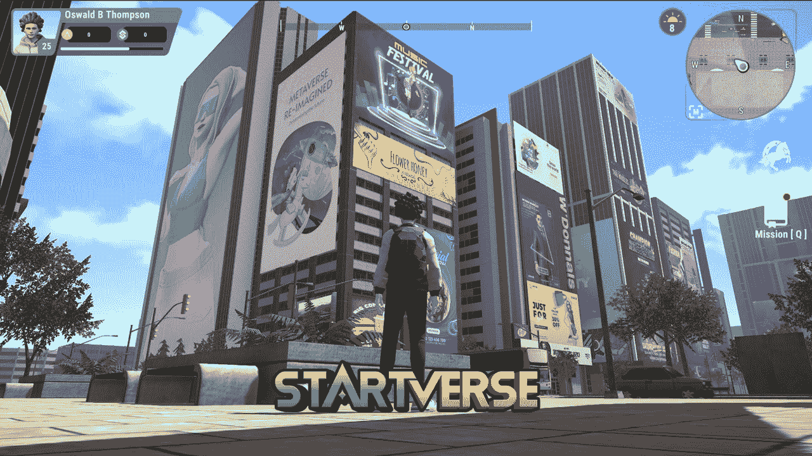
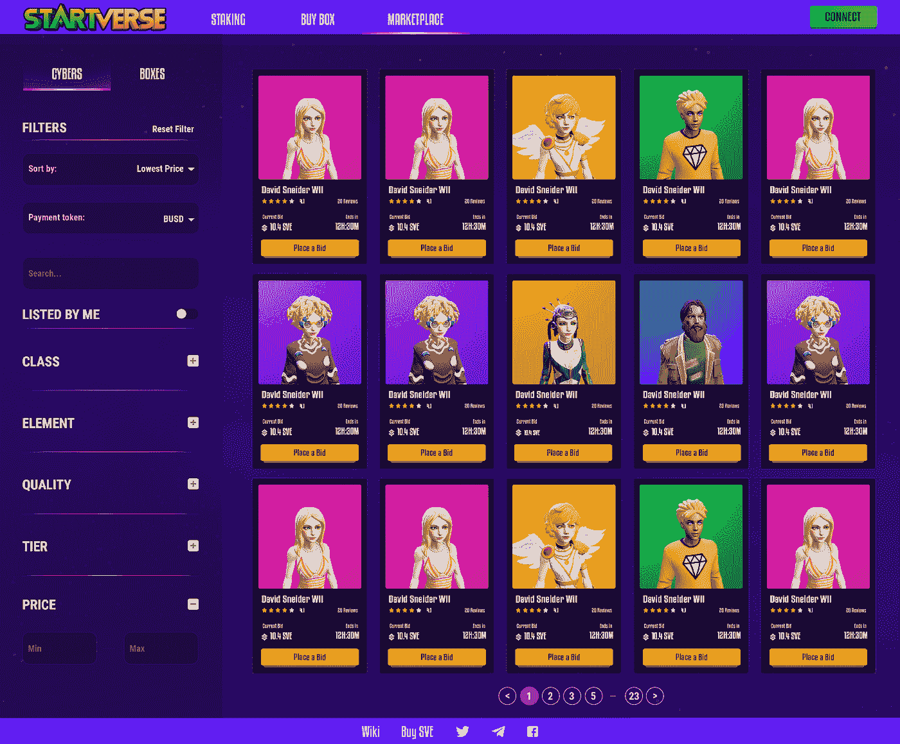
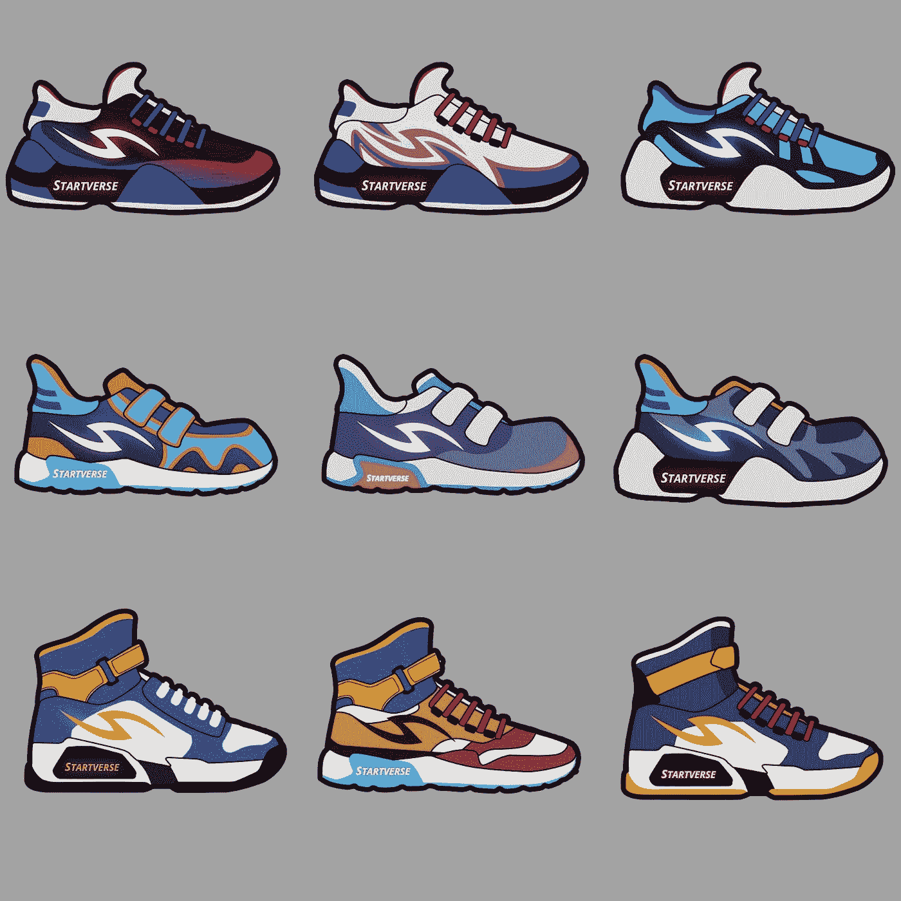
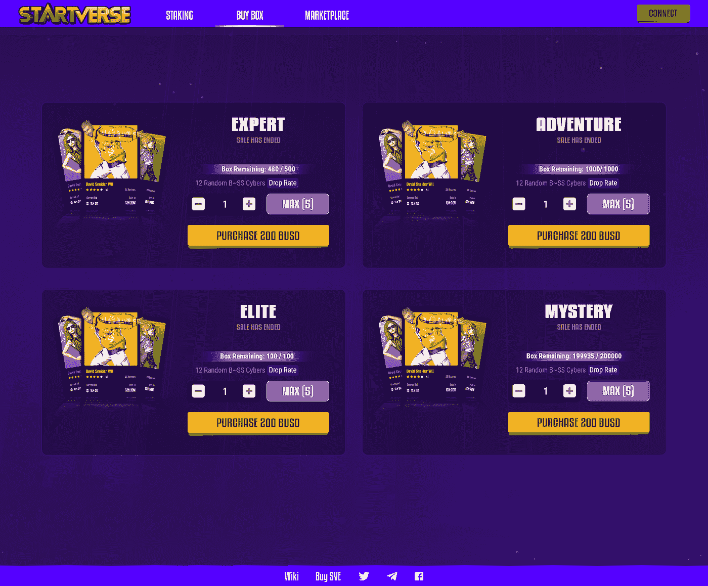

# Startverse 的市场:方向和概念

> 原文：<https://medium.com/coinmonks/startverses-marketplace-direction-concept-2e6e449a9178?source=collection_archive---------49----------------------->

首先，我们将首先简要讨论“星际”Startverse 专注于帮助人们创造他们梦想的生活和事业，并在我们的元宇宙找到他们的灵魂伴侣。在我们的元宇宙星球，玩家可以做任何他们想做的事情，这也是一个开放的宇宙。为了在元宇宙取得成功，你必须在工作和人际关系中取得成就。像真实的人一样，玩家必须满足他们的需求，以便在休息、食物、工作和锻炼之间保持健康的平衡。为了赚钱，他们还需要找工作或自己创业。

**1。STARTVERSE 的市场**

关于 Startverse 的 marketplace，用户在这里安全地买卖他们的物品、土地、建筑和其他 NFT，以帮助他们完成任务、装饰他们的家并以独特的风格建立他们的公司。与其他 NFT 游戏一样，我们的市场也允许用户交换他们的 NFT，并向其他玩家借出/借用 NFT。

**2。市场方向**
在这一阶段，我们将开发一个市场门户，允许用户交换 NFT，赌注代币赚取利益。其他 NFT 游戏是基于玩家的贪婪，他们允许用户自己决定 NFT 的价格，所以有低级别的 NFT 但价格比市场上顶级 NFT 高几十倍。这导致通货膨胀，让新玩家更难进入游戏，也让市场看起来像没有价值的东西…

这就是为什么我们创建了具有以下特征的 Startverse 市场:

*   我们将按时间应用元宇宙的所有趋势动作，并在元宇宙销售每个动作的 NFT:移动挣钱的鞋子，唱歌挣钱的麦克风，…
*   用户获得 NFT 后，玩家可以立即在游戏中使用。
*   我们不允许用户自己决定 NFT 的价格。NFT 的价格将自动计算他们的功能和水平。因此，如果玩家希望他们的 NFT 变得更有价值，他们需要在游戏中花费时间和精力来升级他们的 NFT。当 NFTs 等级足够高，玩家想从中获利的时候，就可以去换别人。

**3。市场概念**

关于市场的概念，我们将有 3 个类别让你更容易理解。

**A .下注:**用户可以购买代币，然后下注代币获得利益。在我们的元宇宙下注的好处:

*   从下注的代币中获利
*   如果你是下注最多代币的前 100 名，你将拥有议员的职位，并将获得每日工资。

**B .买盒子:**用户可以买盒子打开获得 NFT。盒子越贵，你得到的 NFT 就越有价值:

*   我们将按事件出售箱子，而不是一次性出售。
*   每次我们只卖有限数量的盒子。

C. Marketplace: 用户可以在 Marketplace 中交换他们的 NFT:

*   所有的 NFT 都将由用户交换，我们不打算出售它们。
*   NFT 的价格将根据其功能和等级自动计算。如果玩家希望他们的 NFT 变得更有价值，他们需要在游戏中花费时间和精力来升级他们的 NFT。

希望这篇文章给你提供了有用的信息。如果你想了解更多关于这个项目的信息，请点击下面的链接访问 Cardano 平台，查找信息，并通过赞和评论与这个项目互动！

**下面是提案链接:** [**链接**](https://cardano.ideascale.com/c/idea/414876) | [**链接**](https://cardano.ideascale.com/c/idea/414872)

最后，请在以下平台为 Startverse 项目投票，帮助项目发展并进一步向社区传播！

**下面是投票的具体步骤:** [**链接**](https://iohk.zendesk.com/hc/en-us/articles/900005679386-Catalyst-registration-and-voting-guide)

*加入****Startverse****来自世界各地的创业公司、老板、土地持有者的社区，同时接收最新的项目消息，享受特别内容:*

[网站](https://startverse.io/) | [脸书](https://www.facebook.com/Startverse-Global-102077955725659/) | [推特](https://twitter.com/StartverseGame) | [不和](https://discord.gg/cfUSrHUvSz) | [电报](https://t.me/StarverseGlobal) | [白皮书](https://whitepaper.startverse.io/)

> 交易新手？试试[加密交易机器人](/coinmonks/crypto-trading-bot-c2ffce8acb2a)或[复制交易](/coinmonks/top-10-crypto-copy-trading-platforms-for-beginners-d0c37c7d698c)