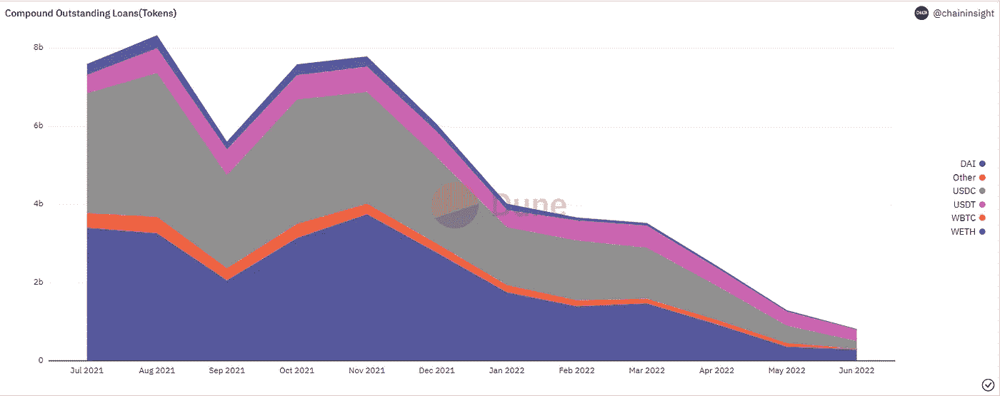
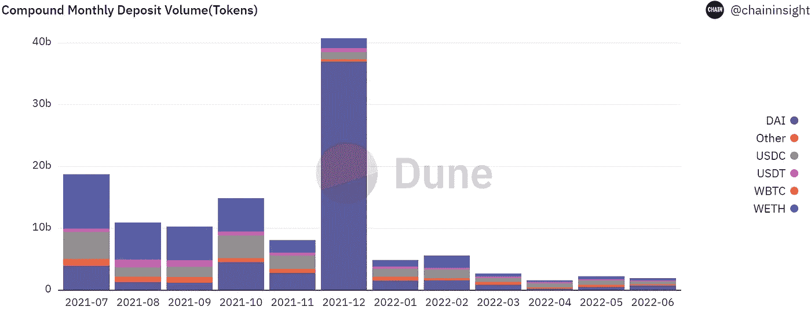
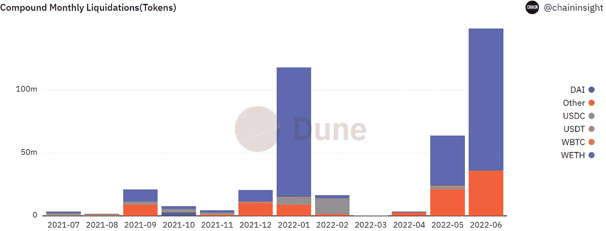

# 2022 年 Q2 大院的状况

> 原文：<https://medium.com/coinmonks/state-of-compound-q2-2022-fd3f619e2c2f?source=collection_archive---------17----------------------->

## 未偿还贷款和存款分别下降了 77%和 68%。

Q2 2022 是加密货币的真正熊市。重大剧变始于 2022 年 5 月 UST 的内爆。随着 UST 的崩溃，许多 CeFi 实体倒闭，杠杆过高的对冲基金 Three Arrows Capital 和贷款平台 Voyager 都陷入了破产。但是以太坊上的 DeFi 安然度过了这场风暴。三个最大的贷款协议 Compound、Aave 和 Maker 成功处理了超过 4 亿美元的清算，100%正常运行。

可以说，这个加密循环始于 Compound 推出 COMP，并将单一货币质押的概念带到大众面前。最后，UST 崩溃了，露娜归零了，最后风险蔓延到了整个加密市场。

在这份报告中，我们把重点放在化合物，这个循环的启动子上。让我们看看这位 DeFi“老将”在 2022 年第二季度交出了一份怎样的成绩单。

## **关键见解**

1.未偿还贷款和在途存款分别下降了 77%和 68%

2.清算指标增长了 25.88%，第二季度清算了 1.91 亿美元

3.本季度协议净收入下降 65%，至 173 万美元

4.协议的资金利用率从 Q1 的 36%下降到 26%的新低

**复合市场——宏观概述**

以太坊 DeFi 市场正在经历历史性的去杠杆化，Compound 处于其中。随着 2022 年第二季度接近尾声，Compound 的许多关键绩效指标都出现了大幅下滑。

在 Q2 2022 年，未偿贷款下降 77%，在途存款下降 68%，季度存款下降 61%，季度贷款量下降 64%。第二季度唯一增长的领域是清算业务，增长了 26%，总额达到 1.9 亿美元，主要是受市场波动的推动。

《协议》主要数据指标的总体下降也对《协议》的财务健康产生了重大影响。在上一季度下降 51%的基础上，本季度下降 65%，至 173 万美元。

1\. Macro overview of Compound market

**未偿还贷款**

Compound 在 Q2 2022 年的未偿贷款下降了 77%，目前 8.16 亿美元的贷款额比 2021 年 8 月 83.3 亿美元的峰值下降了 90%。对贷款杠杆的需求下降是当前悲观情绪背后的一个直接因素。

以和戴为单位的稳定外币贷款继续超过以其他资产为单位的贷款。截至 2022 年第二季度末，戴在复地总贷款余额中保持领先，占总贷款余额的 41.9%。

2\. Compound Outstanding Loans

**未结清存款**

Q2 2022 年未偿存款下降 68%，其中 4 月、5 月和 6 月的未偿存款分别为 78.5 亿美元、55.5 亿美元和 35.5 亿美元。与未偿还贷款额类似，处于持续下降状态。

> 交易新手？试试[加密交易机器人](/coinmonks/crypto-trading-bot-c2ffce8acb2a)或者[复制交易](/coinmonks/top-10-crypto-copy-trading-platforms-for-beginners-d0c37c7d698c)

从货币种类来看，储户还是偏好 wet。在未偿存款中，wet 占 33.4%。存款余额的大幅下降与 ETH 价格的大幅下跌密切相关。

3\. Compound outstanding deposits

**总利用率**

化合物的存款利用率在 2022 年初保持相对平稳，但随着 Q2 加密市场开始波动，其利用率逐渐减弱。

未偿还存款的下降速度较慢，为 64%，而未偿还贷款的下降速度为 77%，导致利用率降至今年的最低点，目前为 26%。

4\. Aggregate Utilization

**利息收入**

2022 年，Q2 的利息收入比 Q1 下降了 61%。

戴跌幅最大，为 68%，其次是和，分别下跌 59.49%和 52.33%。由于市场波动降低了贷款需求，季度利息收入受到影响。

5\. Interest income

**协议收入**

Compound 的协议收入下降了 63%，从 Q1 2022 年的近 500 万美元降至 Q2 的 179 万美元。

在协议收入贡献方面，戴一直排名第一，第二季度贡献了超过 73%的协议收入，但较上一季度下滑幅度高达 67%。

6\. Protocol Income

**季度发行**

2022 年第二季度，总发行量下降了 64%。其中，的降幅最大，为 29 亿美元(65%)，其次是，降幅为 26 亿美元(65%)，戴的降幅相对较小。但也接近 60%。

7\. Originations

**季度存款**

复地在的存款大幅下降，从 620 亿美元降至 138 亿美元，降幅达 78%，其中戴的季度存款从 390 亿美元降至 15 亿美元，降幅超过 95%。

Q2 存款持续下跌，再次下跌 62%，至 52 亿美元。2022 年 6 月，戴的存款接近 7 亿美元。

8\. Deposits

**清算**

Compound 在 Q1 的清算总额接近 1.6 亿美元，比 2011 年第 4 季度的 3188 万美元增长了近 400%。第二季度清算额再次飙升至 1.9 亿美元。

Q2 的清算主要发生在 6 月，仅 WETH 一家就被清算超过 1 . 13 亿英镑。平仓原因主要是 6 月中旬 ETH 的波动。期间 ETH 一度跌破 880 美元。

9\. Total Liquidation

**期末总结**

Compound 的整体活动在很大程度上受到了本季度整体市场波动的影响，Q2 用户对贷款和存款的需求大幅下降，这也是协议收入下降的主要原因。

清算量的进一步增加主要是受 BTC 和 ETH 大幅下跌的影响。6 月中旬，比特币(BTC)一度跌破 2 万美元的支撑，最低 1.75 万美元，以太坊(ETH)也跌破 1000 美元，最低 880 美元，两大加密资产价格跌至年内新低，已导致大量用户平仓。

我们应该看到的不是简单的数据涨跌，而是面对熊市，DeFi lending protocol 展现了一个功能齐全、透明的系统的弹性和韧性。相对于集中式借贷的尴尬结局，分散式借贷暂时安全地度过了这一轮加密风暴。

阿尔法专业版

本报告仅供参考。它并不意味着作为投资建议。

更多信息:

[https://dune.com/chaininsight/compound-markets](https://dune.com/chaininsight/compound-markets)

https://dune.com/chaininsight/compound-micro-market

https://twitter.com/AlphaPro_io❤推特:

> 加入 Coinmonks [电报频道](https://t.me/coincodecap)和 [Youtube 频道](https://www.youtube.com/c/coinmonks/videos)了解加密交易和投资

# 另外，阅读

*   [Bookmap 评论](https://coincodecap.com/bookmap-review-2021-best-trading-software) | [美国 5 大最佳加密交易所](https://coincodecap.com/crypto-exchange-usa)
*   [加密交易机器人](/coinmonks/crypto-trading-bot-c2ffce8acb2a) | [造币评论](https://coincodecap.com/coingate-review)
*   最佳加密[硬件钱包](/coinmonks/hardware-wallets-dfa1211730c6) | [Bitbns 评论](/coinmonks/bitbns-review-38256a07e161)
*   [新加坡十大最佳加密交易所](https://coincodecap.com/crypto-exchange-in-singapore) | [购买 AXS](https://coincodecap.com/buy-axs-token)
*   [红狗赌场评论](https://coincodecap.com/red-dog-casino-review) | [Swyftx 评论](https://coincodecap.com/swyftx-review)
*   [投资印度的最佳密码](https://coincodecap.com/best-crypto-to-invest-in-india-in-2021)|[WazirX P2P](https://coincodecap.com/wazirx-p2p)|[Hi Dollar Review](https://coincodecap.com/hi-dollar-review)