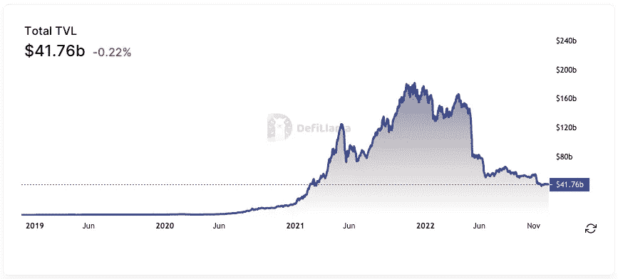
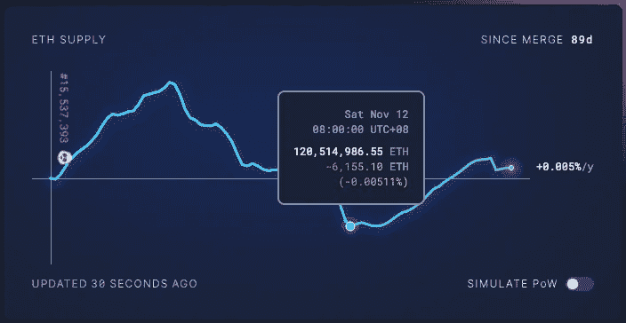

# DeFi 市场的状况(2022 年 12 月 13 日)

> 原文：<https://medium.com/coinmonks/state-of-the-defi-markets-12-13-2022-97853929e771?source=collection_archive---------28----------------------->

# 市场状况

*迪法研究公司分析师吉姆·佛朗哥*

在所有协议中，DeFi 市场的锁定(TVL)或管理(AUM)资产总值目前为 417 亿美元，同比下降 74%。

MakerDAO 在所有连锁店中占有 15%的市场份额。截至本文发稿时，戴背后的刀总价值为 63.1 亿美元(上周下跌 3.78%)。

紧随其后的是丽都液体，市值 62 亿美元，过去七天上涨 1.33%。在 AMM 以低滑动率稳定著称的 Curve Finance 在 TVL 的收入增长了 1.15%，达到 37.2 亿美元。

**一段时间内的 DeFi 用户总数**

用户可以理解为不同的地址。这些数字被高估了，因为一个用户可能有许多地址。

## 哪些 DeFi 协议是可靠的业务？

以下是按过去 30 天最高收入排名的协议。**收益**等于收入减去象征性奖励。如果这个数字是负数，这个项目在代币发行上的花费将会超过它的收入。

image taken from [TokenTerminal](https://tokenterminal.com/terminal/metrics/earnings)

收益是任何企业的命脉。没有它们，企业将无法吸引投资者。这是公司财务报表中最重要、最受关注的数字。它显示了一家公司与其竞争对手和行业同行相比的实际盈利能力。

**现在，哪些代币有价值，有增长空间？**

下面列出了过去 30 天内日累计收入最高的 dapps。

营收呢？

在加密领域，平台费用收入根据令牌组学的设计方式分配给令牌持有者。话虽如此，代币可以用不同于传统商业实体的方式进行估价和分析。

收入是关键的成功指标，但有多少收入直接流向代币持有者？

找到能直接获得项目现金流的代币很重要。

## 哪些是人们付费使用的？

以太坊网络在过去七天中以 280 万美元的平均费用占据了最多的日常费用。基于 EIP-1559，交易费用的很大一部分将被烧掉，使得 ETH 代币成为一种通货紧缩资产。点击阅读更多[。](https://legacy.ethgasstation.info/blog/eip-1559/)

11 月的第二周标志着以太坊网络的一个重要转折点，因为 ETH 令牌开始贬值，或者用他们的话说，成为超健全的货币。这意味着烧毁的 ETH 令牌数量超过了每日发行数量。

## 令牌解锁日历

Image taken from token.unlocks.app

代币解锁事件通常会造成市场抛售压力，因为代币供应量的增加会影响代币的价值。关注这些指标可能有助于投资者和交易者决定何时买入或卖出代币。

# 本周迷因！

到了[milky mes](https://milkroad.com/)的时间了！

**这是真实的生活还是只是幻想？**

***好了，现在就这些。如果你喜欢更新，分享并关注每周时事通讯。***

# 来源:

[https://tokenterminal.com/](https://tokenterminal.com/)

[https://cryptofees.info/](https://cryptofees.info/)

[https://defillama.com/](https://defillama.com/)

 [## 令牌解锁-您的解锁计划和令牌组学数据

### 令牌解锁是最好的令牌分析控制面板，可监控已授予的令牌，通知用户即将解锁…

token.unlocks.app](https://token.unlocks.app) 

> 交易新手？尝试[加密交易机器人](/coinmonks/crypto-trading-bot-c2ffce8acb2a)或[复制交易](/coinmonks/top-10-crypto-copy-trading-platforms-for-beginners-d0c37c7d698c)