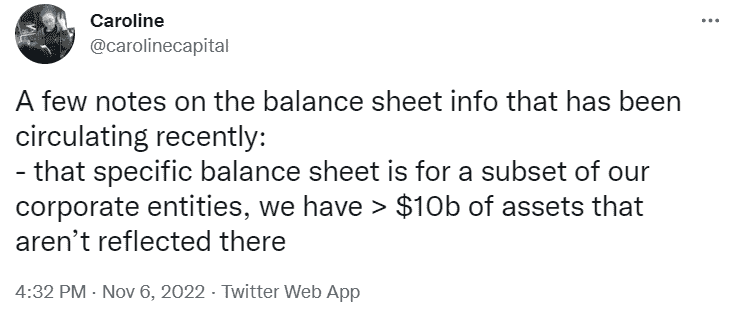
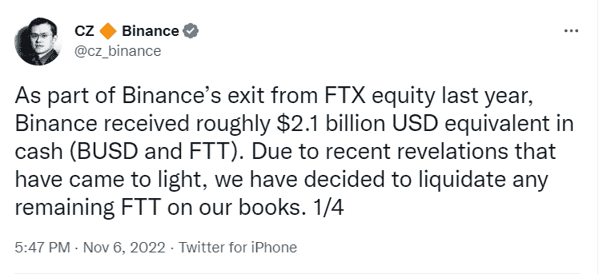
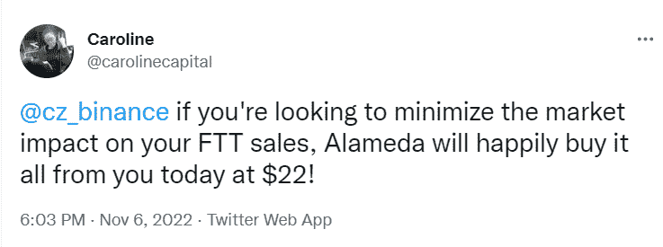
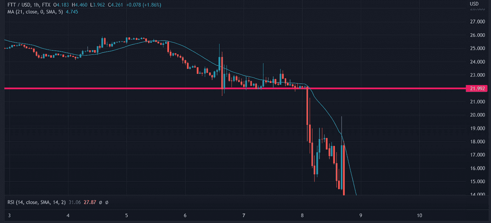
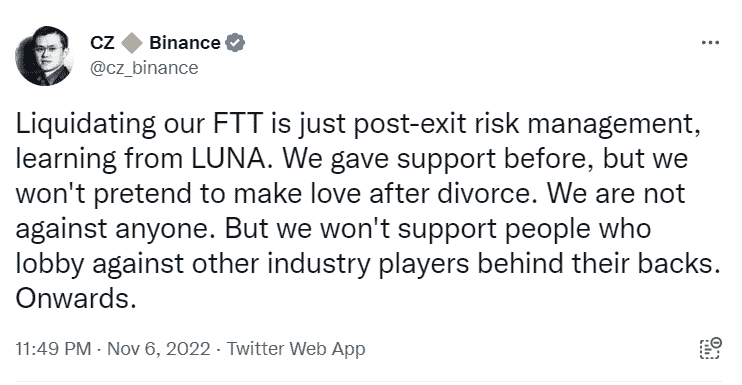
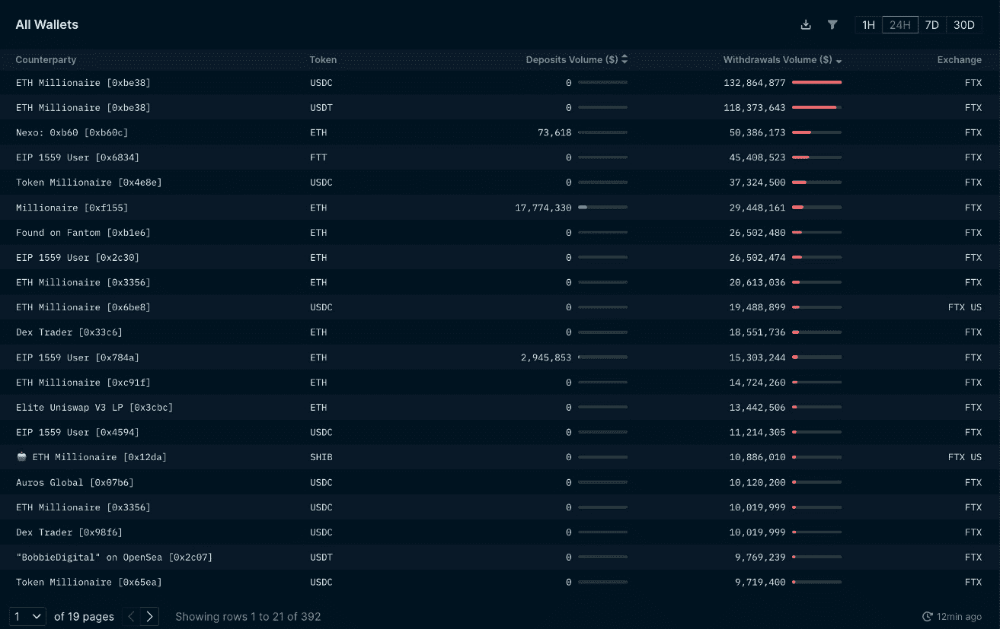
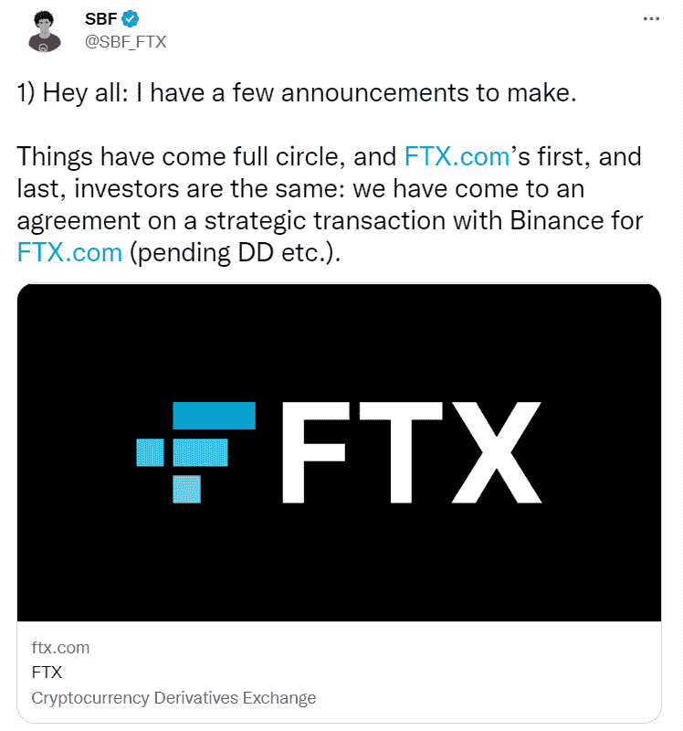

# 市场地址的状态:FTX 事件

> 原文：<https://medium.com/coinmonks/state-of-the-market-adress-the-ftx-incident-72117b1dd7a5?source=collection_archive---------17----------------------->

crypto 的另一个关键事件是，昨天在 Crypto Twitter 上观看展览的投资者见证了历史的创造。

又一个资不抵债事件，又一具集中交易所尸体。FTX 的资不抵债给市场带来了恐慌，由此产生的传染效应尚未完全显现。然而，熊完全控制了局面。

比特币和以太坊已经突破关键支撑位，DXY 的看涨趋势没有被打破:对未来价格行动来说是个坏消息。美国中期和 10 月 CPI 数据的结果可能会带来更多的市场不稳定。鉴于债券市场——金字塔的金融基础——的持续波动，风险资产的未来只有痛苦。

Photo by [K. Mitch Hodge](https://unsplash.com/@kmitchhodge?utm_source=medium&utm_medium=referral) on [Unsplash](https://unsplash.com?utm_source=medium&utm_medium=referral)

**世仇:币安& FTX**

CZ 是玩 5D 量子棋的冷血杀手；任何穿越 CZ 的人都会后悔。

币安已经签署了一份收购 FTX 的 LOI(意向书)，可能会支付提款要求并保证投资者资金的安全。FTX 昨日停止处理提款，当一家交易所无法偿还投资者时，这意味着他们对资金做了不该做的事情。

FTX 和阿拉米达之间投资者存款的混合导致了这一事件。

TLDR: Alameda Research 在其资产负债表上持有相当数量的 FTT(FTX 代币和非流动性资产)，CoinDesk 报告了这一弱点；CZ 抓住要害，开始了银行挤兑，现在 FTX 和阿拉米达一起破产了，CZ 突然出手收购了它:在这个过程中粉碎了他最突出的竞争对手之一。

**谁/什么牵涉其中？**

币安首席执行官 CZ

按交易量排名，币安是全球领先的交易所，在下一轮牛市中，它可能会成为全球首富。币安是加密领域的庞然大物，并在 2017 年真正崛起，这要归功于其本土令牌 BNB 的推出，以及其托管 ICOs(首次公开发行硬币)的发射台吸引了大量流动性。通常被认为是集中式交换在安全性和用户体验方面的黄金标准。

山姆·班克曼·弗里德(SBF)，阿拉米达研究和 FTX 公司创始人

SBF 在 2017 年成立了交易公司 Alameda Research，并在 2021 年的牛市中取得了巨大成功。随后，SBF 在 2019 年推出了 FTX，并迅速成为主流的集中交易所。两家公司之间的这种非正式联系随着最近的事件而被曝光，并导致了两家公司的倒闭。阿拉米达为 FTX 提供了早期流动性，并为其早期发展提供了动力。阿拉米达在 FTX 交易，用流动性支撑生态系统。

FTT 令牌，FTX 的公用令牌

这一事件的大部分可归咎于 FTT。FTX 创造了 FTT，这种代币本质上是跟踪交易所的投资者情绪。FTT 没什么用处，只能通过降低交易费用在 FTX 平台上实现更好的用户体验。

**背景幕**

SBF 最近一直在华盛顿大力游说，密码界普遍认为他的监管建议有利于 FTX，而牺牲了 DeFi 和其他竞争对手的利益。客户在 FTX 的存款被送到阿拉米达研究公司进行交易，这种资产的混合是危险的，会把两个实体都钉在十字架上。

Photo by [Aarón Blanco Tejedor](https://unsplash.com/@innernature?utm_source=medium&utm_medium=referral) on [Unsplash](https://unsplash.com?utm_source=medium&utm_medium=referral)

**故事**

CoinDesk 发布了一份关于阿拉米达研究公司资产负债表的报告。
【146 亿美元资产(36 亿美元解锁 FTT&【26 亿美元 FTT 抵押品】
】80 亿美元负债

FTT 是一种非流动性资产，市场无法承受 10 亿美元的清算。从资产中减去负债，再减去 FTT 余额，就会引起对偿付能力的担忧。阿拉米达还利用 FTT 抵押贷款。FTT 支撑了阿拉米达的资产负债表，使其极易受到市场波动的影响。

阿拉米达首席执行官卡罗琳在推特上谈论资产负债表。基金经理在推特上谈论资产负债表从来都不是好兆头。她声称阿拉米达仍然有偿付能力，这种力量的虚张声势通常出现在不确定时期。

CZ 公开宣布他正在清算 FTT 的 21 亿美元:暗示阿拉米达的破产。CZ 公开宣布他计划抛售 21 亿美元，他知道这个数字是市场无法吸收的，他用这条推文引起了广泛的恐慌。这个人冷酷无情。

卡罗琳出价 22 美元购买币安的全部 FTT 作品。投资者明白，22 美元代表着底线，如果 FTT 股价低于这个价格，阿拉米达就会资不抵债。

在 FTT 最终投降之前，阿拉米达用大量的买单捍卫了 22 美元的价格。至此，阿拉米达研究公司已经资不抵债。

在这场抛售狂潮中，CZ 进一步展开攻势。

与几个月前倒闭的由 Do Kwon 领导的庞氏骗局 LUNA 相比，显示了他的意图。他召集了整个秘密组织，鲜血在水中流淌。CZ 计划并确实消灭了 SBF、FTX 和阿拉米达的研究。

银行挤兑接踵而至，投资者从 FTX 撤出数亿美元。

阿拉米达开始将稳定币直接发送到 FTX 热钱包，该钱包支付用户提款。SBF 公开表示，FTX 有能力支付所有的撤资。然而，当 FTT 突破 22 美元支撑位时，这两个实体都死掉了。

FTX 停止撤军进程。显而易见，FTX 参与了阿拉米达投资者存款的逆向流动。

最后，SBF 在推特上说币安正在购买 FTX。

所有这些都发生在 11 月 6 日至 8 日之间。币安将对 FTX 进行审计，看看资产负债表上的窟窿有多大，看看它是否想继续下去。

**关闭思路**

任何在 FTX 拥有资产的人都有理由感到紧张。任何持有 FTT 的人都看到他们投资组合的价值大幅缩水。现在的问题归结为传染。有多少实体暴露于 FTT，在 DeFi 中有多少 FTT 被用作抵押，有多少清算将会发生？

任何接触到 FTX 或阿拉米达研究的团体都会受到重大打击。大多数人的目光停留在索拉纳的本土 token SOL 上，SOL 构成了阿拉米达资产负债表的一大部分。数以百万计的溶胶目前正在拆解，看起来准备冲击公开市场。

另一波黑天鹅冲击波席卷了市场，推低了资产价格。对于 crypto 来说，可预见的未来看起来令人难以置信的暗淡，生态系统需要几个月才能恢复。此外，它给监管者提供了大量弹药。当投资者无法撤回资金，他们的资本处于危险之中时，监管机构就可以制定全面的、通常是不了解情况的“安全”法律。

加密空间的另一天。

> 交易新手？试试[加密交易机器人](/coinmonks/crypto-trading-bot-c2ffce8acb2a)或者[复制交易](/coinmonks/top-10-crypto-copy-trading-platforms-for-beginners-d0c37c7d698c)