# 市场状况:指数和指标(2022 年 7 月 16 日)

> 原文：<https://medium.com/coinmonks/state-of-the-market-july-16-2022-indexes-and-indicators-9c68423571c0?source=collection_archive---------21----------------------->

## 这是虚假的希望吗？还是市场知道一些我们不知道的事情？

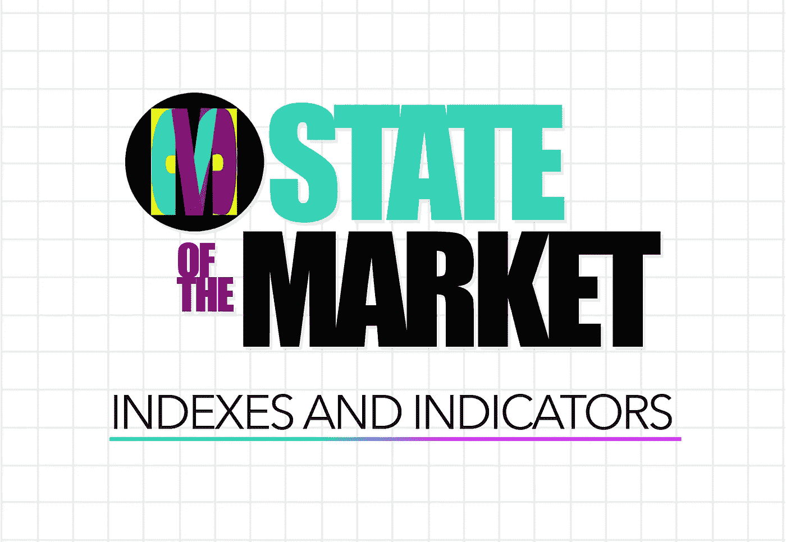

# 我的想法

从短期来看，我确实喜欢我所看到的。指数中有很多潜在的底部，这意味着，如果我们能够继续持平，我相信很多强势股可以在短期内走高。

而且我认为，在下一次 CPI 通胀数据出来(8 月 10 日)之前，我们还有三周多的时间。所以我认为在那之前我们会得到喘息的机会。

然而从长期来看，情况并不乐观。我认为我们正处在悬崖边上。市场希望上涨，我相信它将开始上涨，并希望下一个通胀数据最终显示整体和核心 CPI 都呈下降趋势，而不只是一个或另一个。

如果我们得到一个较低的通货膨胀率，我认为我们可以继续反弹，如果不是，那么我相信低点还没有到来，我们将进一步走低。

随着如此多的经济动荡和全球动荡，负面消息可能真的会迅速堆积，并给市场带来更多的悲观情绪。

但人们希望在这里充满希望，我只是认为这将取决于美联储现在所做的是否真的奏效，或者他们是否仍然过于软弱，市场和世界将不得不适应更加鹰派的美联储政策——以及加息。

说到这里，让我们来看一些图表。

# 市场指数

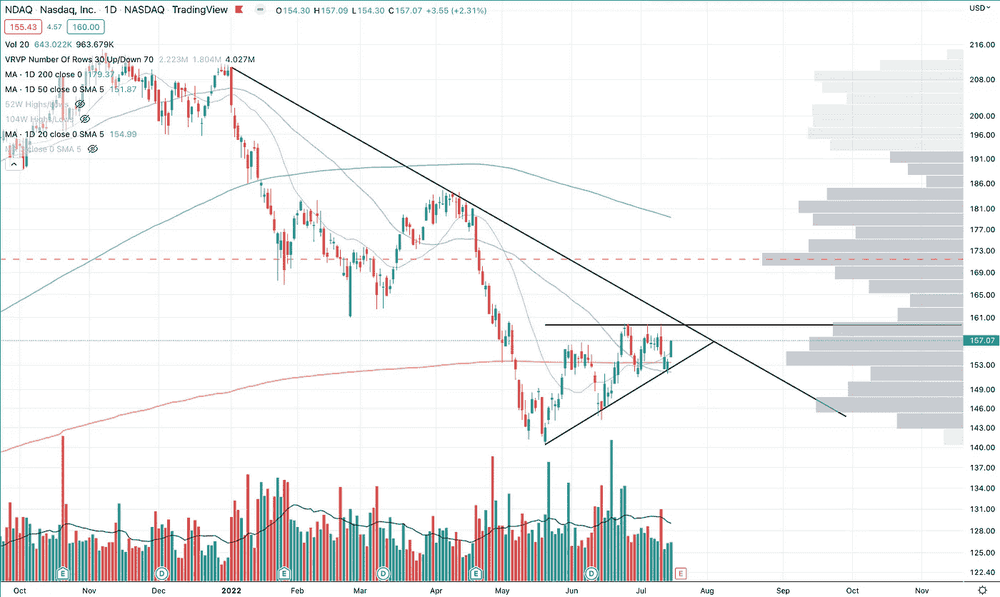

**ndaq——纳斯达克综合指数**
——形成楔形
——50 日均线上方
——200 日均线下方
🟡**|持平趋势|** 🟡

我要用黄灯给 NDAQ 打分。然而，如果我们能够突破并保持在 160 点以上，那对我来说将是一个绿灯，市场趋势将继续走高，即使只是短期的。

我们正在进入这个楔形区域，所以我相信市场可能会以一种或另一种方式走出这个区域，尽管不一定。

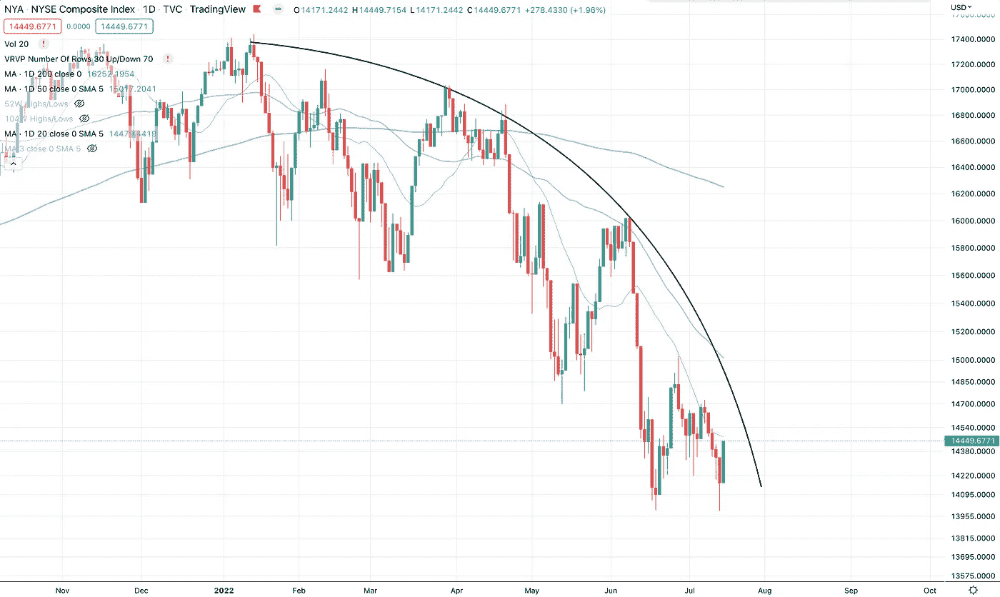

**纽约证券交易所——纽约证券交易所综合指数**
——低于所有主要移动平均线
🔴**|强势下跌趋势|** 🔴

纽约证券交易所的下跌趋势令人厌恶。老实说，这让我害怕，这种下降趋势看起来仍然非常强劲。这里的希望是，我们得到一个非常强劲的下跌反弹，或者我们开始趋势持平。

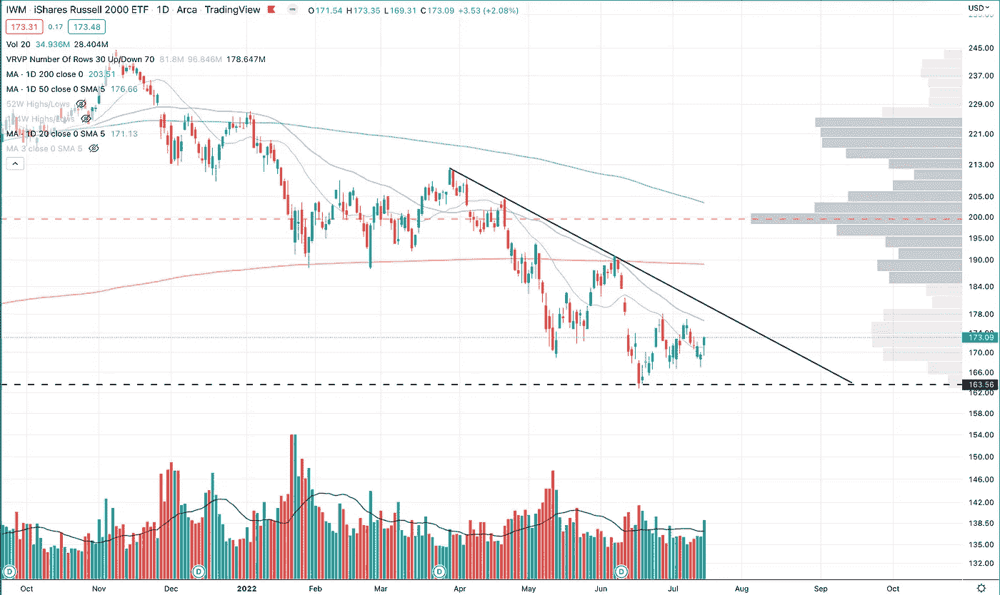

**IWM——罗素 2000**
——20 日均线以上
——50 日和 200 日均线以下
🔴**|趋势下跌|** 🔴

小盘股也表现不错，但仍低于 50 日线。希望能突破 50 天。

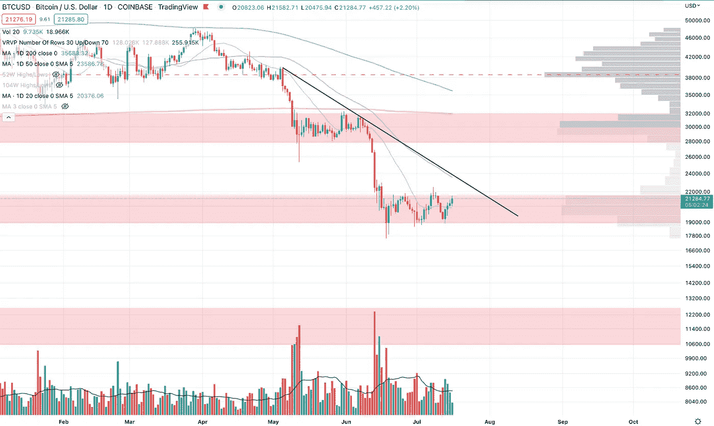

**BTCUSD —比特币**
—通道
—20 日均线以上
—50 和 200 日均线以下
🔴**|持平趋势|** 🔴

如果 BTC 能保持这个水平，或者甚至保持不变，让 50 天赶上来，那将会很有趣。这将是强劲的，特别是如果 BTC 和 NDAQ 都保持并开始上升。

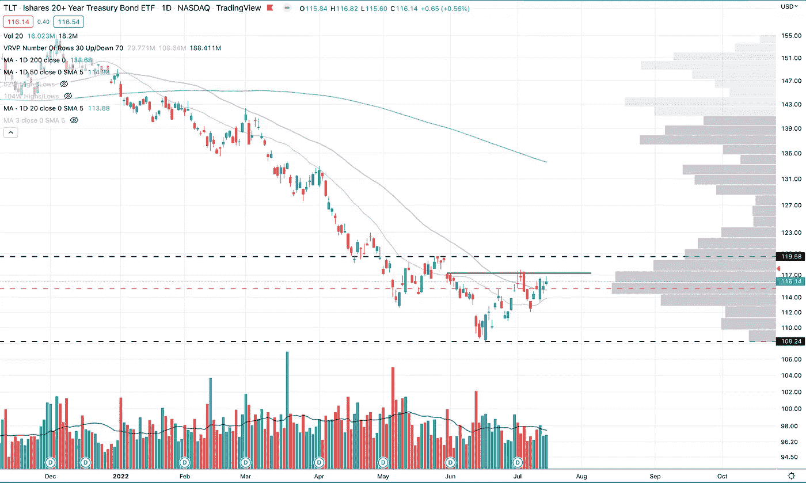

**TLT — 20 年期债券**
—楔入
—20 日和 50 日均线以上
—200 日均线以下
🟡**|持平趋势|** 🟡

如果底部实际上是债券，那是另一个好迹象。然而，从我们刚刚看到的通胀数据来看，如果债券没有进一步下跌，我会感到惊讶。

即使他们能在下一次加薪中保持不变，这也将显示出他们的强大实力。

# 市场指标

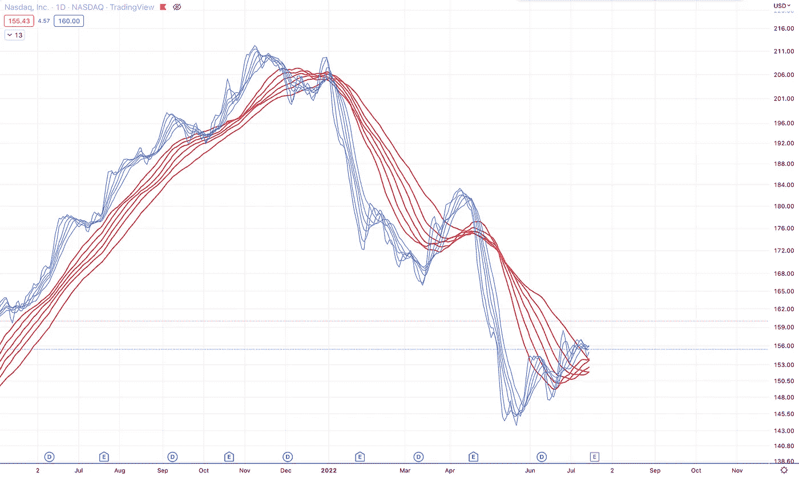

**ndaq——慢速和快速移动平均线**
——见顶
🟢**|上移|** 🟢

NDAQ 移动平均线正在进入看涨形态。本周，如果我们能够突破 NDAQ 并获得更多上行，我们可能会迎来一轮漂亮的反弹——熊市是否结束是一回事，但获得一些好的反弹交易可能是值得关注的事情，如果我们还没有这样做的话。

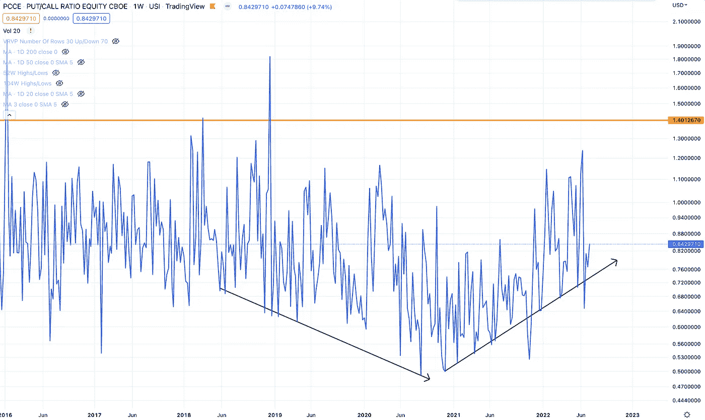

**PCCE —看跌看涨期权比率**
—上移
🔴**|看跌趋势|** 🔴

卖出/买入比率仍在上升。如果我们看一下更广泛的趋势，2018 年至 2020 年，它们呈下降趋势，现在它们呈上升趋势，大多是更高的高点和更高的低点。这种恐惧已经慢慢到来了一段时间，而且似乎仍然倾向于更多的恐惧。

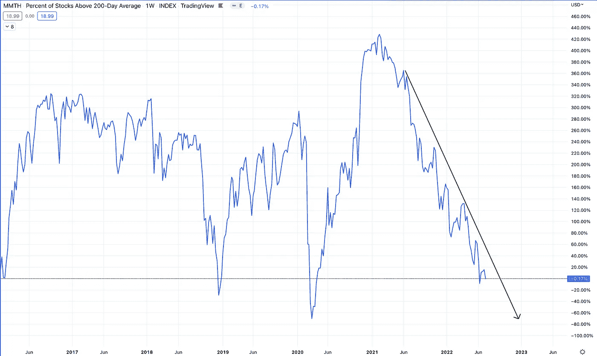

**MMTH——200 日均线以上的股票**
——仍在下跌
🔴**|趋势向下|** 🔴

仍有更多股票跌破 200 天移动平均线。本周我们向下移动，而不是向上。

# 经济标志

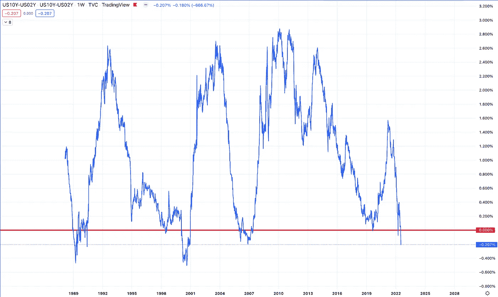

**US10Y-US02Y — (10 年- 2 年)收益率曲线**
—反转
🔴**|倒置|** 🔴

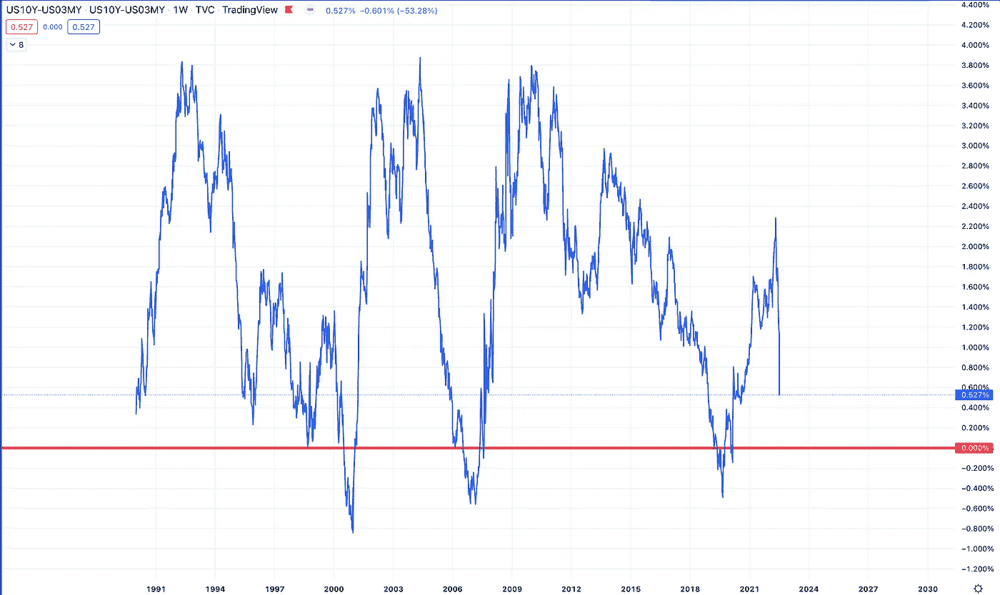

**US10Y-US03M — (10 年- 3 个月)收益率曲线**
—走向反转
🟡**|下跌趋势|** 🟡

许多经济学家将这一 10 年期、3 个月期收益率曲线作为即将到来的衰退的更好迹象。这种趋势正急剧逆转，这是衰退的一个非常糟糕的迹象。

> 交易新手？尝试[加密交易机器人](/coinmonks/crypto-trading-bot-c2ffce8acb2a)或[复制交易](/coinmonks/top-10-crypto-copy-trading-platforms-for-beginners-d0c37c7d698c)

**总体 CPI 通胀** 【同比+1.3%】
🔴 **|整体通胀上升|** 🔴

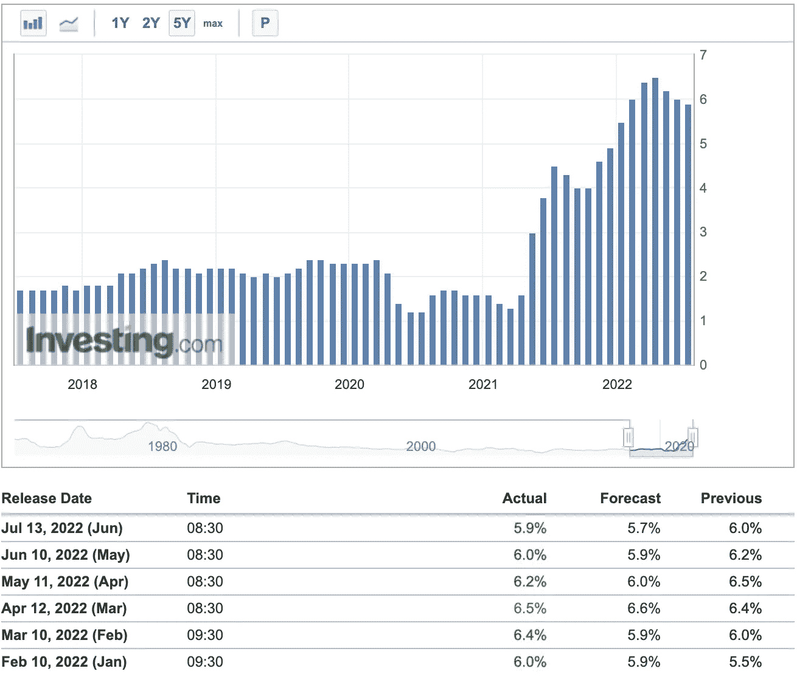

**核心 CPI 通胀** 环比下降. 1%
🟡**|潜在通胀最高|** 🟡

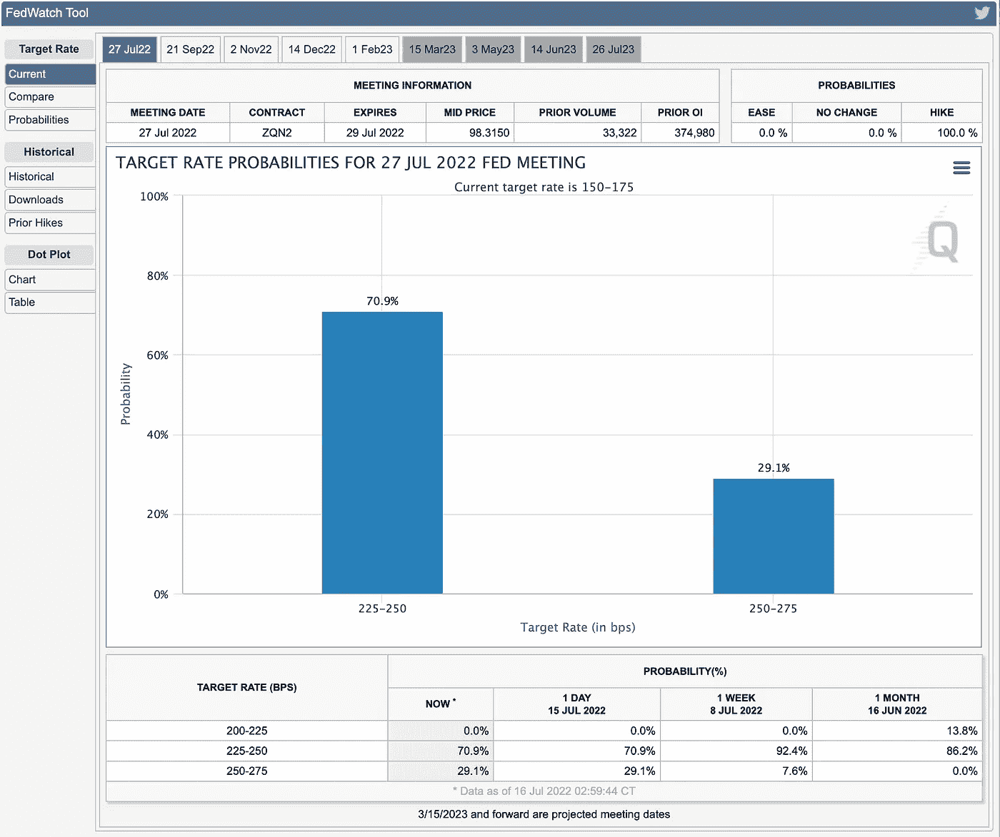

**即将到来的加息** ——市场预期加息 0.75%或更多
🔴 **|利率上行|** 🔴

—

就是这样。你看到了什么？你喜欢这里的什么？你在担心什么？让我知道下面，我很想听听你在想什么。

—

另外，你可以在这里阅读我的市场分析和更多关于当前市场的信息

[市场状况:概述—指数和指标](/coinmonks/state-of-the-market-july-16-2022-indexes-and-indicators-9c68423571c0)

[P2 市场现状:行业、交易所交易基金、大宗商品等](/coinmonks/state-of-the-market-sectors-etfs-commodities-and-forex-july-16-2022-2a204b5b580d)

[本周我最关注的股票](https://growthstocks.medium.com/stocks-to-watch-biotech-ev-and-more-july-17-2022-c19cb377327)

**—**

**由每日交易冠军赞助——有史以来最伟大的交易者免费提供每日交易灵感和动力。**

**现在就报名吧—**[**TradingChampionsDaily.com**](http://tradingchampionsdaily.com/)

> 加入 Coinmonks [电报频道](https://t.me/coincodecap)和 [Youtube 频道](https://www.youtube.com/c/coinmonks/videos)了解加密交易和投资

# 另外，阅读

*   [密码交易机器人](/coinmonks/crypto-trading-bot-c2ffce8acb2a)|[15 大 P2E NFT 游戏](https://coincodecap.com/p2e-nft-games)
*   [币安期货交易](https://coincodecap.com/binance-futures-trading)|[3 commas vs Mudrex vs eToro](https://coincodecap.com/mudrex-3commas-etoro)
*   [如何购买 Monero](https://coincodecap.com/buy-monero) | [IDEX 评论](https://coincodecap.com/idex-review) | [BitKan 交易机器人](https://coincodecap.com/bitkan-trading-bot)
*   [尤霍德勒 vs 科恩洛 vs 霍德诺特](/coinmonks/youhodler-vs-coinloan-vs-hodlnaut-b1050acde55a) | [Cryptohopper vs 哈斯博特](https://coincodecap.com/cryptohopper-vs-haasbot)
*   [顶级付费加密货币和区块链课程](https://coincodecap.com/blockchain-courses)