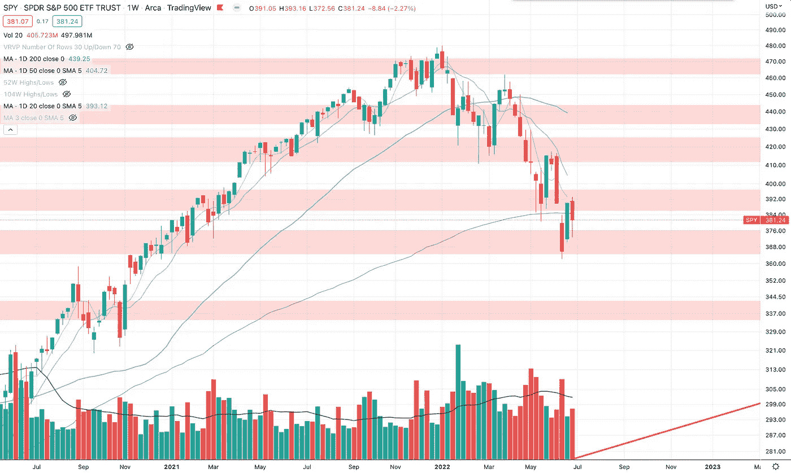
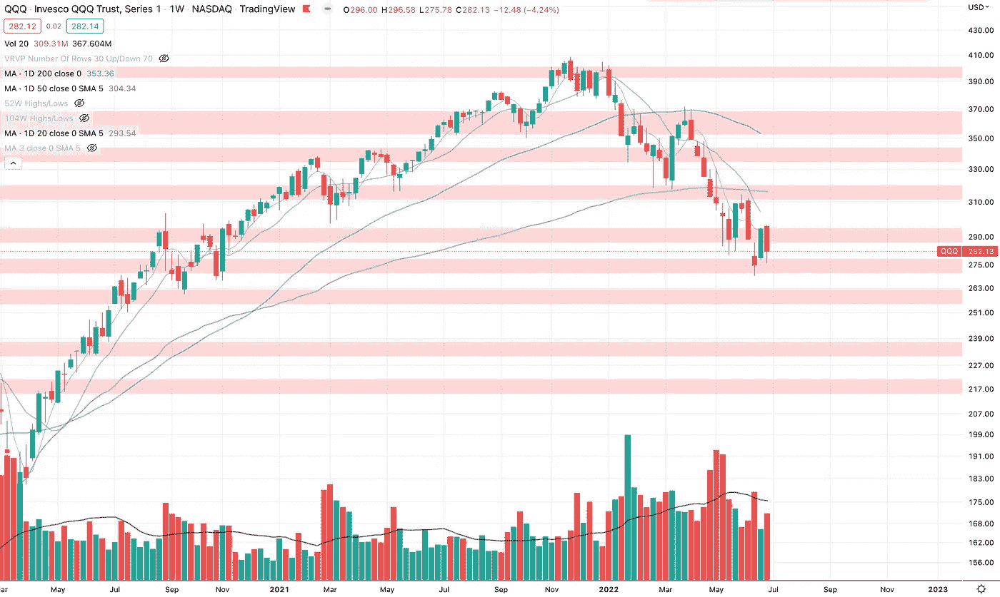
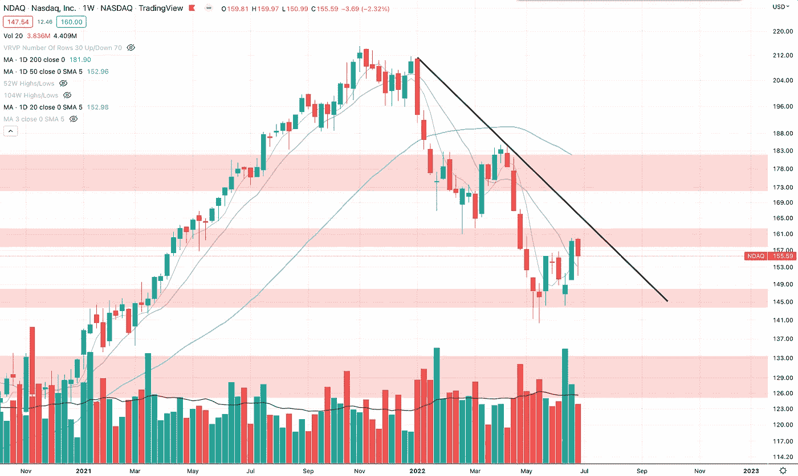
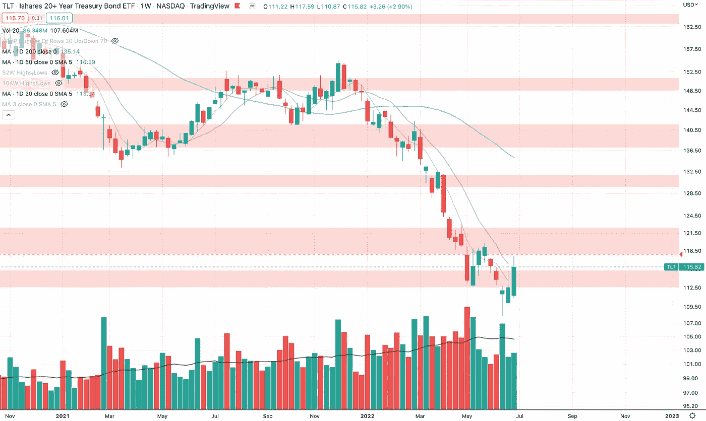
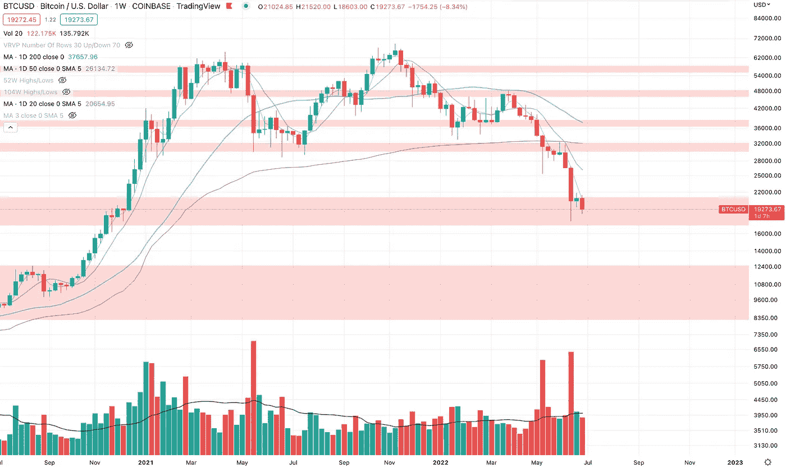
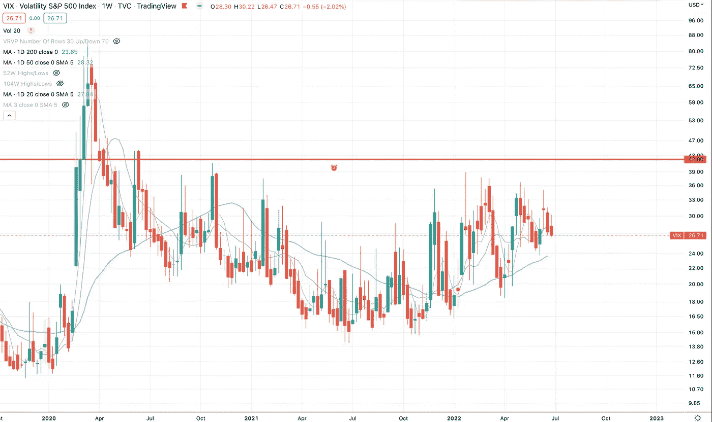
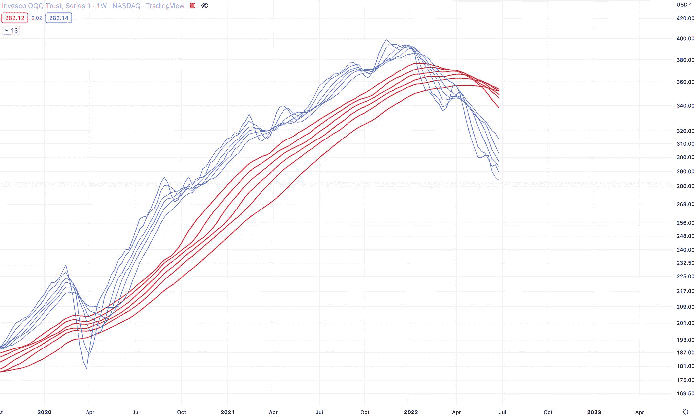
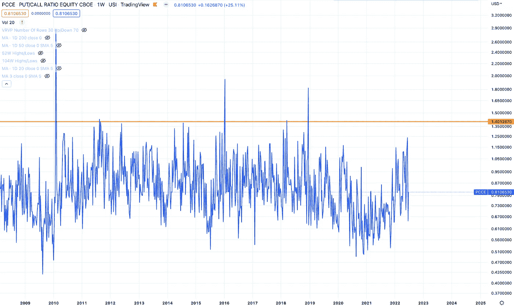
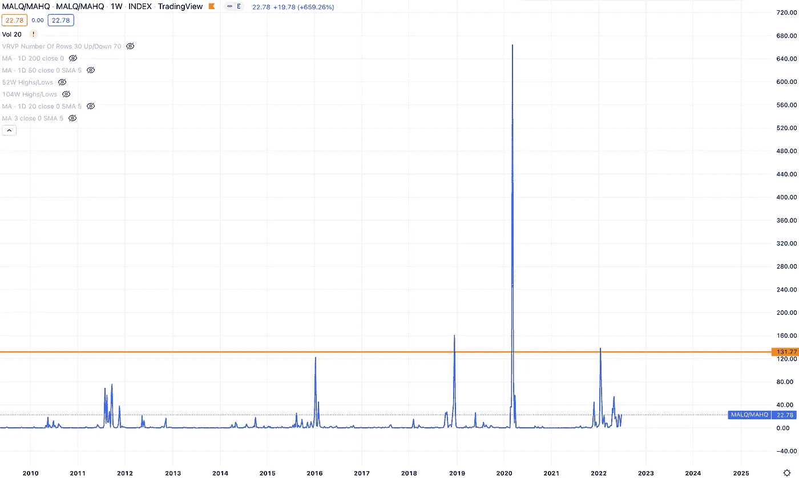
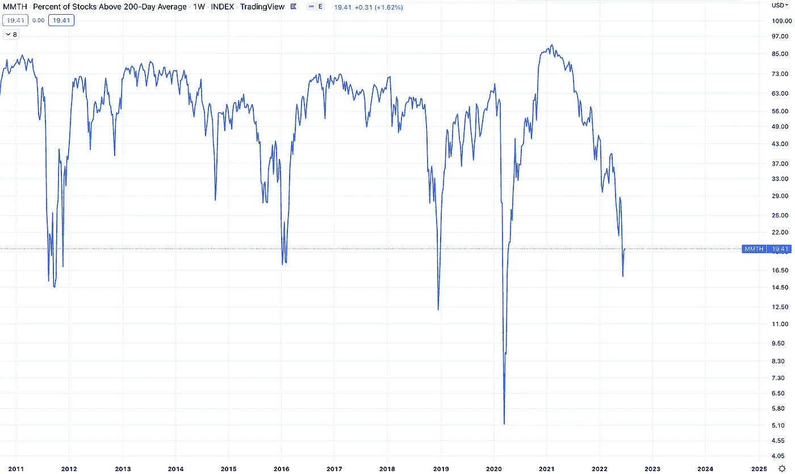

# 市场状况—7 月 2 日—指数和指标

> 原文：<https://medium.com/coinmonks/state-of-the-market-july-2-indexes-and-indicators-fef30409842c?source=collection_archive---------43----------------------->

## 让我们来看看本周市场告诉我们什么。

本周，情况看起来依然黯淡。太紧张了，不能开始做空，不确定性太大，不能做多。日内交易的潜在好市场，这不是我的游戏。

我在等待一个好的反弹来做空，或者等待经济因素发生变化，开始朝着积极的方向发展，然后再做多。

我认为，为了获得强劲的反弹，我们需要人们获得方向信心，然后有一个没有人在等待的惊喜。上行或下行。到目前为止，似乎每个人都非常自满，以至于市场上什么都没有发生。

我也认为大的钱被检查出来。因此，如果在此之前没有任何重大变化来吸引大笔资金的话，可能在 8 月或 9 月左右情况会有所好转。

如果股市出现反弹，本周我可能会开始寻找我想做空的股票。

# 指数

SPY (Weekly)

间谍仍处于下降趋势。

QQQ (Weekly)

QQQ 仍处于下降趋势。

NDAQ (Weekly)

NDAQ 看起来在双底上找到了一些力量。这将是有趣的，看看这是否能保持平稳或向上移动，停留在 140 区域上方。

但仍高于 50 天。

IWM (Weekly)

IWM 也持有前 covid 高。如果这种情况持续下去，这是底部到来的另一个潜在迹象。但是现在看起来希望渺茫。

TLT (Weekly)

TLT 也有可能触底。我认为债券市场正等着看下一次通货膨胀会是什么样子。如果事情朝着正确的方向发展，底部可能就在，如果通胀继续保持高位或走高，如果债券有更多的下行空间，我不会感到惊讶。

就坐在第 50 天。

BTCUSD (Weekly)

比特币努力避免被吸进 12.5k 区域。如果 BTC 能保持在 17k 以上，这是风险资产和潜在底部的另一个好迹象。

# 指示器

VIX (Weekly)

本周 VIX 没什么动静。

QQQ MA (Weekly)

周 QQQ 移动平均线仍然强劲下降。

Put/Call Ratio (Weekly)

看跌/看涨期权比率本周有所回升，但位于较低区域。我认为这种情况需要停止，人们需要明白他们已经购买了太多的保护，这开始是浪费金钱。那么也许我们会得到一个不利的惊喜。

52 Week Lows/52 Week Highs (Weekly)

没有大的变化。52 周低点仍多于高点，但没有大的波动。

Stocks Above/Below 200 Day (Weekly)

低于 200 天平均线的股票仍在缓慢下跌。看起来这个市场想要用时间来消磨人们，而不是直接的恐惧。这意味着更长的熊市。

—

这么无聊的市场。现在即使做这些评论也很无聊。大资金出局了。

我看到的一件事是，当我们有一个跟进日时，似乎我们会看到一些股票快速突破，并持续几天。

所以下一个跌破底部的一天，我将测试这个理论，采取一些突破动作，试图赚几美元。如果这行得通，这可能是一个好策略，因为我认为在熊市结束之前，我们会有很多失败的跟进日。

> 交易新手？试试[加密交易机器人](/coinmonks/crypto-trading-bot-c2ffce8acb2a)或者[复制交易](/coinmonks/top-10-crypto-copy-trading-platforms-for-beginners-d0c37c7d698c)