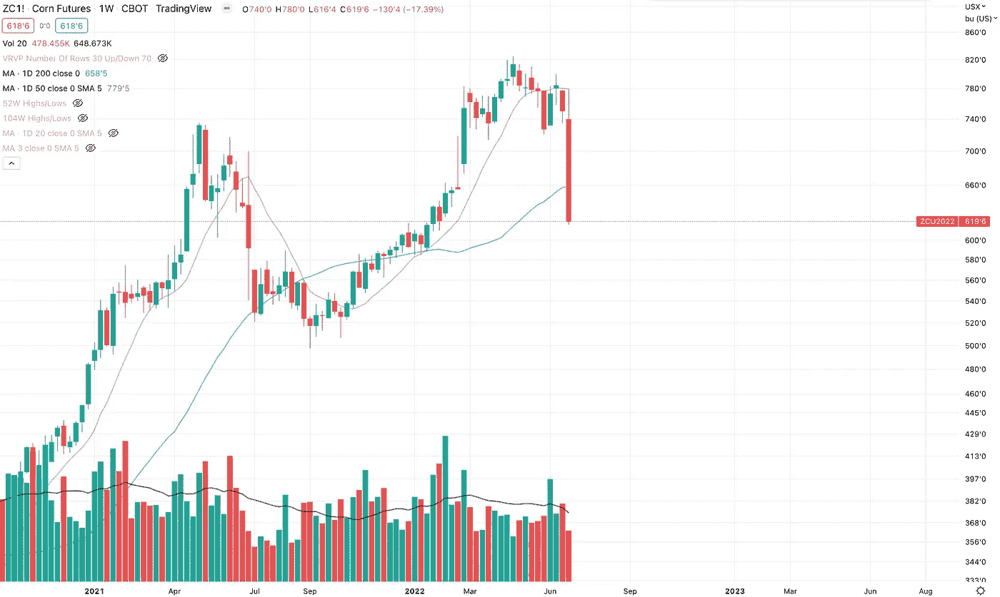
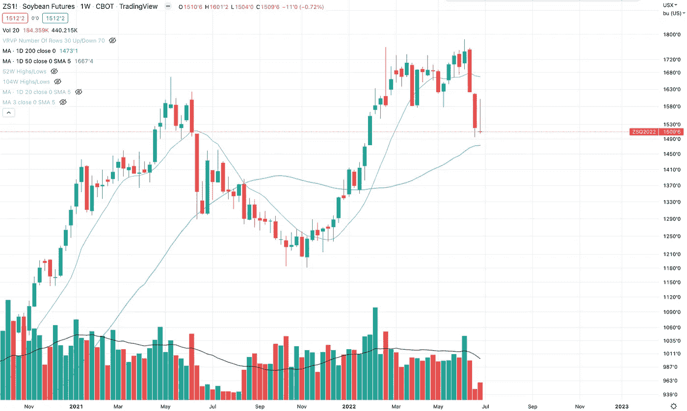

# 市场状况—7 月 2 日—行业、交易所交易基金、大宗商品和外汇

> 原文：<https://medium.com/coinmonks/state-of-the-market-july-2-sectors-etfs-commodities-and-forex-b6c5cd350270?source=collection_archive---------42----------------------->

## 看看市场的其他部分

# 概观

除了石油和天然气类股有所下跌之外，市场板块没有太大变动。

但如果你从事大宗商品，那就好办了，普通商品名称的大幅波动意味着，如果你的方向正确，就能赚大钱。

# 行业和交易所交易基金

**半导体-**

本周在低交易量上大幅下跌。

**太阳能-**

太阳能仍然保持强劲！

**锂和电池技术-**

仍然保持在 50 日上方，但本周趋势线大幅下跌。我们会看到这种情况的发展。

**生物技术-**

生物技术依然坚挺，一路回升至本周基本不变。在如此疲软的市场中，这是非常强有力的信号。

**医疗保健-**

医疗保健也显示了实力，是现在藏钱的好地方。

**石油和天然气-**

石油和天然气正处于一个有趣的十字路口。坐在这条趋势线上。

就我个人而言，如果这只是弱手的一次洗牌，我们会走高，我不会感到惊讶，主要是因为油价如此之高，除非油价开始大幅下跌，否则我看不出石油和天然气不会继续走高的理由。但我认为，在这个行业中，有太多弱手，市场需要摇动这棵树。

当它变得太明显时，波动性就很难出现。

**实用程序-**

公用事业显示实力所以，人们试图把钱藏在无聊又安全的地方。这不是熊市结束的好迹象。

**中国-**

中国看起来将会保持这种新趋势。似乎只有当价格下跌时，人们才会害怕中国，一旦价格上涨，他们就会回到中国？我们将拭目以待这是否会有好结果。

# 商品

**原油-**

仍然保持这种向上的，不稳定的趋势。

**天然气-**

又是一个下跌周，但似乎仍保持这种上升趋势，并停留在 200 日线以上。临界点。

**白银-**

西尔弗的崩溃开始变得恶性。

**木材-**

木材看起来将开始回升，并在这个巨大的通道中保持不变。实际上，这可能是一个好迹象，表明房屋建筑商还没有面临倒闭的危险……目前还没有。

**铜-**

当经济衰退有可能发生时，大宗商品会受到冲击，尤其是铜。铜价继续大幅下跌。

**小麦-**

需求破坏的另一个迹象。小麦价格一落千丈。

**玉米-**

本周玉米价格疯狂上涨。更多需求破坏？

**大豆-**

看起来他们想在这周提升，但是被拉低到基本不变。可能是大豆走强的一个强烈信号。

# 外汇

**DXY-**

这是自 2002 年以来的最高周收盘价。面对全球经济衰退，美国利率上升，以及其他主要国家面临高通胀，美元仍然有需求。

**美元兑日元-**

压力很大，成交量很大，但没有上升，这看起来像一个顶部？

这里面有这么多钱吗？如果它开始被套住，多头就必须卖出，增加下行压力？美元兑日元似乎是“显而易见的”外汇交易，所以我认为这里有很多容易赚到的钱等着被套牢。

这是我将关注的短线交易。

—

如果你正在交易商品或石油和天然气股票，过山车是活生生的。

我仍在密切关注生物技术，如果它保持强劲，那么当我开始在主要数据中看到一些经济变化时，我预计生物技术将成为下一轮牛市的新领导者。留意那个。

> 交易新手？试试[密码交易机器人](/coinmonks/crypto-trading-bot-c2ffce8acb2a)或[复制交易](/coinmonks/top-10-crypto-copy-trading-platforms-for-beginners-d0c37c7d698c)