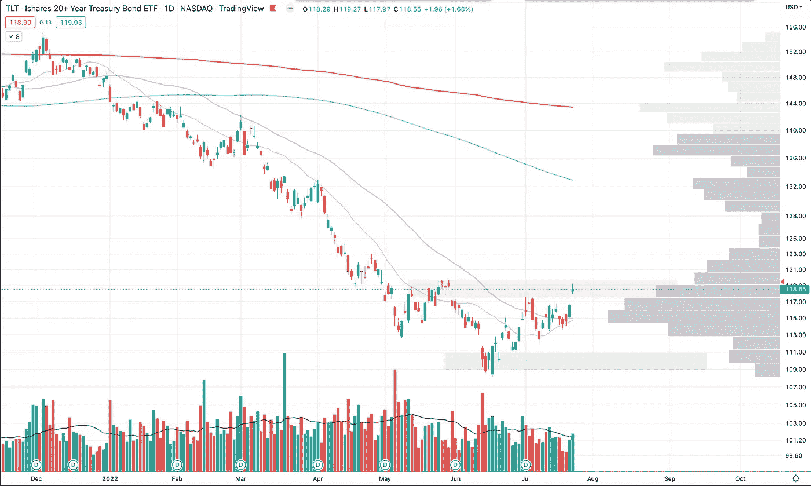
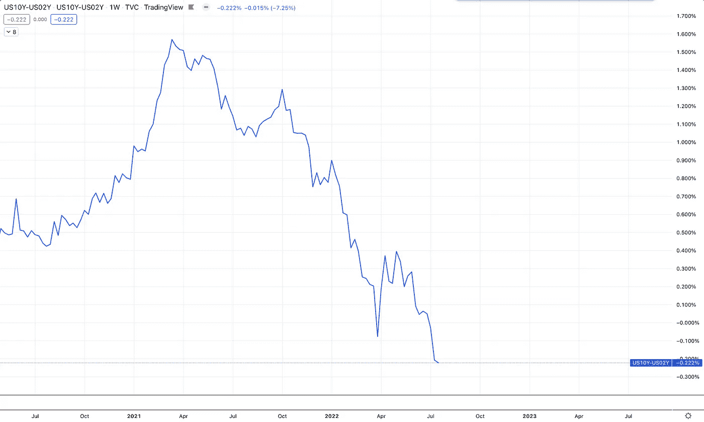

# 市场状况(2022 年 7 月 23 日)

> 原文：<https://medium.com/coinmonks/state-of-the-market-july-23-2022-e8bc2fef76c1?source=collection_archive---------22----------------------->

## 这就是市场，急切地希望 7 月份通胀率下降…

让我们回顾一下本周发生的事情，以及市场目前的状况，然后我会在最后给出我的想法。

# 市场指数

现在让我们来看看。

QQQ —刚从这个补给区反弹回来，也在 covid vwap 之前的附近。50 天以上。20 日即将越过 50 日，这将是一个短期看涨信号。寻找这个解决方案，然后在这个供应区/vwap 区进行另一次运行，运行到 200 天。

SPY——突破 vwap 和 50 日线。那么看起来我们对之前的供应区域(绿色)进行了微弱的重新测试。QQQ 的表现一直好于 SPY to the upside，这是一个风险回归的看涨信号。期待突破 400 点(正是我们反弹的位置)并在下一个供应区 410 点附近运行。

IWM——突破了我们的趋势线和之前的供应区。希望保持这种趋势，并在下一个供应区走高，这也与 precovid vwap 一致。现在 50 天以上。

比特币——看起来它突破了我们的趋势线和 50 天，然后一直沿着这两条作为支撑。这个周末，我们将看看它是否能保持，然后也许会运行到这个 29k 区域。我也希望在这两个区域之间形成另一个区域，这将是一个看涨的信号，如果我们开始向下移动，将提供更多的支撑。

TLT——位于我们的供应区。现在实力在 50 天以上。看能不能破更高。

# 指示器

虽然指数显示了一些底部正在形成的迹象，但市场指标仍然显示恐惧是粘性的，整体市场倾向于看跌。

VIX——波动性仍处于上升趋势。希望看到这一突破，并保持在趋势线以下。

动——债券的波动性仍处于上升趋势。希望看到这一突破，并保持在趋势线以下。

QQQ 移动平均线——快速移动平均线在日线上开始突破，这是一个短期看涨信号。

QQQ 移动平均线——周线仍处于下降趋势，但看起来会向上卷曲。

看跌/看涨比率——看跌期权本周回升，因此随着市场上涨，趋势仍然是卖出这些向上的市场走势。看跌。

看起来 52 周低点对 52 周高点的股票数量正在增加。低于 52 周低点，高于 52 周高点，是看涨信号。我们将会看到这种趋势是否开始回到看涨的方向。

股价在 50 日均线上方看起来像是做了一次大的跳跃，看这是否能继续向上的趋势。

更重要的是，股票在 200 日线以上，看这个。仍处于下降趋势。我没有让强烈的恐惧降低，但如果我们真的在升高，并开始一个新的上升趋势，那就是看涨。

收益率曲线——10 的 2 仍然是反向的。

收益率曲线——10s-03M 的收益率曲线正在向反转方向俯冲。不好！

恐惧正逐渐从市场中消失。

# 部门

音量很低。这使得所有这些趋势都容易受到相反方向的重大转变的影响。然而，趋势似乎是全面看涨，本周大多数行业都出现大幅上涨。然而，大多数行业仍处于下降趋势或持平趋势。

本周技术可能已经打破了趋势。

能量保持不变。

# 交易所交易基金

太阳能似乎无法打破这条趋势线。

网络安全部门进入了补给区，但没能守住。

生物技术很好地控制了这个领域。真正的考验将是下一个上涨区域，主要供应区域和 200 日交汇的地方。

制药行业看起来也很乐观。由于这两个领域都表现良好，这仍然是市场中最乐观、风险最大的领域。让我们看看我们是否能超过 200 天。

住宅建筑商的这一举动非常强劲。与目前的说法相比，市场对房屋建筑商的看法可能会有所不同。

中国看上去想要逃跑，但遭到了拒绝，此后又朝着另一个方向艰难前行。围绕中国的叙述变得非常悲观。

# 商品

黄金在坚守阵地。

原油中大量的犹豫不决。守住这个 200 天的需求区域。看起来它有一些麻烦。看看这是否会跌破低点。

天然气在第 200 天做了一个急转弯，然后又回到了相反的方向。

白银弱势守住这个关键区域。

铀弱地把持着这个关键区域。犹豫不决。

木材转回来。看这是否会跌破这个多年需求区。

铜看起来保持不变。“智能”商品，如果在这里成立，可能会告诉我们，衰退现在已经被消化了。

小麦继续下跌。

玉米落入这个需求区。

大豆价格仍在下跌，但看起来会有所放缓。

# 外汇

主要故事仍然是美元。美元交易量巨大。想看看这个会不会坏掉。

美元/日元似乎仍然坚挺。

# 我的想法

这里看不到任何明确的领导者。市场继续在底部反弹股票，然后痛击它们，并在底部股票的新领域开始反弹。

我希望看到更多的股票超过 200 日平均线，这将是我关注的下一个信号。此外，一般来说，我希望看到一些高质量股票的突破。

然而，风险重返市场是一个好迹象，这可能是我们让市场回到强劲牛市趋势所需的初始支撑。

围绕全球和国家衰退的令人沮丧的谈话令人沮丧。不过，市场看起来正朝着看涨趋势发展。我的想法是，市场继续上涨，预计 7 月份的通胀数据将会下降(我认为是 8 月 10 日的数据)。

如果低于这个水平，那么我认为市场底部已经到来。

如果月环比上涨，那么我认为我们会看到另一次底部测试，甚至是另一次下跌，情况会变得非常糟糕。

我们会看到的！市场只是测试假设的一个平台，这就是我现在看到的正在测试的假设。

我短期看多，我正在寻找将一些资金投入交易的方法。然而，我的预期是，这是一个短期的变化，更多的是熊市反弹，而不是牛市转向。但我也相信市场并不完全知道这是什么，所以它将进行熊市反弹，希望它成为牛市上涨趋势。

在这一点上纯粹是犹豫不决。

谢谢！请在下面的评论中告诉我你的想法。

> 交易新手？试试[加密交易机器人](/coinmonks/crypto-trading-bot-c2ffce8acb2a)或者[复制交易](/coinmonks/top-10-crypto-copy-trading-platforms-for-beginners-d0c37c7d698c)