# 市场状况—7 月 9 日—指数和指标

> 原文：<https://medium.com/coinmonks/state-of-the-market-july-9-indexes-and-indicators-b6df41cc07a8?source=collection_archive---------34----------------------->

## 低量反弹能否持续？

# 我的想法

本周，beat down high beta 强劲反弹，领涨大盘，纳斯达克和小盘股显示出一些触底迹象。

债券价格回落对利率来说不是一个好兆头，这意味着通胀担忧。

这种反弹看起来是熊市反弹，成交量很小，但对于似乎已经过度扩张的下行压力来说，这是一种必要的喘息。尽管任何事情都有可能发生，但我预计反弹还将持续一周左右，在熊市迫使我们回落之前，市场情绪将再次变得乐观。

然而，如果导致熊市的一些经济因素开始缓解，我们可以看到底部和新一轮牛市的开始。我认为市场仍不确定，正在等待本月晚些时候的通胀数据。

所以我短期内会向上走。然而，我在这一周为自己定位，因为我一直在期待它。我做的交易大部分还在进行，如果市场下跌，我要么等着它们结束，要么被踢出去。

我最大的想法是等待一个强劲的熊市反弹，让我们在 SPY 上再上涨 5-10%，然后寻求做空。然而，一路上涨到 200 天也是可能的，所以我会寻找上升势头变化的明显迹象，如果我在整合后没有得到一个稳定的进入，那么我宁愿错过现在的交易，而不是承担不必要的风险。

在真正的牛市开始出现之前，我不会大举交易。每周只是更多的准备，等待抓住下一轮牛市的开始。可能是几天，也可能是几年，但是为那一刻做好准备对我来说就是现在。

# 市场概述

**间谍**

间谍坐在一个重要的阻力位上，还会遇到 50 日均线。如果我们能在这里一直跑下去，那将会很有趣。随着看跌情绪似乎被抛售耗尽，市场情绪似乎变得更加乐观。

我希望这种反弹能够继续，一切皆有可能，但我预计在我们再次变得悲观之前，我们需要一个低量的熊市反弹。

除非这些负面市场如通货膨胀、利率等。开始显示一些回调的迹象，我假设这些反弹是熊市反弹，而不是牛市的变化。

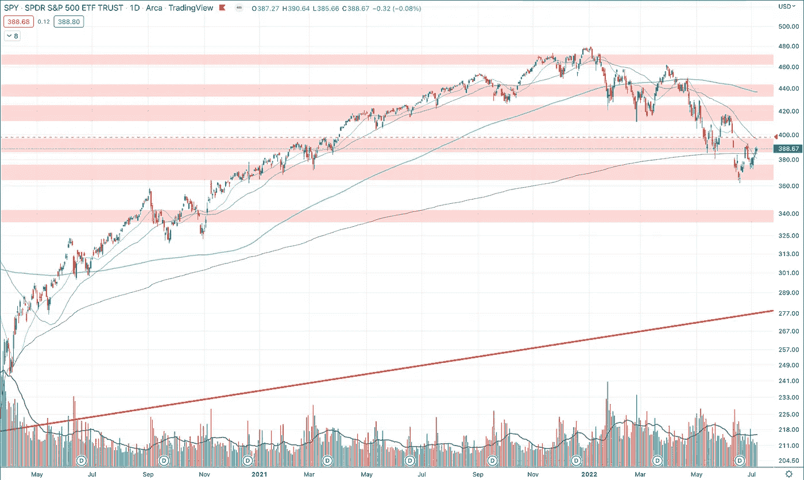

**QQQ**

由于科技股和贝塔股的上涨，QQQ 本周的涨势比 SPY 更强。

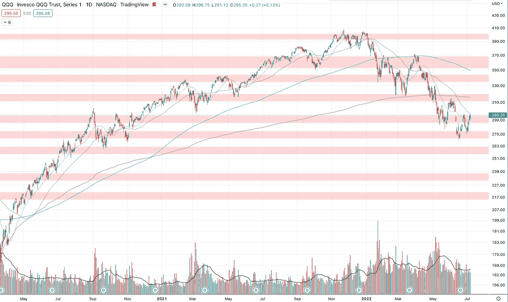

**NDAQ**

纳斯达克确实显示出了一些实力。它看起来已经触底，正在形成一个强大的基础。当主要指数下跌时，纳斯达克有一个更高的低点，一个更高的高点。我们将会看到它是否能达到另一个更高的高度。这是市场中真正的积极信号，是我们可能已经触底的潜在信号。

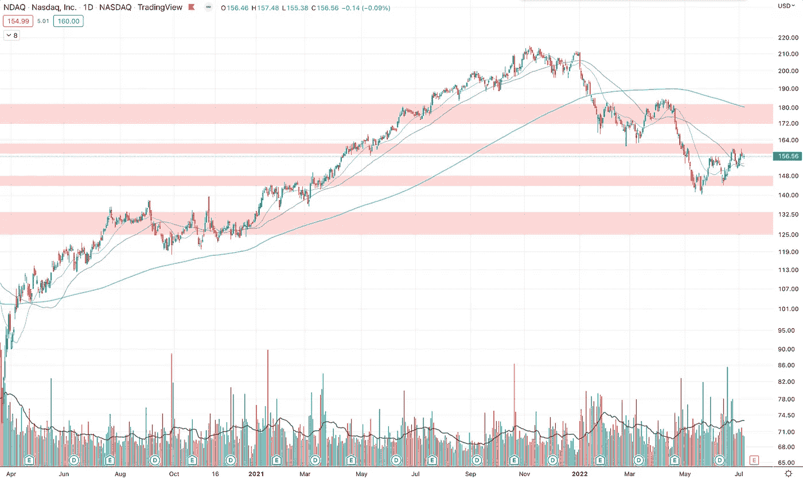

**IWM**

与其他市场相比，小盘股在这里看起来也很强劲。如果这种情况持续下去，并在这里创出更高的高点，这确实是市场走强的好迹象。

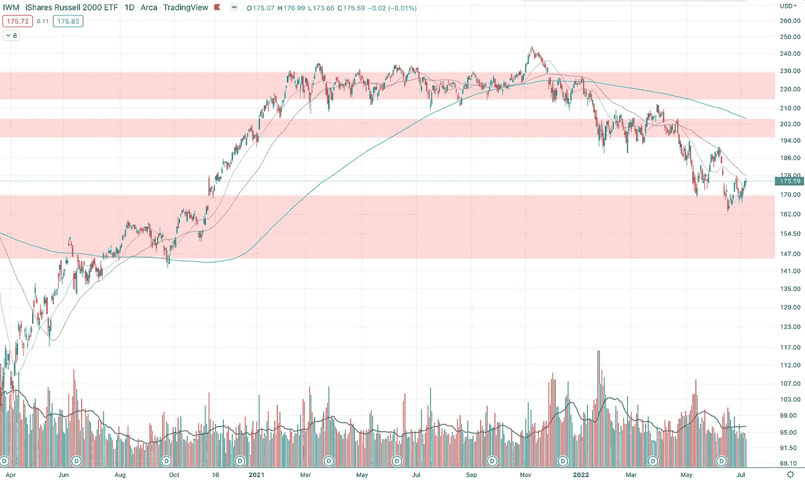

**比特币**

比特币仍然停留在这个较低的支撑区域。在加密领域有这么多负面消息的情况下，我不会对加密仍然落后感到惊讶，市场的其余部分都在上涨，而比特币和加密保持平稳。

> 交易新手？试试[密码交易机器人](/coinmonks/crypto-trading-bot-c2ffce8acb2a)或[复制交易](/coinmonks/top-10-crypto-copy-trading-platforms-for-beginners-d0c37c7d698c)

我认为，在牛市恢复之前，加密市场需要进行一些自我反省。

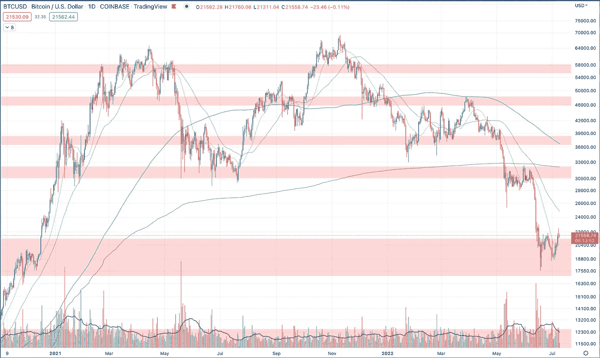

**TLT**

这是我不想看到的。债券再次下跌。如果债券继续下跌，利率开始变得越来越高，那么熊市很可能会继续。我希望看到债券先于市场走高。

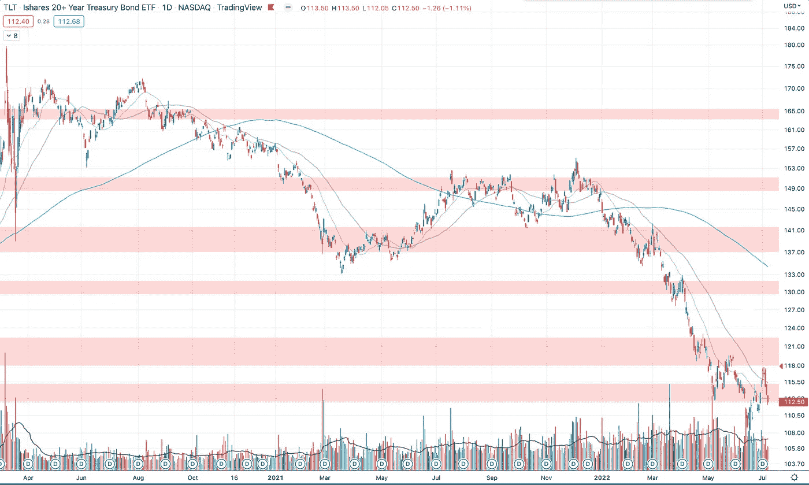

# 市场指标

**VIX**

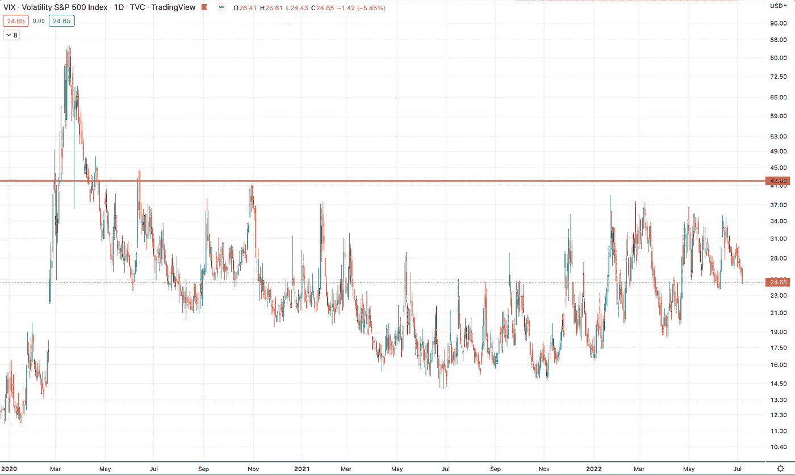

VIX 出现了一些走低的迹象。这是短期内继续上涨的一个好迹象。尽管如此，仍然没有大规模恐慌的迹象，也许市场需要在下跌之前欺骗更多的人转而看涨。

**卖出/买入比率**

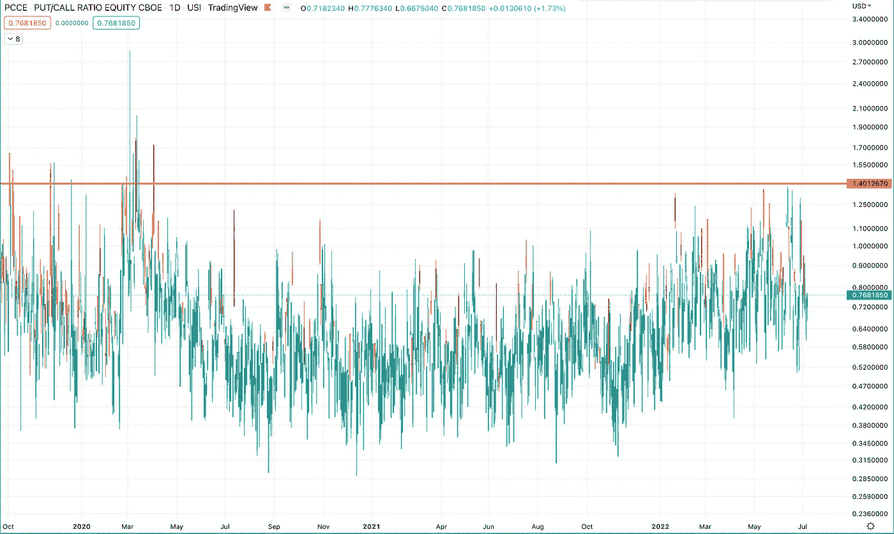

看跌/看涨期权比率下降。目前市场变得更加乐观。

仍然升高，但是在一个更平衡的位置。

**200 日均线以上的股票**

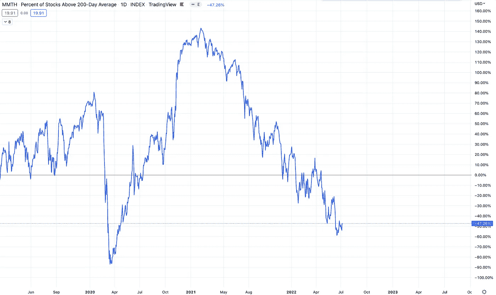

这里仍处于下降趋势。在考虑市场已经转为长期看涨之前，我希望看到这一趋势的强劲转变。

**QQQ 短期和长期移动平均线**

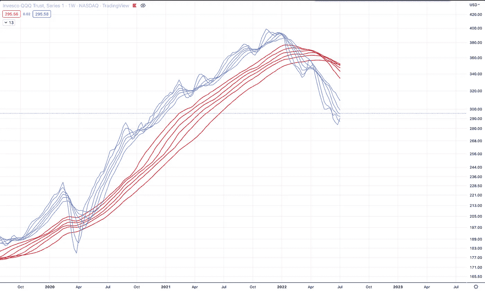

Weekly

周 QQQ 移动平均线仍然强劲下降趋势。

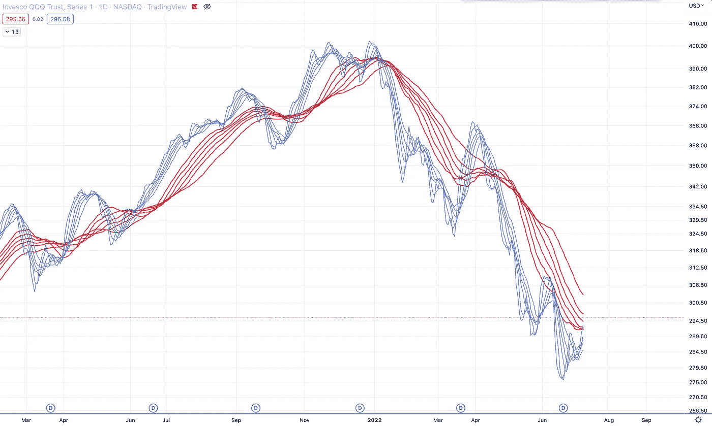

Daily

但是，日线看起来开始散了。事实上，在 3 月份第一次真正的熊市反弹期间，我们有一个假的上涨趋势，所以我预计我们需要另一次上涨。

就是这样！

把我的想法放在最上面，所以如果你已经到了这一步，请随时回到最上面，重新开始。

**—**

由每日交易冠军赞助——有史以来最伟大的交易者免费提供每日交易的灵感和动力。

**现在就报名吧—**[**TradingChampionsDaily.com**](http://tradingchampionsdaily.com/)