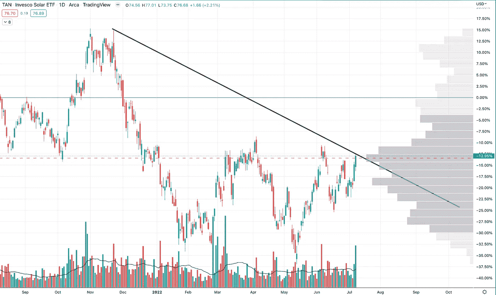
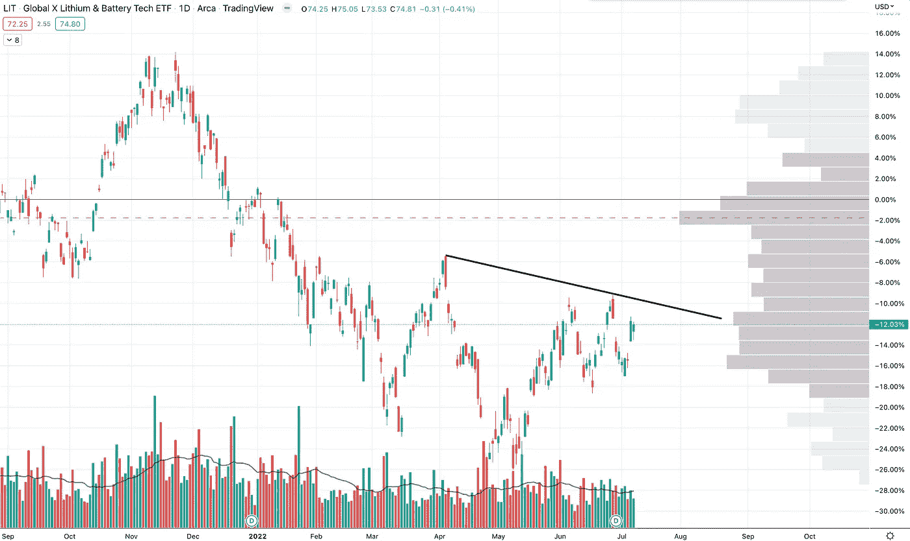
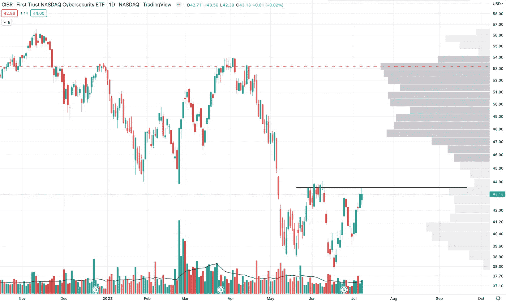
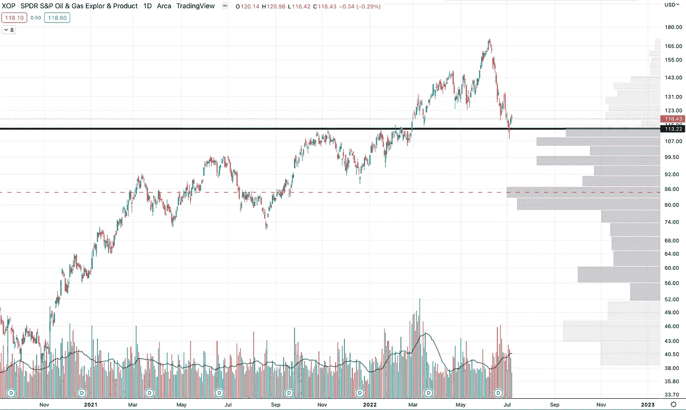
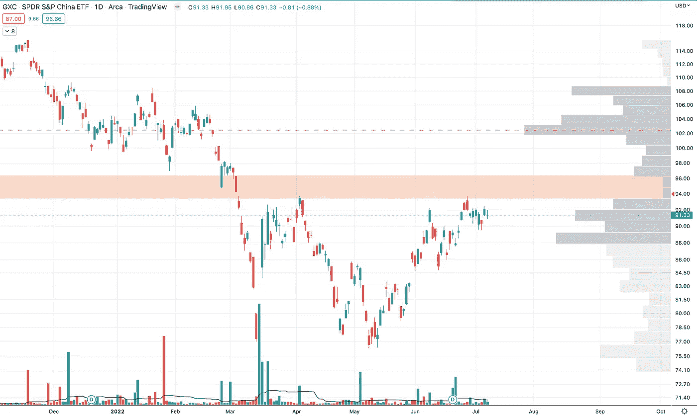
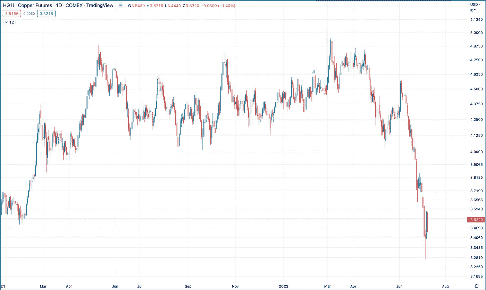

# 市场状况—7 月 9 日—行业、商品等

> 原文：<https://medium.com/coinmonks/state-of-the-market-july-9-sectors-commodities-etc-6051728f614?source=collection_archive---------32----------------------->

## 不断变化的市场带来了新的新兴行业

# 我的想法

虽然本周技术有一个很好的反弹，但它仍处于下降趋势。如果这个打破了，事情就变得有趣了。因此，我不会在这里指出任何仍处于总体熊市趋势的东西。但现在我觉得有趣的是。

网络安全是我关注的 ETF 的新内容。可能成为下一个走出熊市的领导者。在接下来的几天里，我会更深入地研究这些名字。

除此之外，许多相同的部门也在运作或采取行动。市场正在发生变化，这非常有趣。

> 交易新手？试试[加密交易机器人](/coinmonks/crypto-trading-bot-c2ffce8acb2a)或者[复制交易](/coinmonks/top-10-crypto-copy-trading-platforms-for-beginners-d0c37c7d698c)

# 有趣的部门

**谭—太阳能 ETF**

在过去的几个月里，我一直在观察和谈论太阳能。它看起来真的很强劲，上周成交量大幅上升。一个非常好的迹象。

我想在这里发展一些行业。我不喜欢很多中国+太阳图设置，但如果你一直在玩这些你已经做得很好了。

**LIT —锂和电池 ETF**

与市场其余部分相比，仍有望处于强势区间。但是市场的其他部分开始赶上来了。

**CIBR —网络安全 ETF**

哇哦。很高兴在我的清单上有一些坚实的新戏，这一个来自技术。CIBR 似乎在这里有一个双底，周五在这个阻力位反弹。如果我们能在未来几周突破这一水平，这对整个市场来说将是非常强劲的，因为这可能是下一轮牛市的领先板块。

这个周末我会在这个板块寻找我最好的发挥。

**XBI —生物技术 ETF**

生物技术看起来真的很强，走出了双底，创造了一个更高的高点和一个更高的低点，现在正在发展成为一个更高的高点。大趋势。我目前的大部分打法都在这里，寻找更高的低点和再次突破，以增加更多的潜力。

**XOP —石油和天然气勘探**

XOP 本周从一个重要的成交量架子上反弹，似乎一直保持强劲。我周围的大部分叙述似乎是石油正在上涨，我认为我们在过去几周刚刚经历了一次重要的震荡。

我们正处在一个有趣的十字路口。一场真正的衰退是否会继续摧毁对石油的需求，这一行业是否仍然过于拥挤？还是油价继续走高，或者保持高位，石油和天然气公司紧随其后？

就我个人而言，除非我在某个地方看到一个看起来超级吸引人的设置，否则这个行业对我来说太不稳定了，不能低风险玩。

**GXC-中国 ETF**

中国 ETF 依然表现强劲。本周我们从这个关键的交易量水平反弹，但是如果我们能运行超过它，这有一些运行的空间而没有太大的阻力(橙色区域)。

它有动力，所以如果它继续运行，我不会感到惊讶。但我不知道这里的心态如何，中国是强大的，如果有的话，更多的是中国真的被打败了，所以我个人现在没有在这个领域做任何交易。

# 商品

我努力跟踪商品市场，一般只是为了了解那里的信息。

金价本周大幅下跌。

石油和天然气仍在一个区间内，但本周进入该区间的较低部分，然后反弹回到中间区间。

在残酷的三周后，天然气在本周稳定下来，这是一个有趣的转折点。

**白银期货**

几周前，银价下跌，目前仍在继续下跌。

**铜期货**

铜也遭到了破坏。然而，本周我们有一根巨大的反转蜡烛线和向上的趋势。

这就是我得到的！

—

由每日交易冠军赞助——有史以来最伟大的交易者免费提供每日交易灵感和动力。

**现在就报名吧—**[**TradingChampionsDaily.com**](http://tradingchampionsdaily.com/)