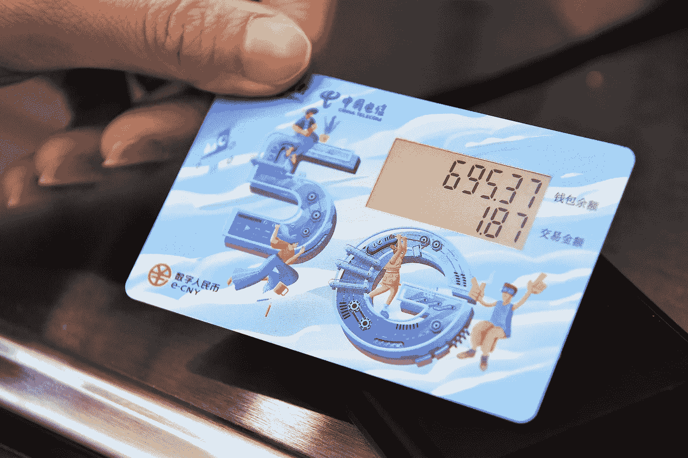

# 官方媒体称，在宣传中国央行数字货币的同时，微信和支付宝将被取消

> 原文：<https://medium.com/coinmonks/state-run-media-says-wechat-and-alipay-will-be-cancelled-while-touting-the-chinese-central-bank-c7fe3193032b?source=collection_archive---------12----------------------->

中文新闻网站[https://www.ntdtv.com/gb/2022/11/15/a103575383.htm](https://www.ntdtv.com/gb/2022/11/15/a103575383.htm)大卫·麦卡尔平翻译的文章

【NTD 新闻，北京时间 2022 年 11 月 15 日】中国互联网传出消息，中国央行相关部门将取消微信支付、支付宝等移动支付业务的使用。官方官方媒体在抨击微信和支付宝钱包的安全漏洞的同时，对央行发行的数字货币(e-Yuan)阿谀奉承，导致外界担心私人数字支付系统落入国家手中。

> 交易新手？在[最佳加密交易](/coinmonks/crypto-exchange-dd2f9d6f3769)上尝试[加密交易机器人](/coinmonks/crypto-trading-bot-c2ffce8acb2a)或[复制交易](/coinmonks/top-10-crypto-copy-trading-platforms-for-beginners-d0c37c7d698c)

近日，一篇题为《微信和支付宝会被取消吗？央行已经宣布了这一消息。没想到这么快”出现在中国互联网上，引起了舆论的关注。文章称，最近微信和支付宝占据了中国手机支付市场 90%的份额，2021 年市场规模为 48 万亿元人民币(17.7 万亿美元)，但这两种支付服务可能会在未来被其头号竞争对手“数字人民币”(电子 CNY)取代。

文章随后介绍了 e 元作为正常人民币的合法数字版本，但受中国中央银行控制。它与传统纸币的功能相同但唯一不同的是，它是一种存在于手机上的虚拟货币，由央行支持。不需要经过添加银行卡等繁琐的步骤，使用起来更加方便。
这篇文章在外界开始猜测央行及其相关部门将取消使用微信、支付宝等移动支付软件的同时，迅速引起了中国网民的广泛关注。
事实上，最近中国互联网上频繁出现类似的文章，共同点是批评微信和支付宝的二维码支付安全性低，称其容易出现安全漏洞，在使用繁琐的同时难以保护用户隐私等。与此同时，这些文章大力宣传央行发行的 e 元“安全方便”，可以匿名使用，可以离线使用，不需要银行卡，甚至可以在没有网络信号的情况下使用。他们宣称，未来我们将“告别二维码支付，微信和支付宝将会消失。”

因此，有舆论认为，中国当局可能已经开始为易元的广泛使用“扫清道路”，以便它将垄断数字支付市场。微信支付和支付宝势必会被当局打压甚至取代。
值得一提的是，中国政府近年来采取措施，收紧对微信支付和支付宝等电子支付的限制。
例如:去年 11 月初，央行官网发布文件《中国人民银行关于加强支付受理终端及相关业务管理的通知(银行对账单[2021] №259 号)》。它宣布了三项要求。首先，对支付条形码进行监管，对支付终端进行监管，对某些商户进行监管。对于支付清算有许多具体的要求。

今年 3 月，中国央行宣布了二维码支付的新规定，限制个人二维码在“商业活动”之外接收支付。此外，还将限制非面对面交易，并加强对网上支付的控制。中国金融学者司凌在接受自由亚洲电台采访时表示，中国共产党当局考虑到在线支付的高风险，但仍允许私营企业开发自己的移动支付软件，且规则宽松。现在他们看到“这块蛋糕越来越大。”
面对“零 Covid”政策下的经济衰退，我们必须专注于“内部循环”在此背景下，“公私新关系”将扩大，不排除微信、支付宝等移动支付 app 也将被“国有化”的方式封杀。
他指出，中国共产党政府现在迫切需要技术和资源来实施其所谓的“宏观调控”,很可能用易元取代微信支付和支付宝，成为移动支付市场的领导者。
他们可能会继续使用行政手段、法律手段和/或“入股”、“投资”等看似市场的手段进行收购。私企“不能说不”
微信支付和支付宝钱包被易元取代的消息在社交媒体上引发了公众的强烈反对。中国网民留言批评，“如此贪婪！他们像吃蛋糕一样吃着它。”；"私营企业无法与国家竞争。"“国企很难有创新基因。一次(支付宝等。)变成国企，移动支付就完了。”

> 加入 Coinmonks [电报频道](https://t.me/coincodecap)和 [Youtube 频道](https://www.youtube.com/c/coinmonks/videos)了解加密交易和投资

# 另外，阅读

*   [如何使用 Solidity 在以太坊上创建 DApp？](https://coincodecap.com/create-a-dapp-on-ethereum-using-solidity)
*   [加密交易机器人](/coinmonks/crypto-trading-bot-c2ffce8acb2a) | [OKEx vs 币安](https://coincodecap.com/okex-vs-binance)
*   [币安 vs FTX](https://coincodecap.com/binance-vs-ftx) | [最佳(SOL)索拉纳钱包](https://coincodecap.com/solana-wallets)
*   如何在 Uniswap 上交换加密？ | [A-Ads 审查](https://coincodecap.com/a-ads-review)

— — — — — — —
🔴点对点加密货币交易现在是、将来也会是规避日益恶化的资本管制的最重要工具。加入点对点加密交易革命。现在报名— [Https://Wild-West。贸易](https://www.youtube.com/redirect?event=video_description&redir_token=QUFFLUhqbEs0WWgybWhXelY1SGZoRC1mN1FYS2tyZGRFd3xBQ3Jtc0tueUt1d01FcS00ZllzQzBBTndkOXktbVZnY2Rha1c1Q0xVWHp6aVJpNjdqMXUyN0FzMmpoaWJWT3NGQm5acE84V1Qtc0lUcGpaYU9ralN0NUVINlBlNGVzb1JCV3c3RElqaVVsQXRrUm9pR0RnTEFYaw&q=https%3A%2F%2Fwild-west.trade%2F&v=snmHTbk-DSU)