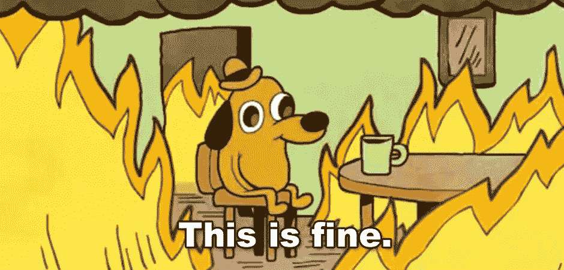

# 伙计们，Crypto.com 说他们没事！

> 原文：<https://medium.com/coinmonks/steady-lads-crypto-com-says-theyre-fine-80ed61dbd511?source=collection_archive---------7----------------------->

谁命名了一个体育场，他将是第一个去的，crypto.com 似乎紧随 FTX 之后。好像周围的坏消息还不够多，Crypto.com·FUD 正在社交媒体上打转。crypto.com 与 FTX 相似，都是超级激进的营销，当然还有粗略的态度。正如首席执行官克里斯·马扎莱克(Kris Marszalek)向美国消费者新闻与商业频道的每个人保证，公司一切都好，但事实并非如此。哦，最后一颗钉子，赵昌鹏警告每个人，不要出现 FTX 式的崩溃。有了这些，如果你失去了从 crypto.com 撤出资产的能力，也许拉里·戴维可以在抑制你的热情上制造一个有趣的插曲。还记得马特·达蒙在超级碗广告上宣传 CRO 代币时说的“幸运青睐勇敢者”吗？CRO 在一个月内下跌了 40%!

## **Crypto.com 颂**

基本上，说 FTX[的倒塌](https://blog.hi.exchange/ftx-collapse/)是一场快速的灾难，是一种保守的说法。然而，可怕的部分是所有的信息显示在后果。曾经是一个 400 亿美元的帝国，我们现在可以清楚地看到所有这一切是一个巨大的谎言。然而，这不仅仅是令人不安的一群多爱的孩子是如何不懈地游说他们可怕的议程。事实上，他们直到最后一刻都在撒谎，就像权和他被诅咒的特拉(露娜)一样。考虑到这一切，人们怎么能相信一个巨大的交易平台呢？

根据 [CoinGecko](https://www.coingecko.com/en/exchanges#:~:text=As%20of%20today%2C%20we%20track,%2C%20Coinbase%20Exchange%2C%20and%20Bybit.) 的数据，就规模而言，crypto.com 是排名前 15 的交易平台之一。上周末，人们对 crypto.com 的流动性状况猜测纷纷。在很大程度上，一场价值 4 亿美元的事故引发了整件事。显然，crypto.com 用以太币向 gate.io 发送了 4 亿美元，但地址是错的。他们确实设法拿回了钱，但投资者现在开始质疑他们为什么要送这么大一笔钱。更糟糕的是，Marszalek 没有注意到这个错误，直到公共区块链的数据公之于众。

周日，币安首席执行官赵昌鹏指出，资产的突然变动“是问题的明显迹象”，这给 FUD 火上浇油然后他补充道，“离远点。”

另一方面，该公司仅在过去几个月里就解雇了大约四分之三的员工。

## **很好**

周二早上，Marszalek 接受了美国消费者新闻与商业频道的 [Squawk Box](https://www.cnbc.com/video/2022/11/15/pro-watch-cnbcs-full-interview-with-crypto-com-ceo-kris-marszalek.html?&amp;qsearchterm=crypto.com) 的采访，解决了一些问题。他表示，他们已经与 10 多个监管机构进行了接触，以防止类似 FTX 的崩溃。

“我明白，现在在市场上，你有这样一种情况，每个人都不再相信人们的话，”Marszalek 说。“我们专注于通过行动展示我们的实力和稳定性。”他还承认取款额突然增加，但表示已经恢复正常。

所以基本上，一切都很好，对吗？

我们当然没有足够的数据来独立评估形势。然而，投资者应该承认 Marszalek 过去的一个事件。

Marszalek 的上一份工作是一家名为 Ensogo 的澳大利亚公司的首席执行官。Ensogo 主要提供在线优惠券。随着 Marszalek 离开公司，该公司在 2016 年突然停业。这是“顾客和商业伙伴指责他们被敲竹杠”Ensogo 客户无法提取资金，几乎损失了所有资产。很自然，这种尴尬意味着 Marszalek 已经准备好接受一次大的晋升，执掌 crypto.com。

我们现在的情况是，一家公司在[柴犬](https://www.coindesk.com/markets/2022/11/11/cryptocoms-preliminary-glimpse-of-token-reserves-reveals-20-in-shiba-inu-coin/)拥有其 20%的资产。首席执行官坚持说他们是一家私人公司，所以他们不需要分享他们的资产负债表。crypto.com 还好吗？要回答这个问题，我们必须超越信任，获得“信仰”。

> 交易新手？试试[密码交易机器人](/coinmonks/crypto-trading-bot-c2ffce8acb2a)或[复制交易](/coinmonks/top-10-crypto-copy-trading-platforms-for-beginners-d0c37c7d698c)