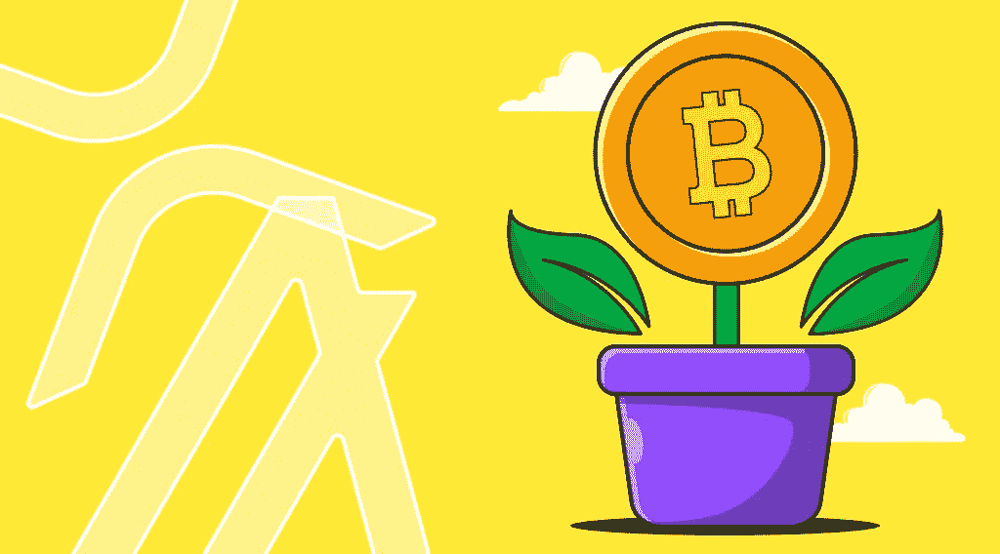

# StealthEX 加密简讯-第 19 期。走向绿色！

> 原文：<https://medium.com/coinmonks/stealthex-crypto-newsletter-issue-19-go-green-177e8157cd3e?source=collection_archive---------72----------------------->

看看我们每周文摘的第 19 期。

可持续发展是每个人的想法。我们试图降低塑料的使用量，想想我们每天使用的产品，少买一些，并保持我们的能源消耗水平。可开采的加密货币不可避免地需要电力——这就是为什么比特币开采受到一些人的关注。然而，所有的加密对环境都是有害的吗？实际上，这很糟糕吗？最后，但同样重要的是，我们在密码领域能做些什么和使用些什么来避免全球危机呢？StealthEX 团队在这里深入挖掘加密可持续性、绿色项目的问题，并尝试回答一些问题。

窃取 x 加密简讯——第 19 期。走向绿色！

[赶快订阅接收最新的加密新闻吧！](https://www.getrevue.co/profile/stealthex_io)

请记住，我们的工作是提供信息，而不是为您做出投资决策😉

在 [Medium](https://stealthex-io.medium.com/) 、 [Twitter](https://twitter.com/Stealthex_io) 、 [Telegram](https://t.me/StealthEX) 、 [YouTube](https://www.youtube.com/channel/UCeES_XBesX76ge7xf1meuSw) 和 [Reddit](https://www.reddit.com/user/Stealthex_io) 上关注我们，获取 [StealthEX.io](https://stealthex.io/) 更新和关于加密世界的最新消息。对于所有请求，请通过 support@stealthex.io 向我们发送消息

**非常欢迎您访问**[**StealthEX exchange**](https://stealthex.io/)**看看它有多快多方便💛**

> 交易新手？尝试[加密交易机器人](/coinmonks/crypto-trading-bot-c2ffce8acb2a)或[复制交易](/coinmonks/top-10-crypto-copy-trading-platforms-for-beginners-d0c37c7d698c)