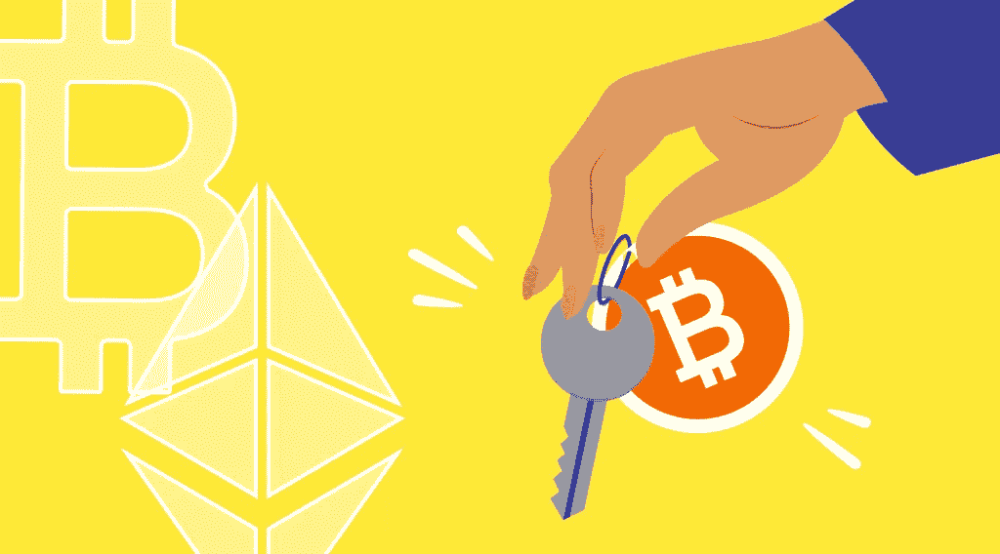

# StealthEX 加密简讯—第 22 期，保管和非保管服务

> 原文：<https://medium.com/coinmonks/stealthex-crypto-newsletter-issue-22-custodial-non-custodial-services-e03f7937b6ce?source=collection_archive---------39----------------------->

加密的最初概念非常清楚——整个事情需要去中心化。

如今，在比特币起源板块诞生 13 年后，我们发现自己身处一个试图转向的空间。集中式交易所正在被黑客攻击，借贷平台使用客户的资金做天知道什么，智能合同被利用……似乎是思考起源并提醒自己自我托管的重要性以及选择给你财务自由的服务的正确时间。

x 队是来帮忙的😉

[赶快订阅接收最新的加密新闻吧！](https://www.getrevue.co/profile/stealthex_io)

[**StealthEX 加密通讯——第 22 期。免托管**](https://www.getrevue.co/profile/stealthex_io/issues/stealthex-crypto-newsletter-issue-22-custody-free-1287850)

在 [Medium](https://stealthex-io.medium.com/) 、 [Twitter](https://twitter.com/Stealthex_io) 、 [Telegram](https://t.me/StealthEX) 、 [YouTube](https://www.youtube.com/channel/UCeES_XBesX76ge7xf1meuSw) 和 [Reddit](https://www.reddit.com/user/Stealthex_io) 上关注我们，获取 [StealthEX.io](https://stealthex.io/) 更新和关于加密世界的最新消息。对于所有请求，请通过 support@stealthex.io 给我们发消息。

非常欢迎您访问[**stealthexchange**](https://stealthex.io/)**看看它有多快多方便💛**

> 加入 Coinmonks [电报频道](https://t.me/coincodecap)和 [Youtube 频道](https://www.youtube.com/c/coinmonks/videos)了解加密交易和投资

# 另外，阅读

*   [OKEx vs KuCoin](https://coincodecap.com/okex-kucoin) | [摄氏替代品](https://coincodecap.com/celsius-alternatives) | [如何购买 VeChain](https://coincodecap.com/buy-vechain)
*   [币安期货交易](https://coincodecap.com/binance-futures-trading)|[3 commas vs Mudrex vs eToro](https://coincodecap.com/mudrex-3commas-etoro)
*   [如何购买 Monero](https://coincodecap.com/buy-monero) | [IDEX 评论](https://coincodecap.com/idex-review) | [BitKan 交易机器人](https://coincodecap.com/bitkan-trading-bot)
*   [CoinDCX 评论](/coinmonks/coindcx-review-8444db3621a2) | [加密保证金交易交易所](https://coincodecap.com/crypto-margin-trading-exchanges)
*   [红狗赌场评论](https://coincodecap.com/red-dog-casino-review) | [Swyftx 评论](https://coincodecap.com/swyftx-review) | [CoinGate 评论](https://coincodecap.com/coingate-review)