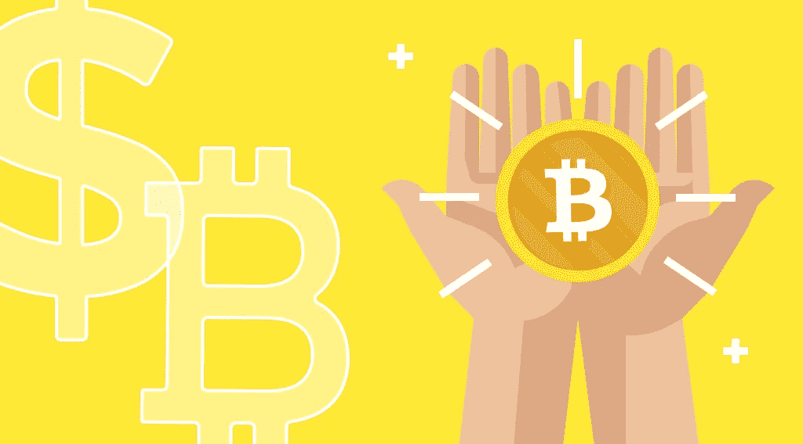

# StealthEX 加密简讯—第 23 期虚拟技术走向现实

> 原文：<https://medium.com/coinmonks/stealthex-crypto-newsletter-issue-23-virtual-technology-goes-real-life-c8aa72d00ccb?source=collection_archive---------44----------------------->

加密货币是一种数字资产，我们习惯于把它放在钱包里，用来交易硬币和代币，或者花在同样“互联网神奇”的东西上。这也是困扰普通人的一件事——密码在现实世界中有用吗？毕竟，钱的主要目的是支付——尽管密码很不稳定，但它能花在杂货/咖啡/房子/汽车等上面吗？

StealthEX 团队在这里阐明了加密用例的问题😉

[**StealthEX 加密简讯——第 23 期。保持真实**](https://www.getrevue.co/profile/stealthex_io/issues/stealthex-crypto-newsletter-issue-23-keep-it-real-1297692)

[赶快订阅接收最新的加密新闻吧！](https://www.getrevue.co/profile/stealthex_io)

在 [Medium](https://stealthex-io.medium.com/) 、 [Twitter](https://twitter.com/Stealthex_io) 、 [Telegram](https://t.me/StealthEX) 、 [YouTube](https://www.youtube.com/channel/UCeES_XBesX76ge7xf1meuSw) 和 [Reddit](https://www.reddit.com/user/Stealthex_io) 上关注我们，获取 [StealthEX.io](https://stealthex.io/) 更新和关于加密世界的最新消息。对于所有请求，请通过 support@stealthex.io 给我们发消息。

非常欢迎你来参观 T21 交易所，看看它有多快多方便💛

> 交易新手？尝试[加密交易机器人](/coinmonks/crypto-trading-bot-c2ffce8acb2a)或[复制交易](/coinmonks/top-10-crypto-copy-trading-platforms-for-beginners-d0c37c7d698c)