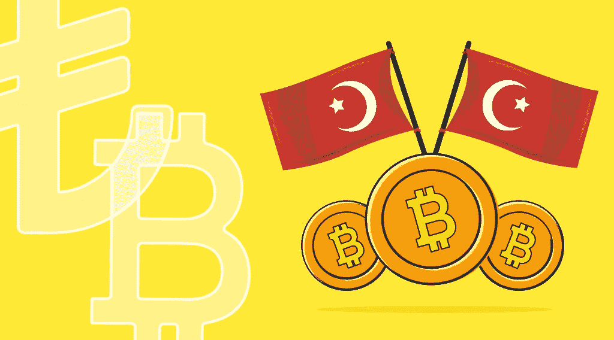

# StealthEX 加密简讯—第 26 期，Merhaba to Crypto

> 原文：<https://medium.com/coinmonks/stealthex-crypto-newsletter-issue-26-merhaba-to-crypto-9c732de4b994?source=collection_archive---------32----------------------->

在八月初，社区正在热烈地讨论土耳其政府对加密使用的可能限制。这一决定被称为“草率”，并面临来自土耳其密码用户的强烈挑战。

这是一个全国范围的秘密感情的很好的例子。

StealthEX 团队在这里研究土耳其的加密场景，它的趋势和习惯。让我们一起进入这个巨大的加密市场吧！

StealthEX 加密简讯——第 26 期。梅尔哈巴到 Crypto

[赶快订阅接收最新的加密新闻吧！](https://www.getrevue.co/profile/stealthex_io)

在 [Medium](https://stealthex-io.medium.com/) 、 [Twitter](https://twitter.com/Stealthex_io) 、 [Telegram](https://t.me/StealthEX) 、 [YouTube](https://www.youtube.com/channel/UCeES_XBesX76ge7xf1meuSw) 和 [Reddit](https://www.reddit.com/user/Stealthex_io) 上关注我们，获取 [StealthEX.io](https://stealthex.io/) 更新和关于加密世界的最新消息。对于所有请求，请通过 support@stealthex.io 给我们发消息。

非常欢迎你来参观 T21 交易所，看看它有多快多方便💛

ok teekkürler！

> 交易新手？尝试[加密交易机器人](/coinmonks/crypto-trading-bot-c2ffce8acb2a)或[复制交易](/coinmonks/top-10-crypto-copy-trading-platforms-for-beginners-d0c37c7d698c)