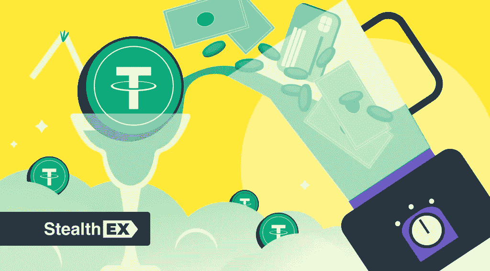

# StealthEX 加密时事通讯—第 32 期生活在令牌化中

> 原文：<https://medium.com/coinmonks/stealthex-crypto-newsletter-issue-32-living-in-a-tokenization-a217452fdb0?source=collection_archive---------45----------------------->

加密令牌不仅是选定网络上易于管理的标准令牌，也是支付、奖励、游戏、信息存储等功能强大的工具。

多年来，这个领域一直在谈论令牌化，但是通过创建令牌，您能真正实现什么呢？

StealthEX 团队在这里深入挖掘记号化的主题，给出一些资产和用例的例子，并研究新的概念。

让我们开始吧！

[**StealthEX Crypto 简讯—第 32 期，活在一个符号化的**](https://www.getrevue.co/profile/stealthex_io/issues/stealthex-crypto-newsletter-issue-32-living-in-a-tokenization-1398077)

[赶快订阅接收最新的加密新闻吧！](https://www.getrevue.co/profile/stealthex_io)

在 [Medium](https://stealthex-io.medium.com/) 、 [Twitter](https://twitter.com/Stealthex_io) 、 [Telegram](https://t.me/StealthEX) 、 [YouTube](https://www.youtube.com/channel/UCeES_XBesX76ge7xf1meuSw) 和 [Reddit](https://www.reddit.com/user/Stealthex_io) 上关注我们，获取 [StealthEX.io](https://stealthex.io/) 更新和关于加密世界的最新消息。对于所有请求，请通过 support@stealthex.io 给我们发消息。

非常欢迎你来参观 T21 交易所，看看它有多快多方便💛

> 交易新手？尝试[加密交易机器人](/coinmonks/crypto-trading-bot-c2ffce8acb2a)或[复制交易](/coinmonks/top-10-crypto-copy-trading-platforms-for-beginners-d0c37c7d698c)