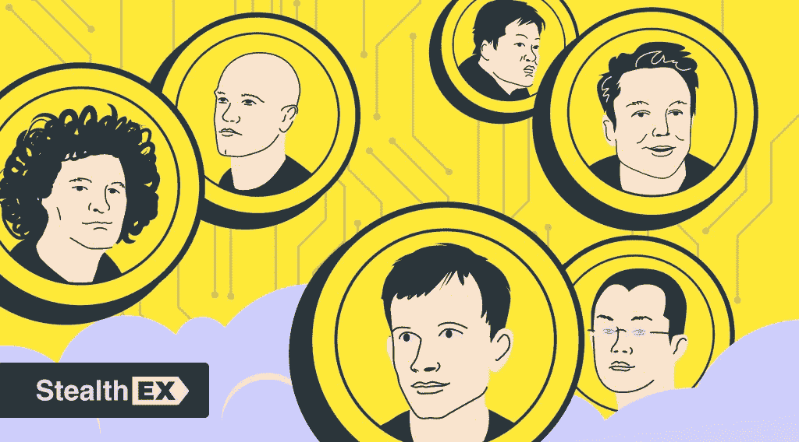

# StealthEX 加密通讯——第 33 期:最著名的加密创始人

> 原文：<https://medium.com/coinmonks/stealthex-crypto-newsletter-issue-33-most-famous-crypto-founders-258ea4907c60?source=collection_archive---------51----------------------->

有钱，有名，还喜欢加密？听起来像一场梦。

加密技术的应用越来越广泛，参与区块链项目的人的名气也越来越大。

本周，我们将谈论选择比特币道路的名人，以及一些一路成名的加密创始人。

这个名单很长(其中确实包括埃隆·马斯克)。

[**StealthEX 加密通讯——第 33 期:最著名的加密创始人**](https://www.getrevue.co/profile/stealthex_io/issues/stealthex-crypto-newsletter-issue-33-the-other-satoshis-1419741)

[赶快订阅接收最新的加密新闻吧！](https://www.getrevue.co/profile/stealthex_io)

在 [Medium](https://stealthex-io.medium.com/) 、 [Twitter](https://twitter.com/Stealthex_io) 、 [Telegram](https://t.me/StealthEX) 、 [YouTube](https://www.youtube.com/channel/UCeES_XBesX76ge7xf1meuSw) 和 [Reddit](https://www.reddit.com/user/Stealthex_io) 上关注我们，获取 [StealthEX.io](https://stealthex.io/) 更新和关于加密世界的最新消息。对于所有请求，请通过 support@stealthex.io 给我们发消息。

非常欢迎你来参观 T21 交易所，看看它有多快多方便💛

> 交易新手？尝试[加密交易机器人](/coinmonks/crypto-trading-bot-c2ffce8acb2a)或[复制交易](/coinmonks/top-10-crypto-copy-trading-platforms-for-beginners-d0c37c7d698c)