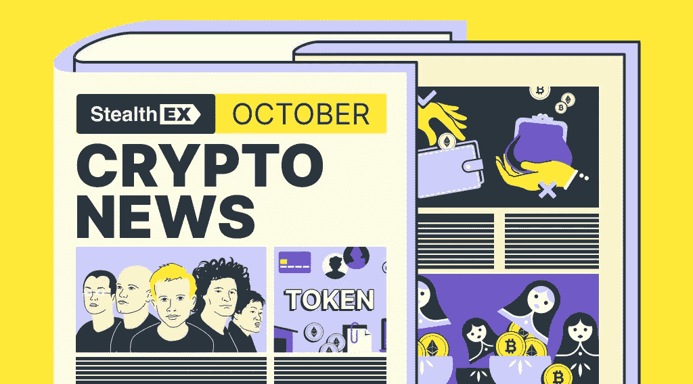

# StealthEX 加密简讯——10 月第 34 期新闻

> 原文：<https://medium.com/coinmonks/stealthex-crypto-newsletter-issue-34-news-of-october-ec7c6ca63a7a?source=collection_archive---------44----------------------->

2022 年 10 月是密码领域的丰富事件。从 Elon Musk Twitter 交易的完成，到 VISA 倾向于加密相关产品的消息。从感觉上看，有比以往更多的人转向采用加密技术，即使是在冬季延续的情况下。好吧，事实上冰在月底开始融化了一点。

黑暗面也不睡觉——一些黑客攻击和利用也发生了，你可以在另一篇文章中读到。

让我们仔细思考十月的事件和未来的可能性！

[**StealthEX 加密简讯——第 34 期。**十月新闻](https://www.getrevue.co/profile/stealthex_io/issues/stealthex-crypto-newsletter-issue-34-news-of-october-1419693)

[赶快订阅接收最新的加密新闻吧！](https://www.getrevue.co/profile/stealthex_io)

在 [Medium](https://stealthex-io.medium.com/) 、 [Twitter](https://twitter.com/Stealthex_io) 、 [Telegram](https://t.me/StealthEX) 、 [YouTube](https://www.youtube.com/channel/UCeES_XBesX76ge7xf1meuSw) 和 [Reddit](https://www.reddit.com/user/Stealthex_io) 上关注我们，获取 [StealthEX.io](https://stealthex.io/) 更新和关于加密世界的最新消息。对于所有请求，请通过 support@stealthex.io 给我们发消息。

非常欢迎你来参观 T21 交易所，看看它有多快多方便💛

> 交易新手？尝试[加密交易机器人](/coinmonks/crypto-trading-bot-c2ffce8acb2a)或[复制交易](/coinmonks/top-10-crypto-copy-trading-platforms-for-beginners-d0c37c7d698c)