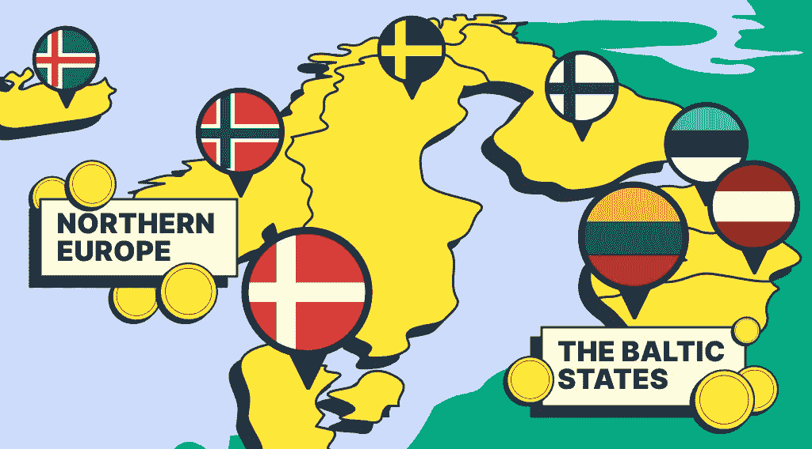

# StealthEX 加密简讯—第 36 期，欧洲斯堪的纳维亚和波罗的海国家的加密货币

> 原文：<https://medium.com/coinmonks/stealthex-crypto-newsletter-issue-36-cryptocurrency-in-scandinavia-and-the-baltic-states-of-356157eb65fa?source=collection_archive---------39----------------------->

在这期迟来的时事通讯中，我们在这里思考另一个关于加密关系的话题，以及区块链理工大学在特定国家的表现。这一次，StealthEX 团队正在破解波罗的海地区和斯堪的纳维亚半岛的密码问题。

顺便说一下，如果你来自那里，请在 Twitter 上留下你的观点和评论。

让我们开始吧！

## 《窃取 x 加密通讯》——第 36 期。北方记得

*   [**北欧的加密货币:欧盟的加密监管和斯堪的纳维亚半岛的赌博**](https://stealthex.io/blog/the-status-of-cryptocurrency-in-northern-europe/)
    看看北欧的加密货币:瑞典、挪威、芬兰、丹麦和冰岛的监管、赌博和区块链技术的使用
*   [**欧盟波罗的海国家的加密货币和区块链技术**](https://stealthex.io/blog/crypto-and-blockchain-technology-in-the-baltic-states-eu/)
    仔细看看欧盟波罗的海国家的加密货币、法规和区块链技术的使用情况:拉脱维亚、立陶宛和爱沙尼亚

[赶快订阅接收最新加密消息吧！](https://www.getrevue.co/profile/stealthex_io)

在 [Medium](https://stealthex-io.medium.com/) 、 [Twitter](https://twitter.com/Stealthex_io) 、 [Telegram](https://t.me/StealthEX) 、 [YouTube](https://www.youtube.com/channel/UCeES_XBesX76ge7xf1meuSw) 和 [Reddit](https://www.reddit.com/user/Stealthex_io) 上关注我们，获取 [StealthEX.io](https://stealthex.io/) 更新和关于加密世界的最新消息。对于所有请求，请通过 support@stealthex.io 给我们发消息。

非常欢迎你来参观交易所，看看它有多快多方便💛

> 交易新手？试试[加密交易机器人](/coinmonks/crypto-trading-bot-c2ffce8acb2a)或者[复制交易](/coinmonks/top-10-crypto-copy-trading-platforms-for-beginners-d0c37c7d698c)