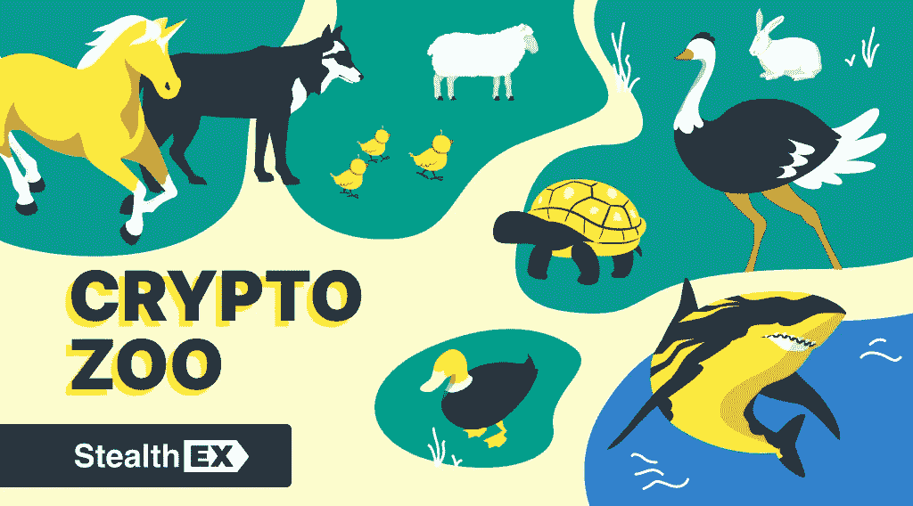

# StealthEX 加密简讯—第 37 期—欢迎来到丛林

> 原文：<https://medium.com/coinmonks/stealthex-crypto-newsletter-issue-37-welcome-to-the-jungle-7f5cc06bd37?source=collection_archive---------26----------------------->

我们知道时局艰难，但是还有什么比看动物更能让你开心的呢？有些雄伟，有些滑稽——都聚集在加密市场动物园，在这里等待你的检查。

本周一，我们来深入了解一些与动物相关的加密货币俚语。有的是！

# [窃取 x 加密简讯——第 37 期——欢迎来到丛林](https://www.getrevue.co/profile/stealthex_io/issues/stealthex-crypto-newsletter-issue-37-welcome-to-the-jungle-1459098)

*   [**加密鲸、熊和公牛的简要概述**](https://stealthex.io/blog/a-brief-overview-of-crypto-whale-bull-and-bear/)
    加密鲸、熊和公牛——这篇文章概述了加密货币市场行业中最流行的动物术语。
*   [**秘密投资市场的动物**](https://stealthex.io/blog/animals-in-the-crypto-investing-market/)
    你需要知道的一些秘密投资俚语——秘密动物园的动物:独角兽、兔子、绵羊、乌龟、猪、鸡、鸵鸟、狗等等……
*   [**骨币哪里买？详细指南**](https://stealthex.io/blog/where-to-buy-bone-coin-guide-on-how-to-buy-bone-shibaswap-crypto/)

[赶快订阅接收最新加密消息吧！](https://www.getrevue.co/profile/stealthex_io)

在 [Medium](https://stealthex-io.medium.com/) 、 [Twitter](https://twitter.com/Stealthex_io) 、 [Telegram](https://t.me/StealthEX) 、 [YouTube](https://www.youtube.com/channel/UCeES_XBesX76ge7xf1meuSw) 和 [Reddit](https://www.reddit.com/user/Stealthex_io) 上关注我们，获取 [StealthEX.io](https://stealthex.io/) 更新和关于加密世界的最新消息。对于所有请求，请通过 support@stealthex.io 给我们发消息。

非常欢迎您访问[**StealthEX exchange**](https://stealthex.io/)**，看看它有多快多方便💛**

> 交易新手？试试[加密交易机器人](/coinmonks/crypto-trading-bot-c2ffce8acb2a)或者[复制交易](/coinmonks/top-10-crypto-copy-trading-platforms-for-beginners-d0c37c7d698c)