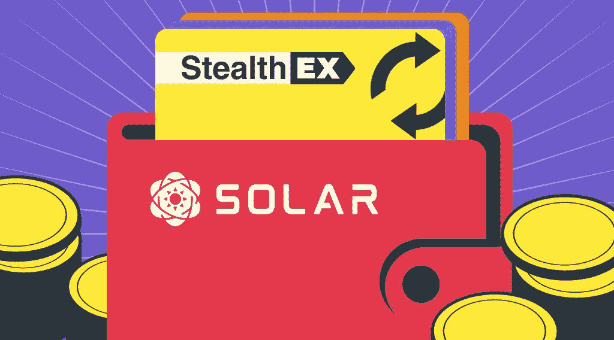

# StealthEX 欢迎太阳能

> 原文：<https://medium.com/coinmonks/stealthex-is-happy-to-expand-its-horizons-cc128e341fe8?source=collection_archive---------31----------------------->

StealthEX 乐于拓展自己的视野。即将到来的联合努力包括与 Solar 的密切合作，Solar 是一个完全分散的区块链和支持 SXP 区块链的开源网络。SXP 区块链通过授权的股权共识证明运营，并由 53 名投票产生区块和验证交易的代表保护。

Solar 为其用户提供了一系列钱包。太阳能钱包帮助加密爱好者与 SXP 区块链建立联系。除了支付和投票交易之外，钱包还将通过大量工具和功能与区块链和太阳能社区进行互动，从而得到进一步增强。

这款钱包有三种版本:桌面版、手机版和浏览器版。桌面版可以从官方 [Solar 网站](https://solar.org/wallets)下载，适用于 Windows、MacOS 和 Ubuntu。作为开放测试计划的一部分，太阳能手机钱包目前仅适用于 Android。名为 Armor 的太阳能浏览器钱包被 Chrome 网络商店接受，目前正在接受内部审计。

# 太阳能区块链基金会:关于

太阳能区块链基金会是一家成立于爱沙尼亚的非营利组织，旨在开发一个区块链生态系统，包括开源组件和更广泛的社区参与。

Solar 由 Solar Core 供电，通过充分利用 Schnorr 进行签名，不再使用 ECDSA 签名，在区块链框架的安全性上有所提升。

Solar 本质上是一个安全可靠的第一层区块链框架。如前所述，它利用了授权的利益相关者共识证明，也称为 DPoS。拥有自己的名为 SXP 的本地硬币的区块链是快速、模块化、可持续、高效和完全分散的，没有传统工作证明(PoW)区块链的已知问题和漏洞。由 53 名代表组成的委托利益证明共识，也称为节点运营商或验证者，负责保护和维护高端服务器的网络。

该项目在 Github 上得到积极维护，这使得任何人都可以创建一个 PR 或在网站的存储库中打开一个问题，以讨论任何关于 Solar 代码及其发展的潜在建议。该公司尽最大努力确保该框架对其用户和参与太阳能项目的任何人来说都是安全的。

# SXP 硬币，投票和赌注

目前存在于 ERC20 和 BEP20(包装的 BEP2)上的 SXP 令牌将被迁移到 SXP mainnet。用户可以在 solar.org/swap 的[找到完整的换购详情。](https://solar.org/swap)

块奖励是通货膨胀硬币，这意味着 SXP 总供应量每轮增加 530 SXP。这是一种持续的通货膨胀，由于报酬率不波动，通货膨胀会随着时间的推移而降低。但是，区块奖励的金额可能会在未来通过修改太阳核心的里程碑来改变。修改未来的整体奖励或引入减半需要代表和选民以及更广泛的社区的批准。块奖励和交易费奖励给负责验证给定块和保护网络的活跃代表。

SXP 硬币持有者可以在太阳能桌面钱包里为代表投票。SXP 留在投票人的钱包里，不会转移给代表。重要的是投票权重。投票人的资金不会被锁定任何时间，他们可以自由投票和取消投票。选民可以通过在 [Solar Delegates](https://delegates.solar.org/home) 网站上阅读代表们的提议来选择他们想要投票给哪些代表。根据代表们的提议，投票者可以获得赌注奖励，这些奖励会自动转入他们的钱包。代表们应该通过市场营销、技术支持、内容创作或安全方面的贡献来帮助 Solar 的发展。

# 偷梁换柱迎接太阳能

Solar 期待着新的发展，扩展他们的元宇宙游戏 D53，开发 NTF 市场，等等。我们期待与 Solar 合作，并热切期待他们的新功能、产品和工具。我们也希望通过这个创新的分散平台为我们的用户提供更多定制服务。

在[媒体](https://stealthex-io.medium.com/)、[推特](https://twitter.com/Stealthex_io)、[电报](https://t.me/StealthEX)、 [YouTube](https://www.youtube.com/channel/UCeES_XBesX76ge7xf1meuSw) 和 [Publish0x](https://www.publish0x.com/stealthex) 上关注我们，了解关于 [StealthEX.io](https://stealthex.io/) 和其他秘密世界的最新消息。

在购买任何密码之前，不要忘记做自己的研究。本文表达的观点和意见仅代表作者个人。

> 交易新手？尝试[加密交易机器人](/coinmonks/crypto-trading-bot-c2ffce8acb2a)或[复制交易](/coinmonks/top-10-crypto-copy-trading-platforms-for-beginners-d0c37c7d698c)