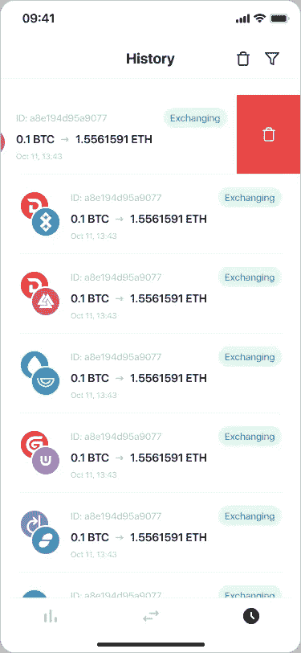

# StealthEX 手机加密交换应用出来了！

> 原文：<https://medium.com/coinmonks/stealthex-mobile-crypto-exchange-app-is-out-d79f56fe63ec?source=collection_archive---------21----------------------->

StealthEX 团队继续致力于为我们的用户提供最好的服务。今天，我们自豪地推出一款全新的产品——最好的移动加密交换应用之一。GooglePlay 上已经有了移动加密交换应用。现在，为您喜爱的加密货币获得最佳利率变得更加容易！超过 600 种加密硬币可供使用，包括我们在 StealthEX 上引以为豪的最受欢迎的——比特币、以太坊、Monero、莱特币、Solana(当然，还有更多)。

StealthEX 的主要产品是一种即时加密货币交易所，自 2018 年以来一直存在。这种非托管的交换平台为加密爱好者提供了一个无需注册或创建账户即可进行加密货币互换的机会。StealthEX 专注于隐私和安全，因此选择了免注册和免托管的方法来促进交换并保护用户的资金和数据。该平台与许多加密货币合作——StealthEX 提供了大量的硬币——从比特币和以太坊到互联网计算机或预搜索等更罕见的硬币，加上用借记卡和信用卡购买加密货币的选项。

# StealthEX 最佳加密交换应用程序:功能

StealthEX 移动应用即将面世，功能丰富。

以下是您在第一版中能够看到的一些内容:

*   大量的密码收藏。
*   交流历史。
*   监视名单。
*   加密汇率。
*   选择浮动或固定利率互换。
*   从各种著名的供应商处收集的有竞争力的价格。
*   这项服务是透明的，不需要注册，同时保护你的个人隐私。

此外，在接下来的版本中，该应用程序将扩展为支持菲亚特购买选项和更多功能。

现在，让我们仔细看看这个应用程序。

首先，这个应用程序让你可以访问价格和你的观察列表。您可以将您希望兑换的货币放在观察列表中，以便获得最有吸引力的汇率:

你也可以在手机上看到价格图表和价格变化。

当您单击“购买”时，您将进入交换程序本身。

别忘了，你可以选择最适合你的汇率——浮动汇率或固定汇率。通过单击锁图标在这些选项之间切换。

点击开始交换，您将进入以下屏幕，要求您输入您的钱包地址:

此外，StealthEX 应用程序提供了对您的历史记录的轻松访问。只需选择您需要的日期或时间段，然后点击应用:

你的历史记录存储在应用程序中。通过单击应用，您可以快速查看在所选时间范围内处理的事务:

此外，您可以修改您的历史记录。只需向左滑动交易并点击红色十字即可删除:

应用程序的过滤器部分可让您找到任何最近的交易:

在您的设置中，您将看到四个部分:通知、安全性、常见问题和清除本地存储:

# 下载 StealthEX 加密交换应用程序

[下载 StealthEX 应用](https://play.google.com/store/apps/details?id=com.stealthex)能够在你所在的任何位置处理交换，无论你是在公交车上、在排队还是在公园散步。它是您启动加密交换、选择最佳加密速率等的一体化解决方案。通过加密货币价格变化跟踪发现机会。不要让你的日常事务阻止你得到你正在寻找的加密速率。

我们的应用程序是免费的，证明是任何加密投资者或爱好者的必要工具。你可以在 Google Play 上找到我们的[应用，很快，它就会在 AppStore 上发布。](https://play.google.com/store/apps/details?id=com.stealthex)

在 [Medium](https://stealthex-io.medium.com/) 、 [Twitter](https://twitter.com/Stealthex_io) 、 [Telegram](https://t.me/StealthEX) 、 [YouTube](https://www.youtube.com/channel/UCeES_XBesX76ge7xf1meuSw) 和 [Reddit](https://www.reddit.com/user/Stealthex_io) 上关注我们，了解关于 [StealthEX.io](https://stealthex.io/) 和其他秘密世界的最新消息。

在购买任何密码之前，不要忘记做自己的研究。本文表达的观点和意见仅代表作者个人。

> 交易新手？试试[加密交易机器人](/coinmonks/crypto-trading-bot-c2ffce8acb2a)或者[复制交易](/coinmonks/top-10-crypto-copy-trading-platforms-for-beginners-d0c37c7d698c)