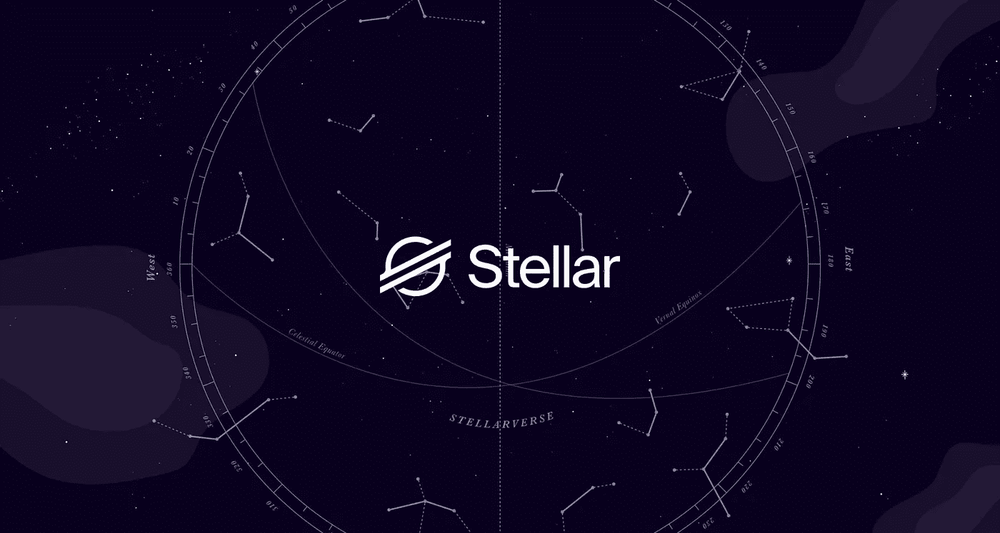

# 恒星流明(XLM)存储和移动金钱的开放网络

> 原文：<https://medium.com/coinmonks/stellar-lumens-xlm-an-open-network-for-storing-and-moving-money-c14fe995d262?source=collection_archive---------28----------------------->

# 什么是恒星(XLM)加密货币？

恒星(XLM)加密货币是一个简单的开放网络，允许货币存储和移动；当它在 2014 年 7 月发布时，它的主要目标之一是通过接触世界上没有银行账户的人来促进金融包容性，但不久之后，它的优先事项转向帮助不同的金融公司通过 [**区块链科技**](https://procommun.com/2021/10/technology/why-is-the-world-getting-obsessed-with-bitcoin/) 相互联系。

网络的本地令牌，流明，也作为一个桥梁，使各种跨境贸易资产更便宜。所有这些都集中在挑战现有的支付提供商，他们通常对类似的服务收取高额费用。如果这一切听起来对你来说很熟悉，那么值得注意的是，Stellar (XLM)加密货币最初是基于 Ripple Labs 协议的。因此，区块链是作为硬分叉的结果创建的，并且代码也随后被重写。

# 恒星(Xlm)加密货币的创始人是谁？

杰德·麦克·凯莱布(Jed Mc Caleb)在 2013 年因对公司未来方向的各种分歧离开 Ripple cryptocurrency 后，与律师乔伊斯·金(Joyce Kim)一起创立了 Stellar (XLM)加密货币。在解释 2020 年 9 月 Stellar (XLM)加密货币背后的基本原理时，创始人 McCaleb 说:“Stellar (XLM)加密货币的整个原始设计是，你可以有许多法定货币和其他种类的价值，它们彼此并行运行，并与其他加密资产并行运行。因此，推动这种东西成为主流非常重要。

McCaleb 的目标是确保 Stellar (XLM)加密货币能够为人们提供一种将法定货币转换为加密货币的方式，并消除不同参与者在世界各地发送大量货币时通常会遇到的所有摩擦。此外，他还担任 Stellar (XLM)加密货币的首席技术官，是 Stellar (XLM)加密货币的联合创始人。这个非营利组织致力于通过让资金更具流动性、市场更开放、全球人民更有权力来释放全球的经济潜力。

# 是什么让恒星(XLM)加密货币？

费用是许多人的症结所在。然而，进行跨境支付的高成本并不仅限于 PayPal 等基于菲亚特的收费解决方案，因为拥堵，以太坊和比特币区块链的交易费用也大幅上涨。

恒星(XLM)加密货币是独一无二的，因为每笔交易仅花费 0.00001 XLM。此外，一个单位的恒星(XLM)加密货币在写入时只需要几分钱，这有助于确保用户保留更多的钱。一些区块链项目已经与大品牌科技公司和金融科技公司建立了合作关系。例如，几年前，IBM 和 Stellar 合作推出了 world wire，该项目允许各大金融机构使用 stablecoins 等桥接资产向 Stellar (XLM)加密货币网络 transact 提交交易。其他区块链拥有社区基金，这意味着可以向进一步帮助 [**生态系统发展**](https://procommun.com/2021/11/technology/how-will-web-3-0-shape-the-future-of-the-internet/) 的项目提供资助，并允许用户投票决定哪些企业应该获得这种支持。

> 交易新手？试试[密码交易机器人](/coinmonks/crypto-trading-bot-c2ffce8acb2a)或[复制交易](/coinmonks/top-10-crypto-copy-trading-platforms-for-beginners-d0c37c7d698c)

# Stellar (Xlm)加密货币网络是如何保护的？

该网络使用 stellar consensus 协议进行安全保护，该协议具有四个主要特性:低延迟、**【分散控制】、灵活信任和渐近安全。通过 SCP，任何人都可以加入到达成共识的过程中来，没有任何一种商品可以最终拥有决策权的优势。这些交易也是廉价确认的。**

# **有多少恒星(Xlm)加密货币硬币在流通？**

**当恒星(XLM)加密货币网络在 2015 年推出时，发行了约 1000 亿 XLM，但自发布之日起，情况发生了变化。总供应量为 500 亿恒星(XLM)加密货币，目前流通的收藏品为 207 亿。**

**2019 年，恒星(XLM)加密货币发展基金会宣布，它正在烧掉一半以上的加密货币供应。这意味着它现在控制着大约 300 亿恒星(XLM)加密货币。虽然一部分资金被指定用于营销和帮助该组织发展，但大约三分之一的资金被保留用于投资其他区块链企业。**

> **原载于[**procommun.com**](https://procommun.com/2022/04/technology/stellar-lumens-xlm-an-open-network-for-storing-and-moving-money/)**