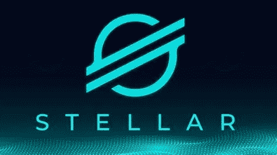

# 恒星(XLM)2022–2025 年价格预测

> 原文：<https://medium.com/coinmonks/stellar-xlm-price-prediction-2022-2025-909b339325ec?source=collection_archive---------33----------------------->

Source photo [xlm — Bing images](https://www.bing.com/images/search?view=detailV2&ccid=RjSWXIqs&id=B92E0485E52C3B4ADCE449AA51B754F709F6F0A2&thid=OIP.RjSWXIqs7oOn-nw4O3VyhgHaEK&mediaurl=https%3a%2f%2fwww.coinnewsspan.com%2fwp-content%2fuploads%2f2020%2f04%2fStellar.jpg&cdnurl=https%3a%2f%2fth.bing.com%2fth%2fid%2fR.4634965c8aacee83a7fa7c383b757286%3frik%3dovD2CfdUt1GqSQ%26pid%3dImgRaw%26r%3d0&exph=451&expw=802&q=xlm&simid=608043227761506763&FORM=IRPRST&ck=8241C788FF64A52E7B72976171226607&selectedIndex=1&ajaxhist=0&ajaxserp=0)

## 恒星(XLM):这是什么？

金钱可以在每个人都可以访问的恒星网络上存储和转移。该平台的目标是帮助世界上没有银行账户的人，以促进金融包容性。之后，工作重点转向了利用区块链技术连接金融机构的桥梁。