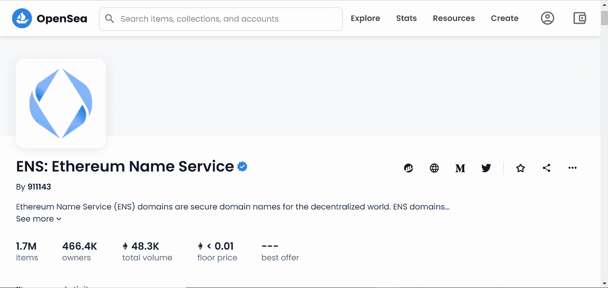
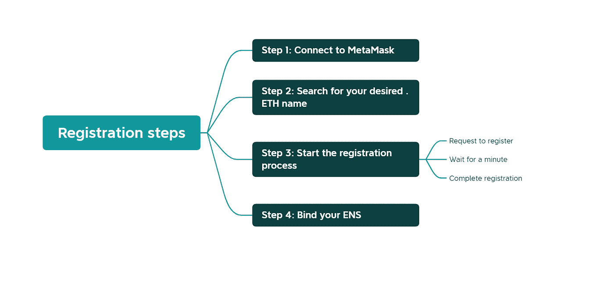
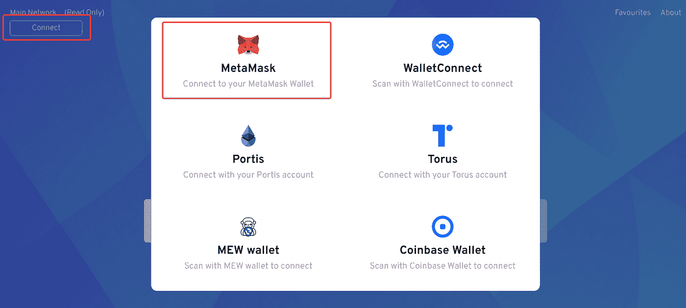
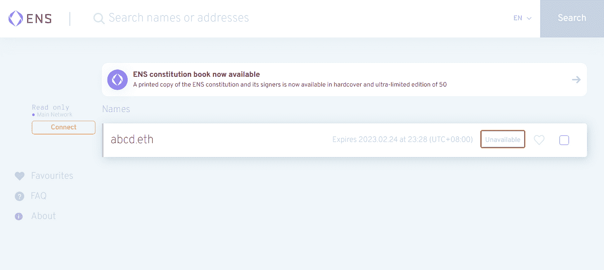
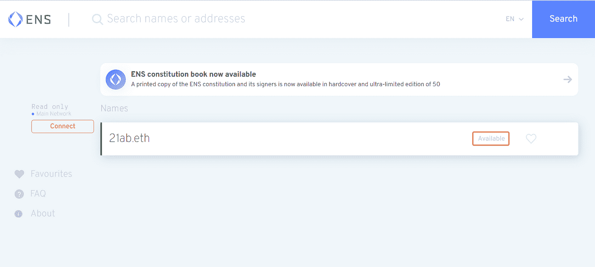
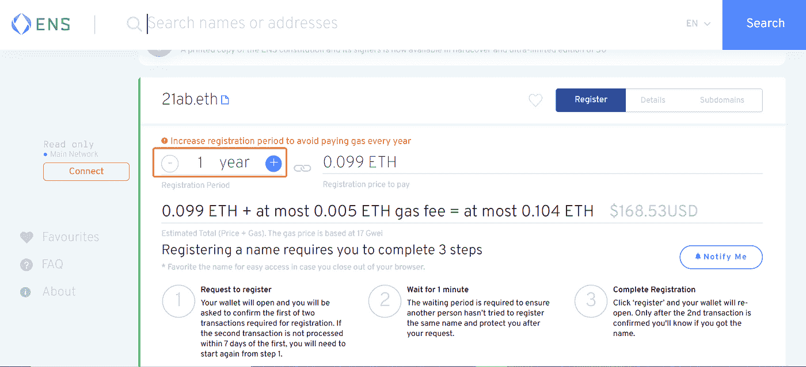
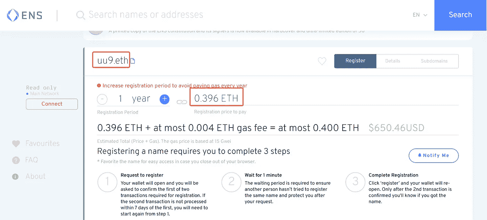
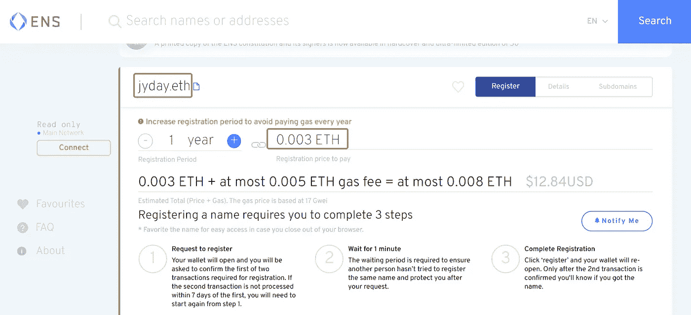
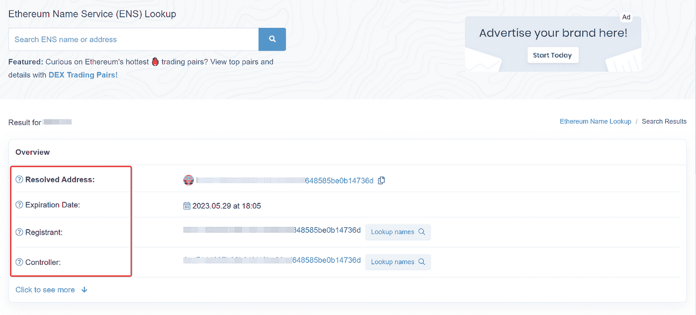
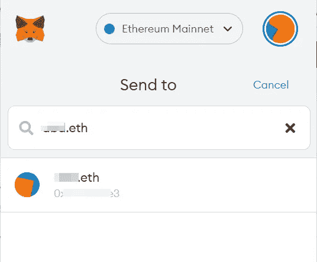

# ENS 教程第一部分-注册 ENS 名称的分步指南

> 原文：<https://medium.com/coinmonks/step-by-step-guide-to-registering-ens-name-part-i-53e33b6a0889?source=collection_archive---------7----------------------->

👉关注我 [***推特***](https://twitter.com/TheCryptoKK)***|***[***中***](/@TheCryptoKK) 让自己升职！

思前想后 **#NFT 研究员**&**#网路搜寻家**

每日分享关于**# web 3 # Crypto # NFT #比特币**的真实素材

ENS 这些天在社交媒体上疯传。以太坊的联合创始人 Vitalik Buterin 表示，“ENS 仍然是非常有价值和重要的以太坊基础设施。”2021 年 10 月 9 日，一个不知名的钱包以 420 ETH 的价格购买了 ENS *paradigm.eth* ，这是迄今为止最大的一笔 ENS 交易。

为什么要花这么大一笔钱买域名？如何注册一个. ETH 名称并进行运营？让我们来找出答案。

**一、什么是 ENS？**

***以太坊名称服务*** ，也称为 ENS，是一种域名服务，它会分配一个与您的钱包帐户地址绑定的用户特定的域。

ENS 域采用 *YourDomainHere.eth、*的格式，将普通地址简化为更易于使用和发送给他人的形式。通过将以太网地址替换为简单字符，用户不再需要复制和粘贴长地址，而是可以直接使用 ENS 域名，这使得发送和接收加密资产更加容易，并降低了将资金转移到错误地址的风险，因为每年都有因地址输入错误而造成巨大损失的报道。

另外，ENS 是建立在 ERC721 协议之上的，即每个 ENS 域名实际上是一个 NFT。注册完成后，可以选择一个价格在 [OpenSea](https://opensea.io/collection/ens) 等 NFT 交易市场挂牌，通过拍卖方式转让。

**二。如何注册一个 ENS 域名？**

**步骤 1:连接到元掩码**

前往[https://app.ens.domains/,](https://app.ens.domains/)点击进入左上角的“连接”，我们假设你使用的是 MetaMask，但其他支持以太坊的钱包应该工作非常类似。

Connect to your wallet

你的钱包里至少要有少量的 ETH 来支付交易费用，第一年的年费，以及设置费用。

第二步:搜索你想要的。以太网名称

在“搜索名称”字段中键入。您要迁移的 ETH 名称(包括“.ETH "结尾)，并点击"搜索"按钮。

名称的长度没有限制，并且允许使用特殊字符。但是，如果该名称已被其他人注册，则该名称将不可用。

如果你看到这样的页面，“不可用”意味着这个名字已经被别人注册了，那么你必须考虑另一个名字。

The name is unavailable

如果该名称可用，您将看到如下页面:

The name is available

这里问你多久你想注册的名字，使用“-”和“+”按钮选择时间间隔。

Set the registration period

**注:**

*   ENS 目前开放注册 3 个字符及以上的域名，注册人需要按年租用域名(最少 1 年，无上限)。

对于最稀缺的 3 个字符的域名，租赁费为 640 美元/年

3-character domain name

对于 4 个字符的域名，160 美元/年

4-character domain name

对于 5 个或更多字符，5 美元/年

5 or more characters

*   跨市场检查和发现 ENS 名称的工具:【https://www.ens.vision/&[https://ens.tools/domains](https://ens.tools/domains)

**第三步:开始注册过程**

*   请求注册

点击右下角的蓝色*“请求注册”*按钮。MetaMask 会弹出一个对话框，要求您确认交易。点击*“确认”*按钮进行确认。

*   等一会儿

你必须等待，以确保没有其他人试图注册相同的名称。

*   完成注册

一旦等待时间结束，就会出现橙色文本，上面写着“单击注册进入第三步”点击旁边写着“注册”的蓝色图标

会弹出另一个 MetaMask 框，要求你确认另一笔燃气费和年费的交易。点击*确认*按钮。然后你会看到“TX PENDING”，意思是交易确认，你的名字注册了！

**第四步:绑定您的 ENS**

点击“设置为主要 ENS 名称”>“选择一个您的 ENS 名称”，您可以将您的 ENS 名称绑定到您的地址，MetaMask 将弹出以确认设置费用。

通过这样做，

*   任何人都可以通过 block 浏览器和多个 DApps 查询你的 ENS 域名。例如，在[以太扫描](https://etherscan.io/)中，搜索 ENS 名称，您将看到地址、到期日期、注册人和控制者。

*   元掩码中的事务只需要 ENS 名称，而不需要长长的地址列表。

我会在下一个教程中介绍如何将 ENS 名称绑定到 Twitter、Discord 和 Telegram！如果感兴趣，请保持密切联系。

***关注我让自己升职！***

***聚焦#NFT 研究员&#网路搜寻家***

***每日分享关于# web 3 # Crypto # NFT #比特币的真实素材***

[***碎碎念***](https://twitter.com/TheCryptoKK)***|***[***中等***](/@TheCryptoKK)

*欢迎关注我，并随时询问任何事情*

> 交易新手？尝试[加密交易机器人](/coinmonks/crypto-trading-bot-c2ffce8acb2a)或[复制交易](/coinmonks/top-10-crypto-copy-trading-platforms-for-beginners-d0c37c7d698c)