# ENS 教程第二部分-设置 NFT 头像的一步一步的指导

> 原文：<https://medium.com/coinmonks/step-by-step-guide-to-registering-ens-name-part-ii-e15d95ec306c?source=collection_archive---------8----------------------->

**👉在 Twitter | Medium 上关注我，让自己得到提升！**

**聚焦#NFT 研究员&#网路搜寻家**

**每日分享# web 3 # Crypto # NFT #比特币的真实素材**

[我上一个教程](/@TheCryptoKK/step-by-step-guide-to-registering-ens-name-part-i-53e33b6a0889)一步一步带你看如何注册一个 ENS 域名。今天的文章会给你一个清晰的画面，告诉你如何管理你的 ENS 名称，并建立一个 NFT 头像。

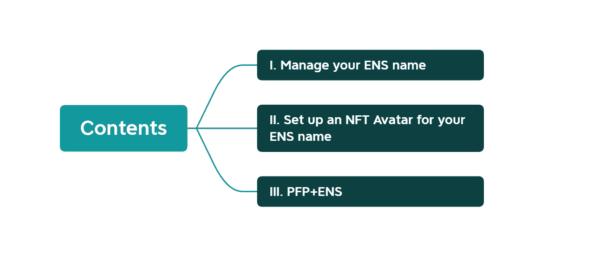

# **一、管理您的 ENS 名称**

进入[https://app.ens.domains/,](https://app.ens.domains/,)连接你的钱包，选择管理你的域名。

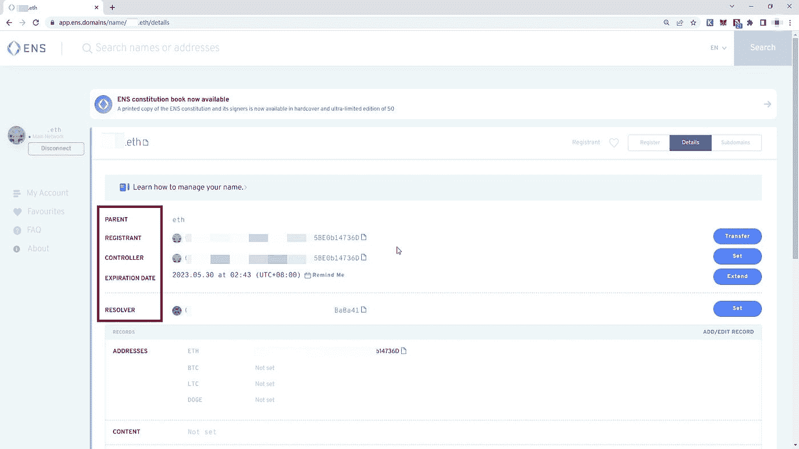

*   ***注册人:*** 注册的所有者。如果需要，注册人可以转让注册、设置控制人并在注册管理机构中收回该名称的所有权。
*   ***控制器:*** 可以编辑某个名字的记录的账户。注册人或控制人可以变更控制人。
*   ***到期日期:*** 您的续费到期时，您也可以在此处支付。您可以通过点击“提醒我”在您的电子邮件上设置提醒。
*   ***解析器:*** 从名称映射到资源(如加密货币地址、内容哈希等)的契约。

您可以设置地址、内容和文本记录，点击“添加/编辑记录”来设置解析器。

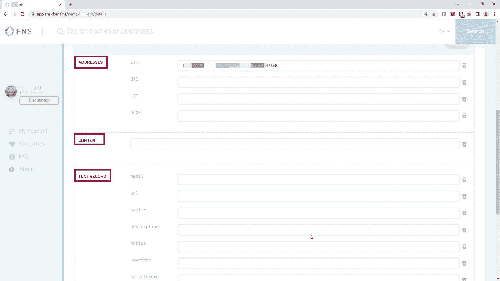

*   ***地址:*** 输入您已经注册的以太坊名称或地址。你也可以添加其他地址，如$BTC，$ LTC 和$DOGE。
*   ***内容:*** 你可以放一个 IPFS、BZZ 或者 Tor 的内容哈希，当你在网络浏览器中进入你的域名时，会调出你的网站。如果你想了解详细说明，请留下评论让我知道。
*   ***文字记录:*** 这允许 ENS 域名持有者将电子邮件地址、不和谐、Twitter 和电报地址与一个 ENS 域名相关联。

可以按照官方说明:[https://docs . ens . domains/ens-improvement-proposals/ensip-5-text-records](https://docs.ens.domains/ens-improvement-proposals/ensip-5-text-records)

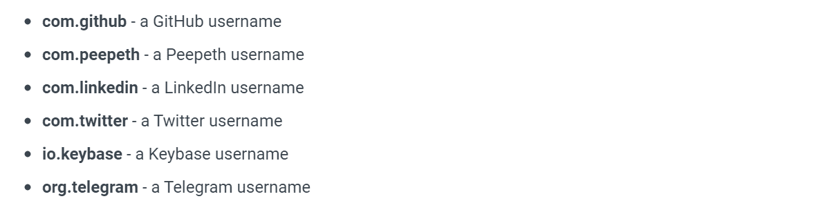

# **二。为你的 ENS 名字设置一个 NFT 头像**

在这里，我与你分享两种方法来建立 NFT 头像。

***【方法一】***

前往 [app.ens.domains](http://app.ens.domains) 并搜索您的 ens 名称以进入其记录页面。找到“头像”部分，并按以下格式填写:

**EIP 155:1/【NFT 标准】:【NFT 集合的合同地址】/【令牌 ID 或其在集合中的编号】**

你可以在 [OpenSea](https://opensea.io/) 上你的 NFT 的“详情”部分找到 *NFT 标准*、*合同地址*和 *token ID* 。

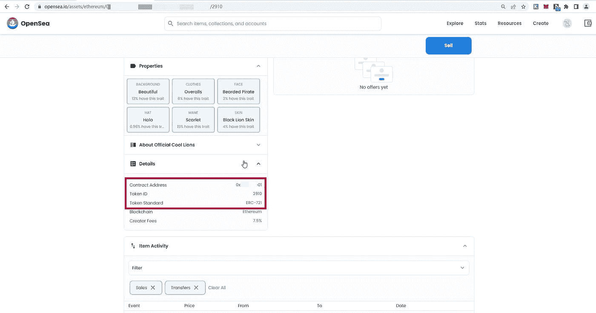

此处合同地址不完整。点击*蓝色文本*将带您进入 Wtherscan 页面，显示完整的合同地址。

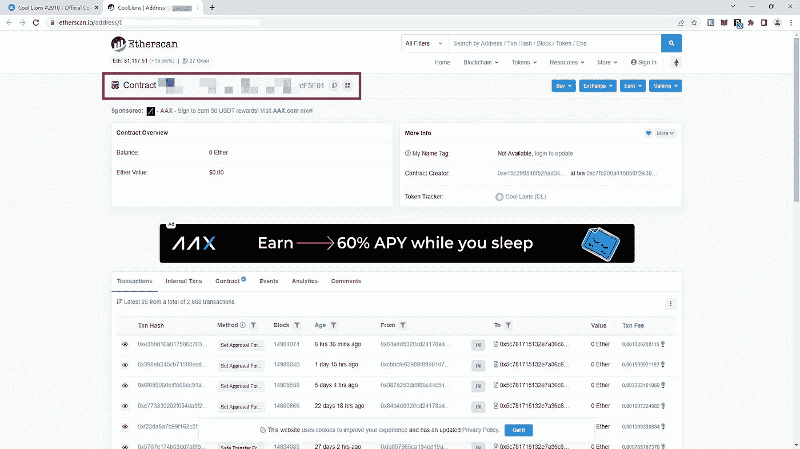

***注意:所有大写字母都要作为小写字母输入，不能有 hypen，否则不起作用。例如，OpenSea 可能将标准显示为“ERC-721”，将其输入为“erc721”。***

在头像栏中输入，然后向下滚动并点击“确认”。系统将提示您批准交易。一旦交易在区块链上被确认，你的头像就设定好了！

***【试用】***

*   [ENS Manager App](https://app.ens.domains/) :刷新页面，你会在左手边看到你的头像。
*   刷新页面，直到你的 NFT 头像作为你的 ENS 名称的背景图片出现。
*   拿起你的钱包，等几秒钟，你的 ENS 名字和头像就会出现。

***【方法二】***

更简单的方法是使用[**https://www.enspfp.xyz/#/.**](https://www.enspfp.xyz/#/.)

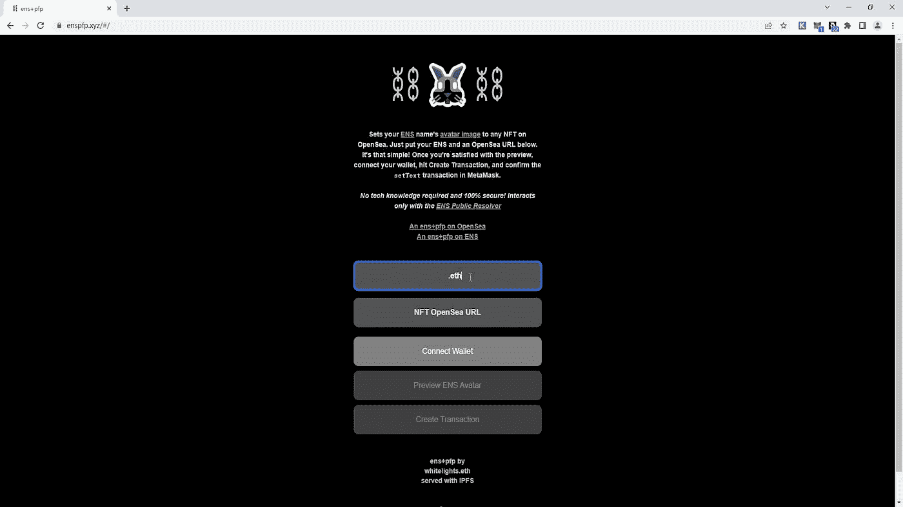

*   **第一步:输入你的 ENS 名称**

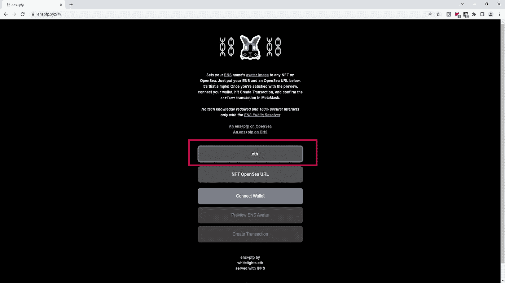

*   **第二步:输入 NFT OpenSea 网址**

进入 [OpenSea，](http://opensea.io)选择一个 NFT，复制并粘贴所选 NFT 的网址。

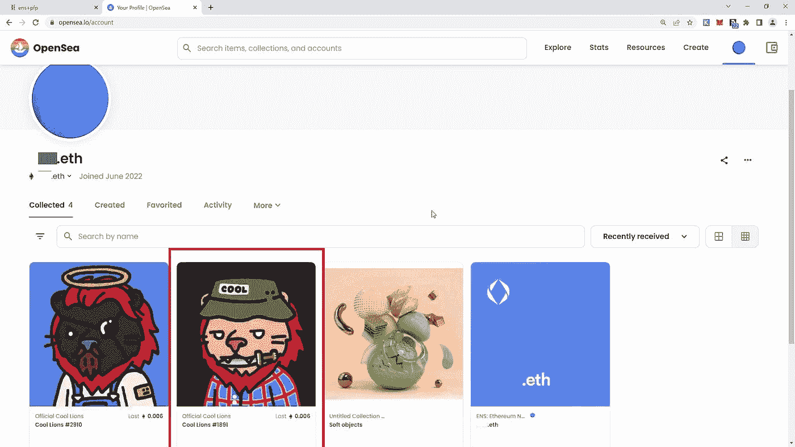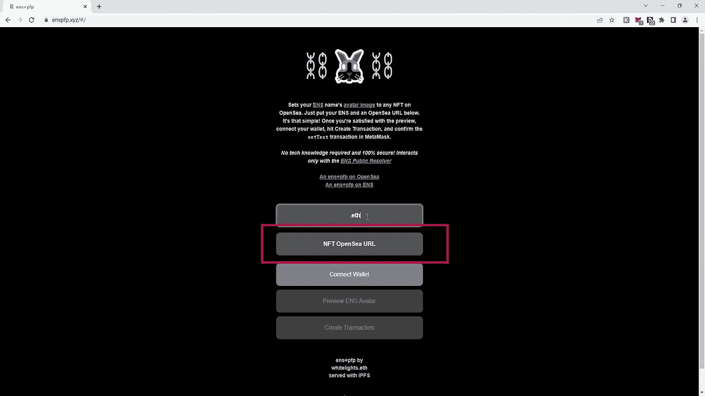

*   **第三步:连接钱包**

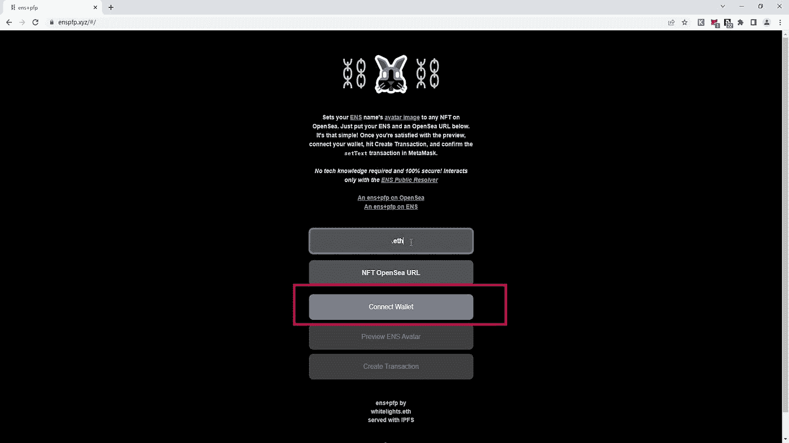

*   **第四步:预览 ENS 头像**

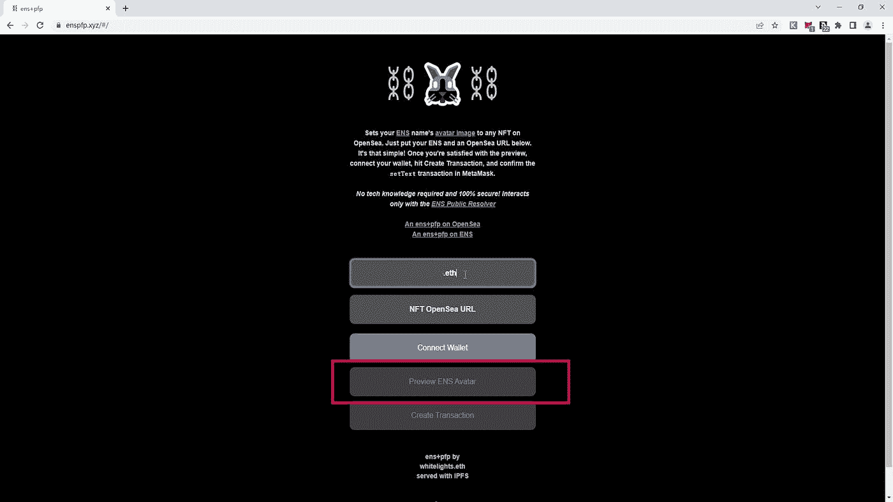

*   **第五步:创建交易**

将弹出元掩码来运行事务。现在你完成了！

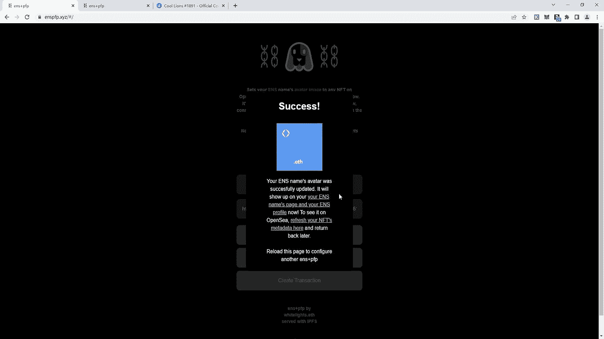

# **三世。PFP+ENS**

根据 ENS DAO 的官方文档，它正在启动一个项目，将一个生成性 PFP 生成器纳入该平台，旨在为 ENS 用户提供一个具有随机性状的独特 PFP，概念上类似于现代 NFT 收藏。

用户将能够选择此 PFP 生成器作为手动填充 ENS 记录头像字段的替代方法。随机头像将是 ENS 名称的衍生。不管所有权是否转移，每个 ENS 名称将总是解析为化身的相同单个排列。

我期待 PFP+ENS 可能成为 NFT 的一个新趋势。

> ***保持消息灵通***

https://app.ens.domains/[ENS App【获得你的 ENS 名字】](https://app.ens.domains/)

***ENS 视觉*** 【发现 ENS 市场交易】:[https://www.ens.vision/](https://www.ens.vision/)

***ENS 论坛*** 【随时了解】:[https://discuss.ens.domains/](https://discuss.ens.domains/)

***ENS 不和*** 【加入社团】:[https://chat.ens.domains/](https://chat.ens.domains/)

***ENS 文档*** 【阅读文档】:[https://docs.ens.domains/](https://docs.ens.domains/)

***关注我让自己升职！***

***聚焦#NFT 研究员&#网路搜寻家***

***每日分享关于# web 3 # Crypto # NFT #比特币的真实玩意儿***

[***碎碎念***](https://twitter.com/TheCryptoKK)***|***[***中等***](/@TheCryptoKK)

*欢迎关注我，有什么问题尽管问*

> 交易新手？尝试[加密交易机器人](/coinmonks/crypto-trading-bot-c2ffce8acb2a)或[复制交易](/coinmonks/top-10-crypto-copy-trading-platforms-for-beginners-d0c37c7d698c)