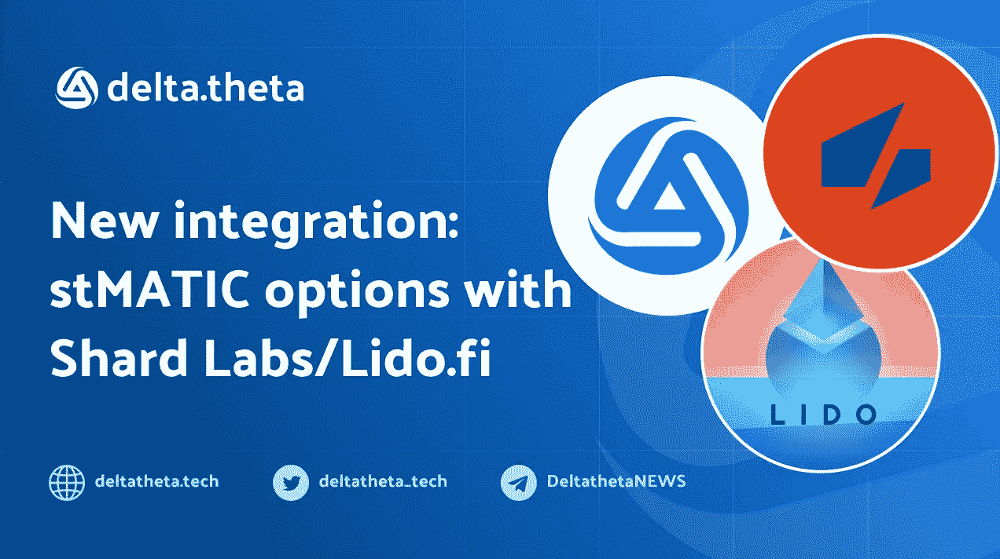
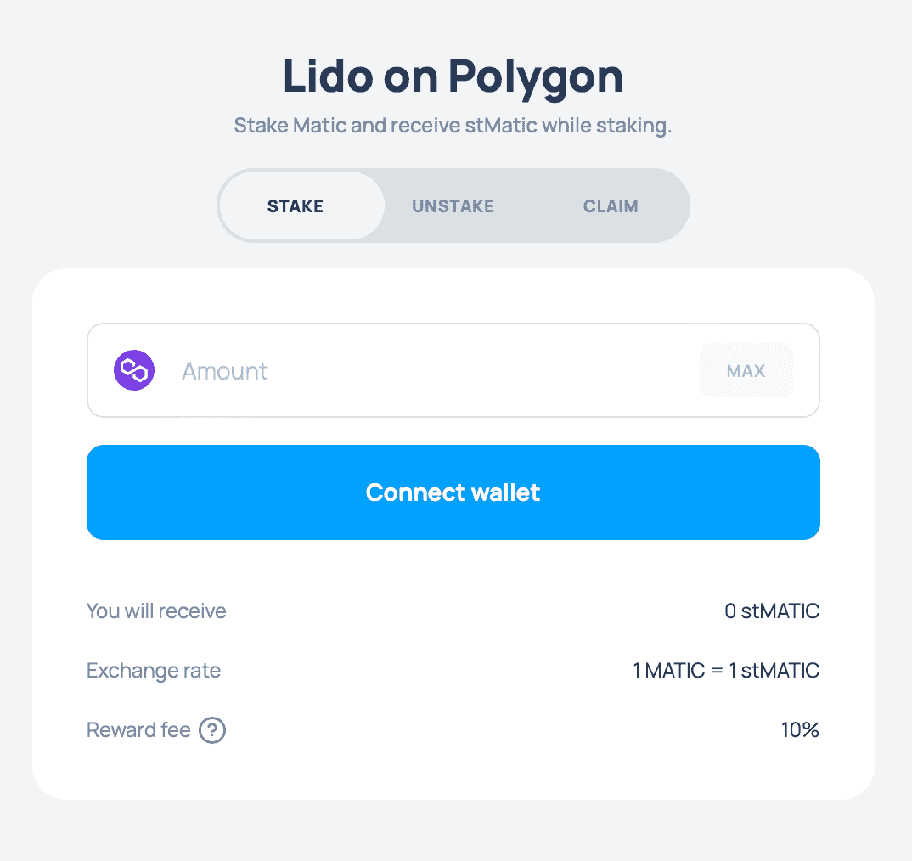

# stMATIC——delta theta 的新令牌列表和集成。

> 原文：<https://medium.com/coinmonks/stmatic-the-new-token-listing-and-integration-at-deltatheta-b324f8c38307?source=collection_archive---------18----------------------->

一个新的令牌 stMATIC 将很快在 deltatheta 平台上上市。作为我们与 Polygon Family 合作的一部分，我们将继续扩展 MATIC 令牌的功能。市场上有几家液体堆叠服务提供商。在这种情况下，stMATIC token 就是[碎片实验室](https://shardlabs.io/)和丽都道的一个开发产品。

# 它是如何工作的？

借助灵动堆叠协议，用户无需锁定资产和维护堆叠基础设施即可获得回报。这个想法很简单:用户将代币存入合同，并收到可交易的流动代币作为回报。DAO 管理的智能合约使用选定的提供者部署用户令牌。绝对的优势是，由于资产是由 DAO 控制的，所以定位服务提供者不能直接访问资产。

在多边形网络的[丽都平台下注时，用户发送 MATIC 后会立即收到 stMATIC 令牌。Lido 计算当前的 stMATIC/MATIC 比率，并将所需的数量发送给用户。然后，在多边形验证器之间分配标记，这些验证器是多边形上 Lido 的一部分。](https://polygon.lido.fi/)

# stMatic 与市场上类似解决方案的区别:

*   由 DAO 管理的智能合同
*   堆叠奖励的分配如下:90%转让给 stMATIC 值，5%给节点操作员，5%给 DAO 库
*   输出需要 4 天时间(这是由多边形网络中验证节点的性质决定的；详见[文档](https://wiki.polygon.technology/docs/maintain/delegate/delegator-faq/#what-is-the-unbonding-periodhttps://wiki.polygon.technology/docs/maintain/delegate/delegator-faq/#what-is-the-unbonding-period)
*   拥有自己的 DeFi 基础设施——分散式交易所的交易所池，收益聚合器——以及现在在 deltatheta 交易期权的能力。

# 新的机会。

随着 stMATIC 的上市和该平台第 3 版的推出，代币持有人将能够结合三种类型的有机回报:

1.  从 stMATIC 叠加返回，
2.  deltatheta 平台上 stablecoins 中的期权费
3.  在 AAVE 平台上存放卖出期权的抵押品的回报。我们将在下面的文章中更详细地解释这个系统是如何工作的。

**在社交媒体上关注我们:**

**ShardLabs**
网站—[https://shardlabs.io/](https://shardlabs.io/)

推特—[https://twitter.com/shard_labs](https://twitter.com/shard_labs)

中型—[https://news.shardlabs.io/](https://news.shardlabs.io/)

领英-【https://www.linkedin.com/company/shard-labs/ 

**δθ**

网站—[https://deltatheta.tech/](https://deltatheta.tech/)

推特—[https://twitter.com/deltatheta_tech](https://twitter.com/deltatheta_tech)
电报—[https://t.me/deltatheta](https://t.me/deltatheta)

TG 公告—[https://t.me/DeltathetaNEWS](https://t.me/DeltathetaNEWS)
中—[https://optiondeltatheta.medium.com/](https://optiondeltatheta.medium.com/)

LinkedIn—[https://www.linkedin.com/company/deltathetatech](https://www.linkedin.com/company/deltathetatech)

> 交易新手？试试[加密交易机器人](/coinmonks/crypto-trading-bot-c2ffce8acb2a)或者[复制交易](/coinmonks/top-10-crypto-copy-trading-platforms-for-beginners-d0c37c7d698c)