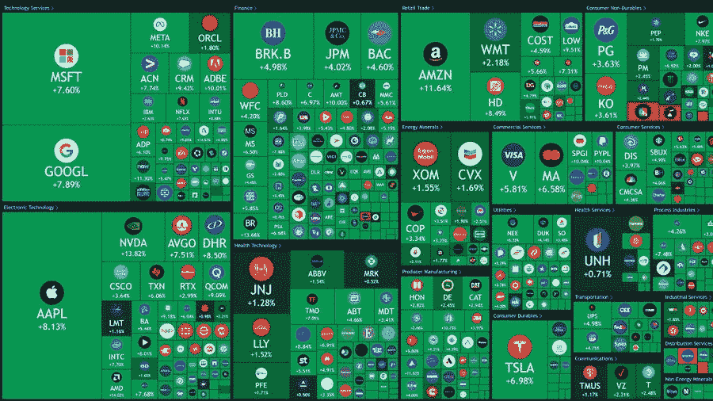

# 股票反弹。加密崩溃结束了吗？

> 原文：<https://medium.com/coinmonks/stocks-bounce-is-the-crypto-crash-over-67b000751a63?source=collection_archive---------4----------------------->

股票正在大幅上涨。如果不是因为那个该死的愚蠢的 FTX，比特币现在应该是 25000 美元了。

事情是这样的。

昨天，美国劳工统计局(BLS)公布了 10 月份的 CPI 数据。12 个月的通胀率从 9 月份的 8.2%降至 10 月份的 7.7%。这表明美联储将在 12 月的 FOMC 中降低加息幅度…