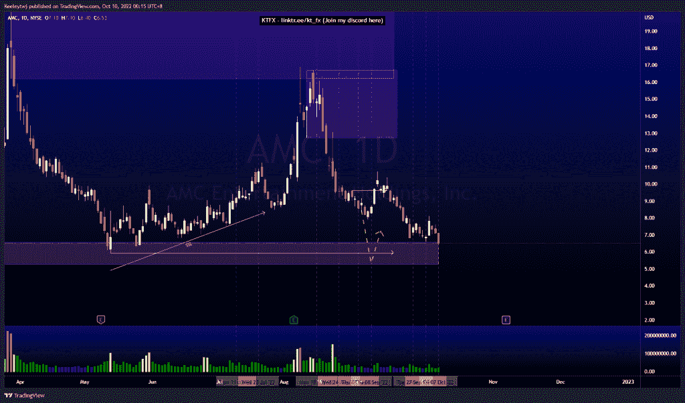
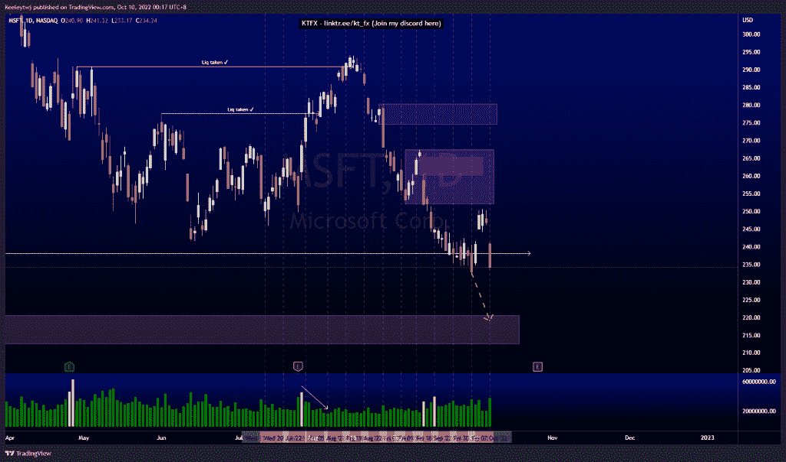
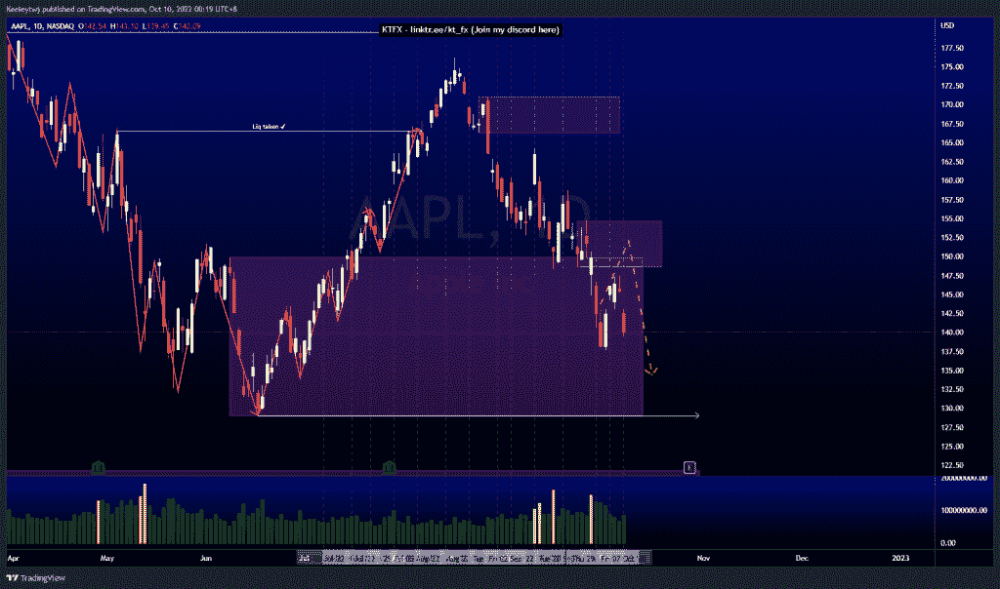

# 股票技术分析#AMC #MSFT #AAPL

> 原文：<https://medium.com/coinmonks/stocks-technical-analysis-amc-msft-aapl-4e0f457e1f73?source=collection_archive---------12----------------------->

在这里了解更多关于我的信息(YouTube/insta gram/Telegram):[https://www.linktr.ee/keeleytan](https://www.linktr.ee/keeleytan)

如果你觉得我的帖子有帮助，如果你能在这个帖子上给我一个赞，并关注我以后的类似帖子，我将不胜感激。如果您有任何意见/反馈，请随时使用上面的谷歌表单链接。

不和谐的免费信号服务正式启动。如果有兴趣，请到我的不和谐来看看！

#AMC

根据上周的分析，价格正在上涨。我预计价格将走低，在降低目前的 POI 6.59 后，价格将跌至 5.96 的低点，与我之前的预期没有变化。

#MSFT

根据我上周的分析，价格没有发挥作用。我预计价格会下跌至 220.58 的看涨点。价格走高，几乎缓解了 251.94 的看跌点，并继续走低。现在，我的预期不变，预计价格将继续下跌至 220.58 的看涨点。

#AAPL

根据我上周的分析，价格已经上涨。价格走高，几乎缓解了 148.56 的看跌点，然后继续走低。我预计价格将向下突破市场结构，目标可能是 129.04 的低点

如果你持有这些公司中的任何一家，就可以点赞、分享和评论！

让我知道，如果你有任何你想让我分析的行情。

一定要在其他社交平台上看看我，我在交易、分析和心理学上发布内容。看看我这里:【https://www.linktr.ee/keeleytan】T2

*原载于 2022 年 10 月 9 日***。**

> *交易新手？尝试[加密交易机器人](/coinmonks/crypto-trading-bot-c2ffce8acb2a)或[复制交易](/coinmonks/top-10-crypto-copy-trading-platforms-for-beginners-d0c37c7d698c)*