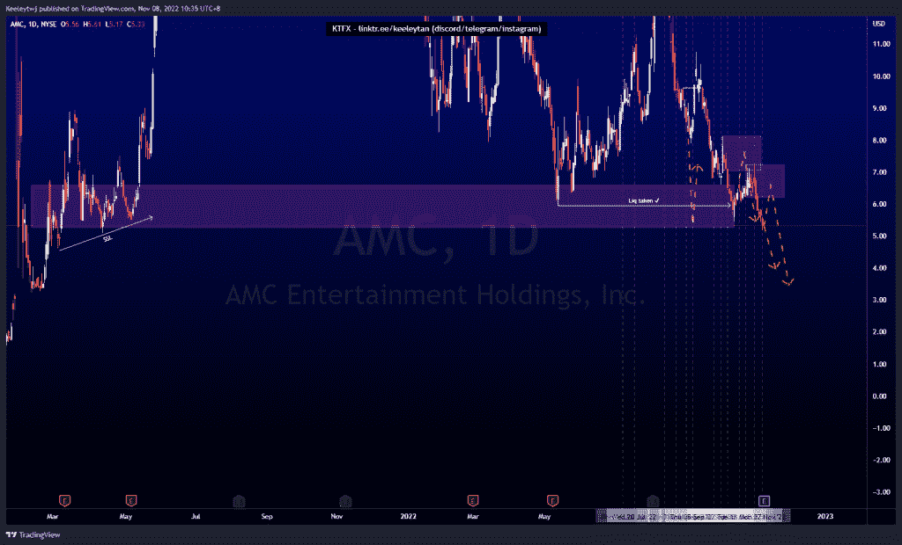
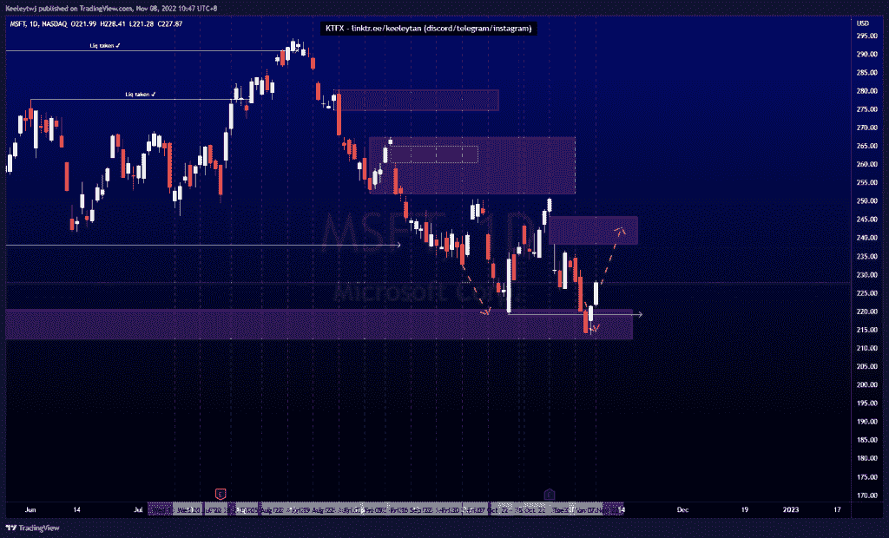
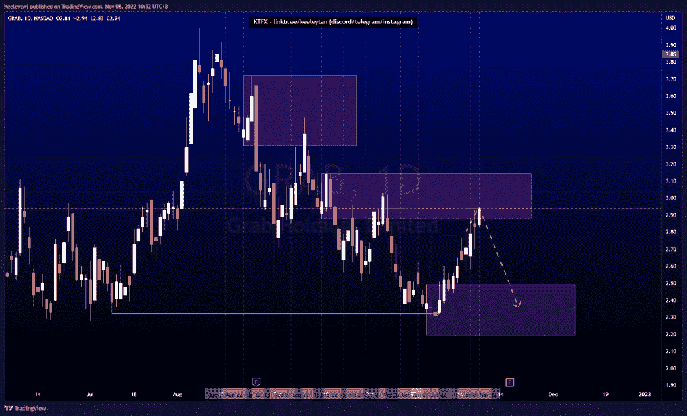

# 股票技术分析# AMC # MSFT #抓取

> 原文：<https://medium.com/coinmonks/stocks-technical-analysis-amc-msft-grab-82b03b4c714a?source=collection_archive---------43----------------------->

在这里了解更多关于我的信息(YouTube/insta gram/Telegram):[https://www.linktr.ee/keeleytan](https://www.linktr.ee/keeleytan)

如果你觉得我的帖子有帮助，如果你能在这个帖子上给我一个赞，并关注我以后的类似帖子，我将不胜感激。如果您有任何意见/反馈，请随时使用上面的谷歌表单链接。

不和谐的免费信号服务正式启动。如果有兴趣，请到我的不和谐来看看！

#AMC

价格完全符合我之前的分析。看涨点 6.59 已被接受，我预计在下跌之前，看涨点将回撤至新的看跌点 7.25。然而，由于今天的收益，从 2021 年 3 月开始，价格可能会直线下跌，收回旧的卖方流动性。

[https://www . trading view . com/chart/AMC/bj 7 cquqh-AMC-Analysis/](https://www.tradingview.com/chart/AMC/bJ7CqUqh-AMC-Analysis/)

#MSFT

价格的走势与上周的分析完全一致。价格尊重 220.58 的看涨点，对上涨反应强烈。此次上调的下一个目标可能是填补 245.83 的公允价值缺口。

[https://www . trading view . com/chart/MSFT/wxmaq 0x u-MSFT-Analysis/](https://www.tradingview.com/chart/MSFT/Wxmaq0xu-MSFT-Analysis/)

#抓取

根据上周的分析，价格正在上涨。价格目前正在缓解看跌点 2.88。我预计在走低之前，这个 POI 会有一个更深的缓解。

[https://www . trading view . com/chart/GRAB/B2 hbjprc-GRAB-Analysis/](https://www.tradingview.com/chart/GRAB/b2hbjprC-GRAB-Analysis/)

如果你持有这些公司中的任何一家，就可以点赞、分享和评论！

让我知道，如果你有任何你想让我分析的行情。

一定要在其他社交平台上看看我，我在交易、分析和心理学上发布内容。看看我这里:[https://www.linktr.ee/keeleytan](https://www.linktr.ee/keeleytan)

*原载于 2022 年 11 月 8 日 http://2minutesliteracy.wordpress.com***。**

> *交易新手？试试[加密交易机器人](/coinmonks/crypto-trading-bot-c2ffce8acb2a)或者[复制交易](/coinmonks/top-10-crypto-copy-trading-platforms-for-beginners-d0c37c7d698c)*