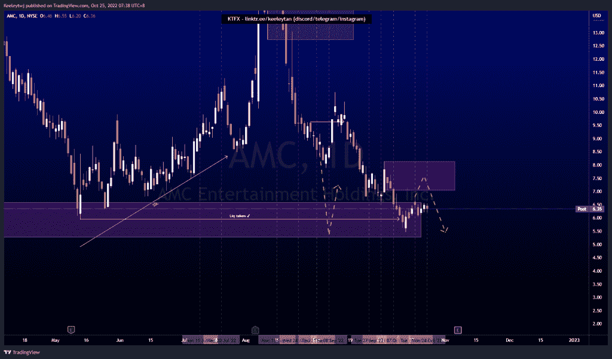
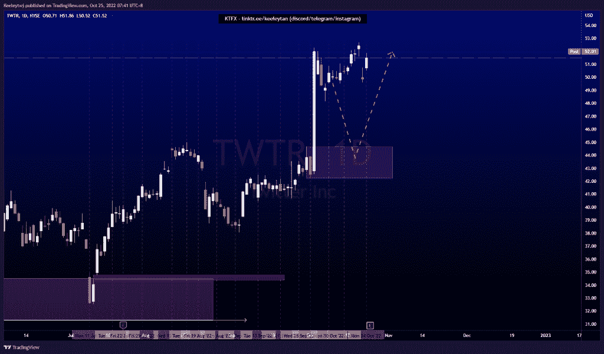
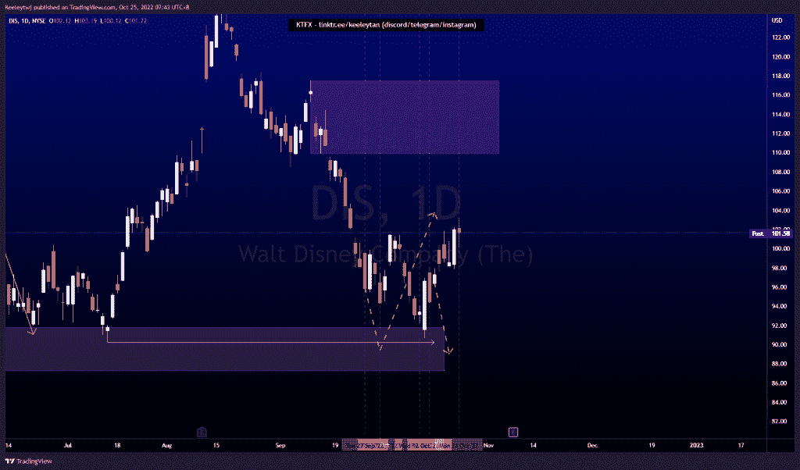

# 股票技术分析#AMC #TWTR #DIS

> 原文：<https://medium.com/coinmonks/stocks-technical-analysis-amc-twtr-dis-7691d9199988?source=collection_archive---------47----------------------->

在这里了解更多关于我的信息(YouTube/insta gram/Telegram):[https://www.linktr.ee/keeleytan](https://www.linktr.ee/keeleytan)

如果你觉得我的帖子有帮助，如果你能在这个帖子上给我一个赞，并关注我以后的类似帖子，我将不胜感激。如果您有任何意见/反馈，请随时使用上面的谷歌表单链接。

不和谐的免费信号服务正式启动。如果有兴趣，请到我的不和谐来看看！

#AMC

自从我上次分析后，价格有所巩固。我的期望没有改变。价格目前在 6.59 缓解看涨 POI，并在 5.96 获得流动性。我预计价格将在 8.13 的熊市点进行看涨回撤，并继续走低。

#TWTR

根据我之前的分析，价格得到了巩固。价格在每日时间框架内过度延伸，我仍然预计价格将在 44.66 处对看涨点进行看跌回撤。

#DIS

价格并没有按照我之前的分析发挥作用。我预计 90.23 的低点会在看涨回撤之前被拿下。现在价格已经打破了市场结构向上。我预计价格将在 109.88 下跌。

如果你持有这些公司中的任何一家，就可以点赞、分享和评论！

让我知道，如果你有任何你想让我分析的行情。

一定要在其他社交平台上看看我，我在交易、分析和心理学上发布内容。看看我这里:【https://www.linktr.ee/keeleytan】T2

@ captain tiger @ tiger stars @ millionaire tiger

*原载于 2022 年 10 月 24 日***。**

> *交易新手？尝试[加密交易机器人](/coinmonks/crypto-trading-bot-c2ffce8acb2a)或[复制交易](/coinmonks/top-10-crypto-copy-trading-platforms-for-beginners-d0c37c7d698c)*