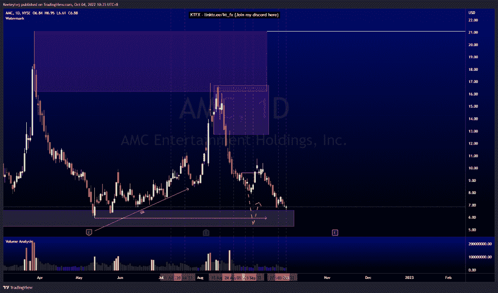
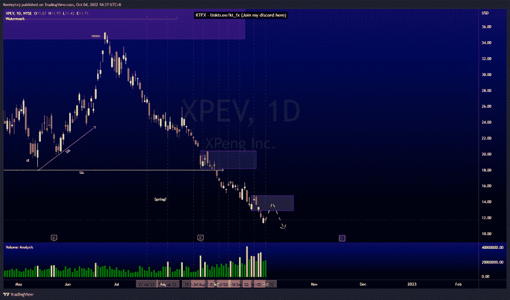
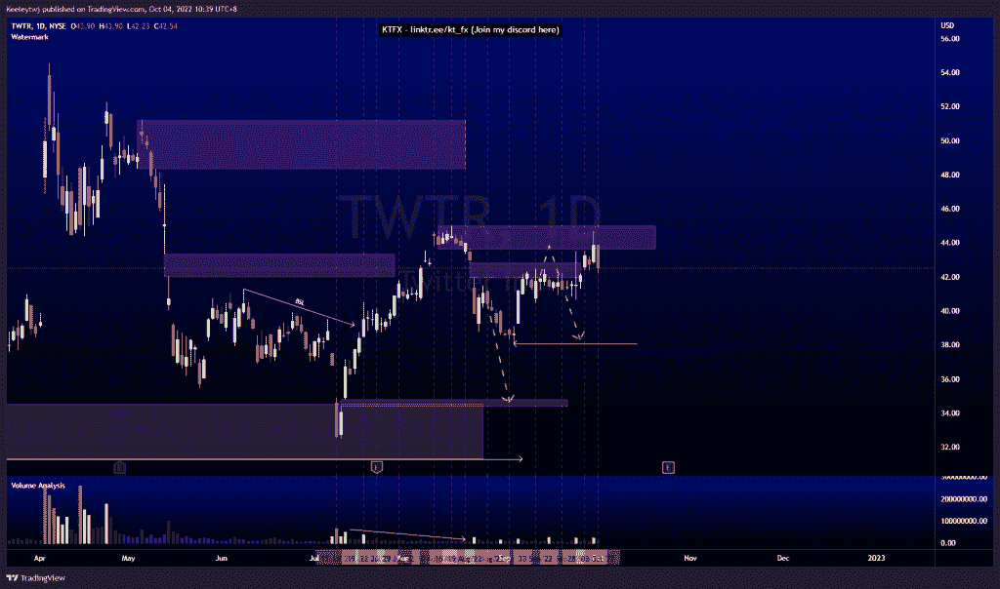

# 股票技术分析#AMC #XPEV #TWTR

> 原文：<https://medium.com/coinmonks/stocks-technical-analysis-amc-xpev-twtr-d7e13e12350f?source=collection_archive---------47----------------------->

在这里找到更多关于我的信息(YouTube/Discord/Telegram):[https://www.linktr.ee/keeleytan](https://www.linktr.ee/keeleytan)

如果你觉得我的帖子有帮助，如果你能在这个帖子上给我一个赞，并关注我以后的类似帖子，我将不胜感激。如果您有任何意见/反馈，请随时使用上面的谷歌表单链接。

不和谐的免费信号服务正式启动。如果有兴趣，请到我的不和谐来看看！

#AMC

根据上周的分析，价格正在上涨。价格几乎触及看涨点 6.59，并略有反应。我的预期不变，将在 5.96 的低点。

#XPEV

价格目前呈下降趋势。我期待着根据威科夫堆积示意图在这里制造一个弹簧。这个想法已经作废了。现在，我们应该看到在看涨回撤后继续走低，以缓解看跌点 12.86。

#TWTR

根据我上次的分析，价格从 43.64 的看跌点反弹。从这里开始，我预计价格至少会继续走低至 38.06 的低点。

如果你持有这些公司中的任何一家，就可以点赞、分享和评论！

让我知道，如果你有任何你想让我分析的行情。

一定要在其他社交平台上看看我，我在交易、分析和心理学上发布内容。看看我这里:【https://www.linktr.ee/keeleytan】T2

*原载于 2022 年 10 月 4 日 http://2minutesliteracy.wordpress.com***。**

> *交易新手？尝试[加密交易机器人](/coinmonks/crypto-trading-bot-c2ffce8acb2a)或[复制交易](/coinmonks/top-10-crypto-copy-trading-platforms-for-beginners-d0c37c7d698c)*