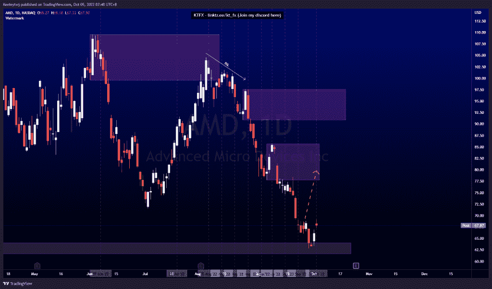
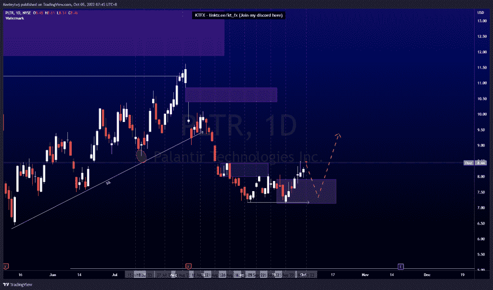
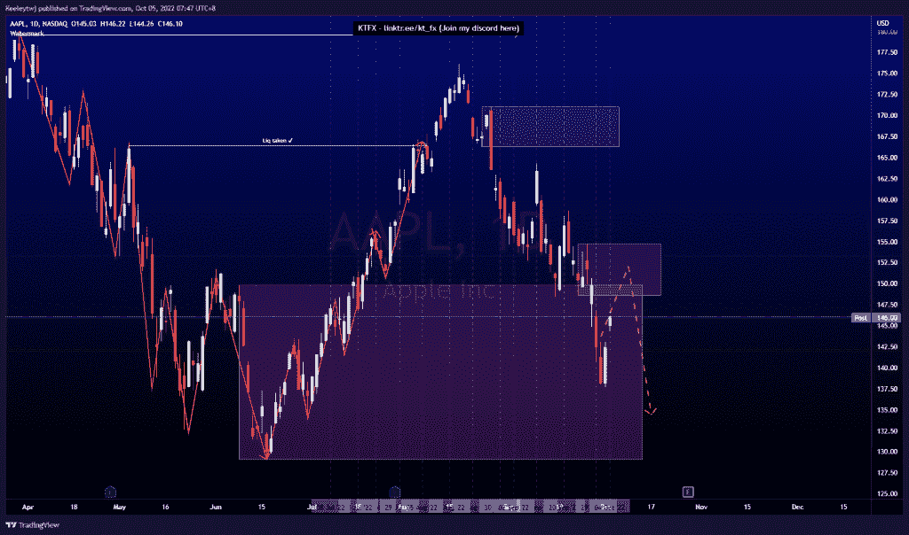

# 股票技术分析#AMD #AAPL #PLTR

> 原文：<https://medium.com/coinmonks/stocks-technical-analysis-amd-aapl-pltr-1f08c266cc9d?source=collection_archive---------21----------------------->

在这里找到更多关于我的信息(YouTube/Discord/Telegram):[https://www.linktr.ee/keeleytan](https://www.linktr.ee/keeleytan)

如果你觉得我的帖子有帮助，如果你能在这个帖子上给我一个赞，并关注我以后的类似帖子，我将不胜感激。如果您有任何意见/反馈，请随时使用上面的谷歌表单链接。

不和谐的免费信号服务正式启动。如果有兴趣，请到我的不和谐来看看！

#AMD

价格在 64.05 处填补了公允价值缺口，并在此基础上反弹，形成看涨回撤。我仍然预计价格将朝着 85.68 的看跌点下跌。

#PLTR

价格没有按照我上次的分析发挥作用。价格已经打破了市场结构的上升趋势。从这里开始，如果价格想继续走高，我预计会在 7.92 的位置出现一个熊市回撤。

#AAPL

根据上周的分析，价格表现良好。价格目前正在缓解 149.87 的看涨 POI，目前正在走向 148.56 的看跌 POI。我预计在看跌情绪缓解后，价格将继续走低。

如果你持有这些公司中的任何一家，就可以点赞、分享和评论！

让我知道，如果你有任何你想让我分析的行情。

一定要在其他社交平台上看看我，我在交易、分析和心理学上发布内容。看看我这里:【https://www.linktr.ee/keeleytan】T2

*原载于 2022 年 10 月 4 日 http://2minutesliteracy.wordpress.com***。**

> *交易新手？尝试[加密交易机器人](/coinmonks/crypto-trading-bot-c2ffce8acb2a)或[复制交易](/coinmonks/top-10-crypto-copy-trading-platforms-for-beginners-d0c37c7d698c)*