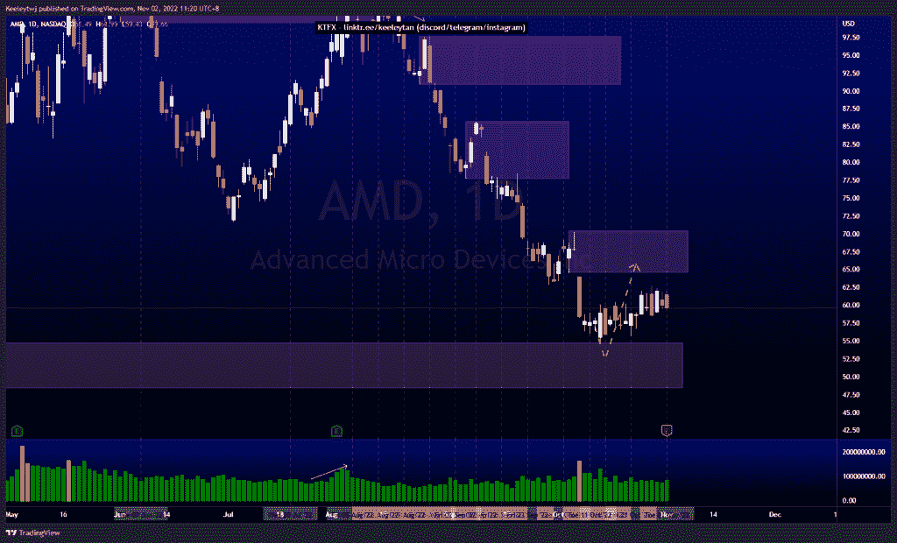
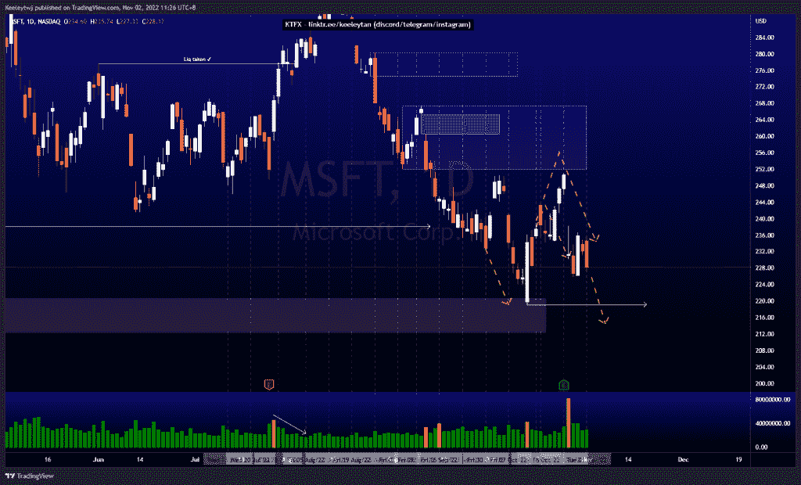
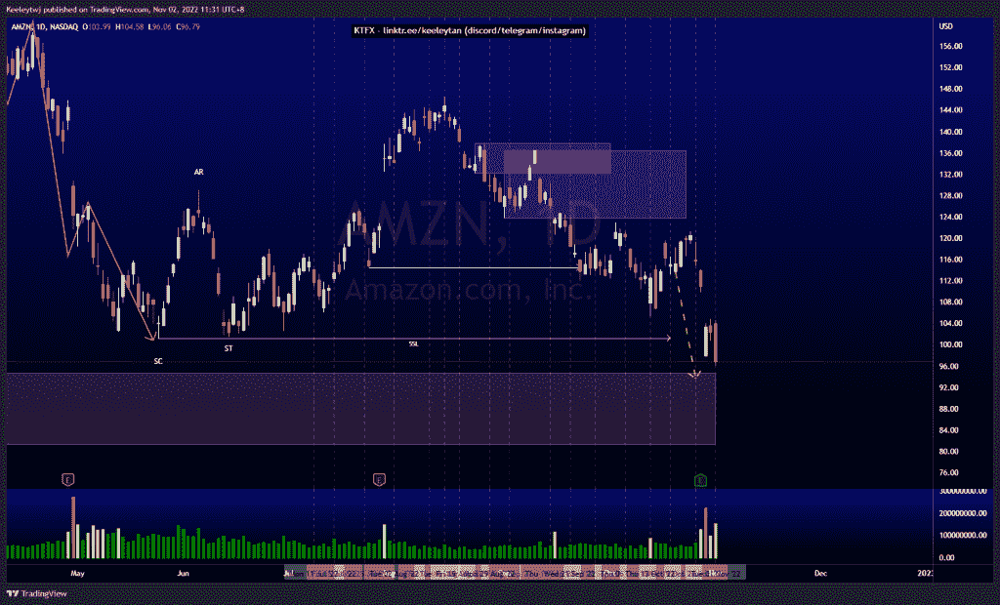

# 股票技术分析#AMD #MSFT #AMZN

> 原文：<https://medium.com/coinmonks/stocks-technical-analysis-amd-msft-amzn-500fce553d2d?source=collection_archive---------14----------------------->

在这里了解更多关于我的信息(YouTube/insta gram/Telegram):[https://www.linktr.ee/keeleytan](https://www.linktr.ee/keeleytan)

如果你觉得我的帖子有帮助，如果你能在这个帖子上给我一个赞，并关注我以后的类似帖子，我将不胜感激。如果您有任何意见/反馈，请随时使用上面的谷歌表单链接。

#AMD

上周价格巩固。价格在 54.74 缓解了看涨的兴趣点，并作出反应。这次反弹的下一个潜在目标是 64.61 的熊市点。我的预期不变，预计价格将达到熊市点。

[https://www . trading view . com/chart/AMD/6 fidatnd-AMD-Analysis/](https://www.tradingview.com/chart/AMD/6fIDATnd-AMD-Analysis/)

#MSFT

根据我之前的分析，价格表现良好。盘后价格从 251.94 的熊市点反弹，并在收益后保持沉默。这一熊市走势的下一个目标是在 219.13 点走出低点。

[https://www . trading view . com/chart/MSFT/hcz 9v 1 pt-MSFT-Analysis/](https://www.tradingview.com/chart/MSFT/HCz9V1PT-MSFT-Analysis/)

#AMZN

根据我上次的分析，价格表现良好。股价在盈利后大幅下跌，跌至 101.26 点的低点。此次下跌的下一个目标是缓解 94.71 的看涨 POI。

[https://www . trading view . com/chart/AMZN/sgig 35 GK-AMZN-Analysis/](https://www.tradingview.com/chart/AMZN/sgIg35GK-AMZN-Analysis/)

不和谐的免费信号服务正式启动。如果有兴趣，请到我的不和谐来看看！

如果你持有这些公司中的任何一家，就可以点赞、分享和评论！

让我知道，如果你有任何你想让我分析的行情。

一定要在其他社交平台上看看我，我在交易、分析和心理学上发布内容。看看我这里:[https://www.linktr.ee/keeleytan](https://www.linktr.ee/keeleytan)

*原载于 2022 年 11 月 2 日 http://2minutesliteracy.wordpress.com***。**

> *交易新手？试试[加密交易机器人](/coinmonks/crypto-trading-bot-c2ffce8acb2a)或者[复制交易](/coinmonks/top-10-crypto-copy-trading-platforms-for-beginners-d0c37c7d698c)*