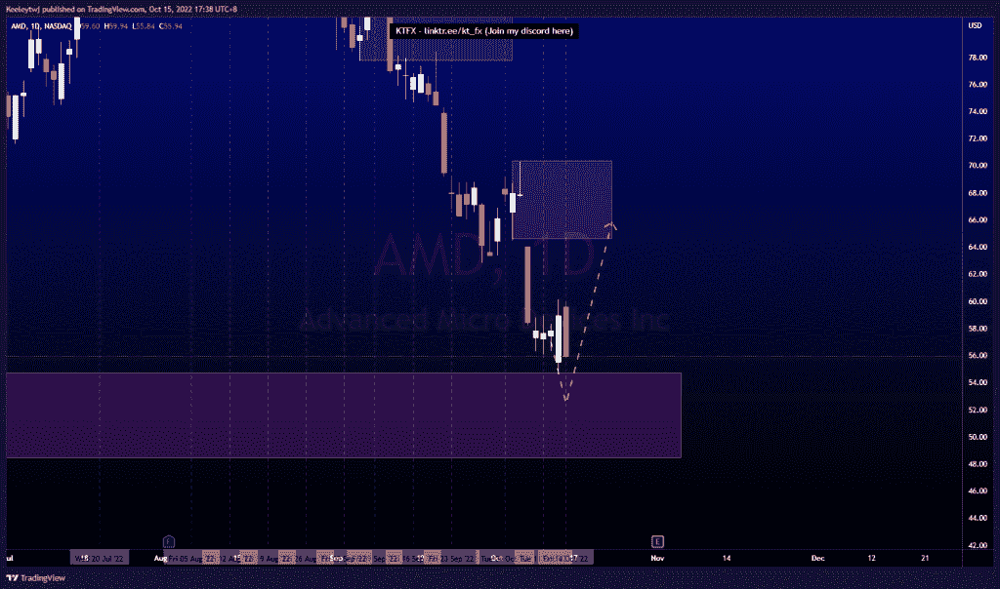
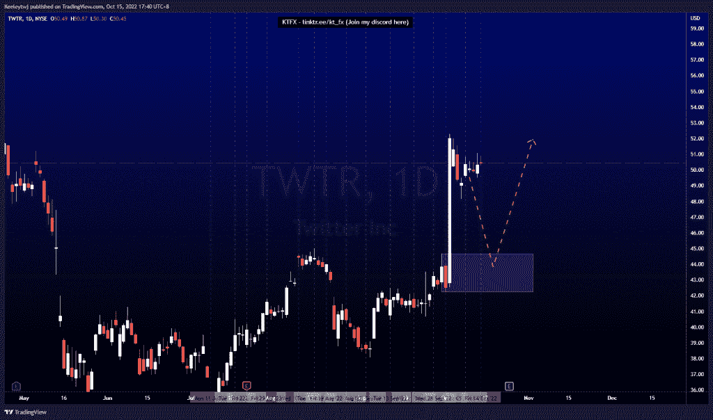
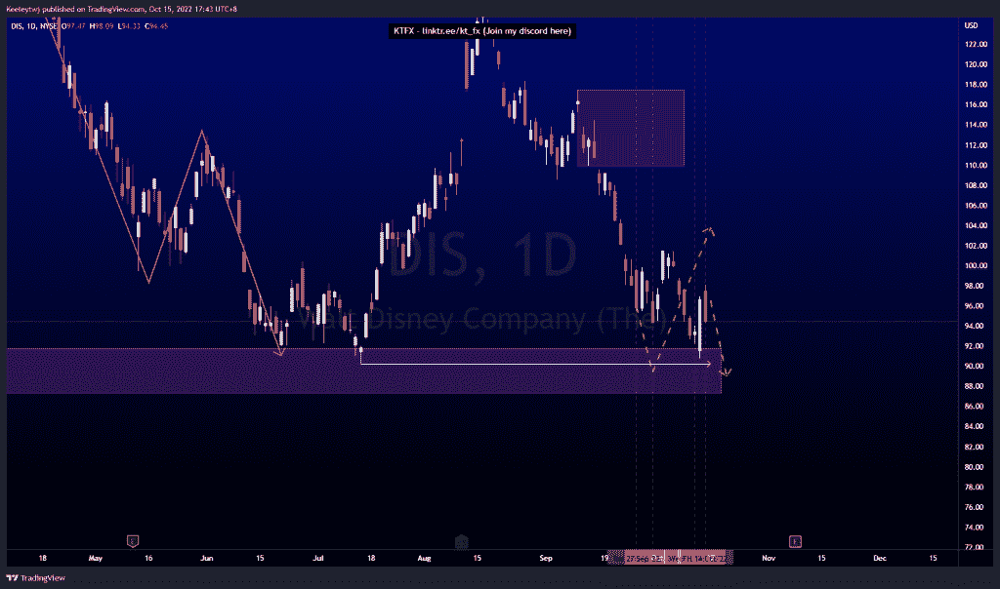

# 股票技术分析#AMD #TWTR #DIS

> 原文：<https://medium.com/coinmonks/stocks-technical-analysis-amd-twtr-dis-396b12847939?source=collection_archive---------32----------------------->

在这里了解更多关于我的信息(YouTube/insta gram/Telegram):[https://www.linktr.ee/keeleytan](https://www.linktr.ee/keeleytan)

如果你觉得我的帖子有帮助，如果你能在这个帖子上给我一个赞，并关注我以后的类似帖子，我将不胜感激。如果您有任何意见/反馈，请随时使用上面的谷歌表单链接。

不和谐的免费信号服务正式启动。如果有兴趣，请到我的不和谐来看看！

#AMD

上周价格如预期的那样上涨。价格反弹并对看涨 POI 的缓解做出反应，产生了强劲的上涨。从这里，我预计价格将继续走高至 64.61 的熊市点。

#TWTR

强劲走势后，本周价格盘整。价格现在非常过度延伸，我预计将回撤至 44.66 的看涨点。与上周相比，我的期望没有变化。

#DIS

上周的价格表现出乎我的意料。价格在 91.80 缓解了看涨的兴趣点，并从那里反弹。我预计低点会在 90.23，但它几乎没有达到这个水平。从这里开始，我预计本周将触及 90.23 的低点。

如果你持有这些公司中的任何一家，就可以点赞、分享和评论！

让我知道，如果你有任何你想让我分析的行情。

一定要在其他社交平台上看看我，我在交易、分析和心理学上发布内容。看看我这里:【https://www.linktr.ee/keeleytan】T2

*原载于 2022 年 10 月 16 日***。**

> *交易新手？尝试[加密交易机器人](/coinmonks/crypto-trading-bot-c2ffce8acb2a)或[复制交易](/coinmonks/top-10-crypto-copy-trading-platforms-for-beginners-d0c37c7d698c)*