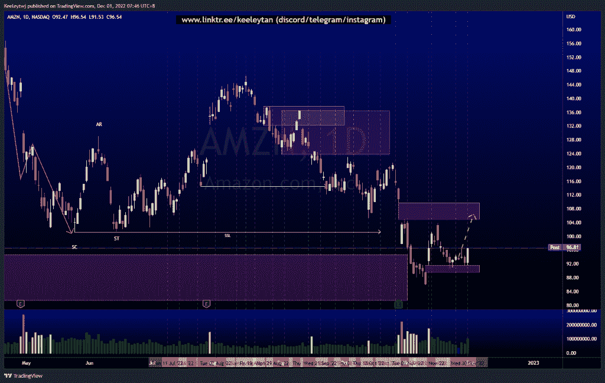
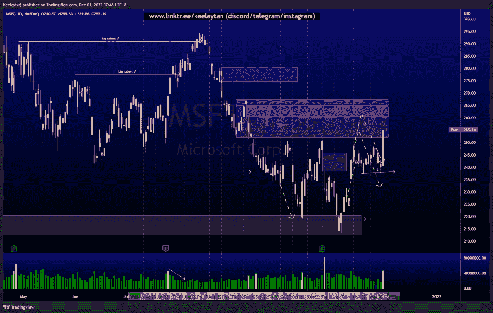
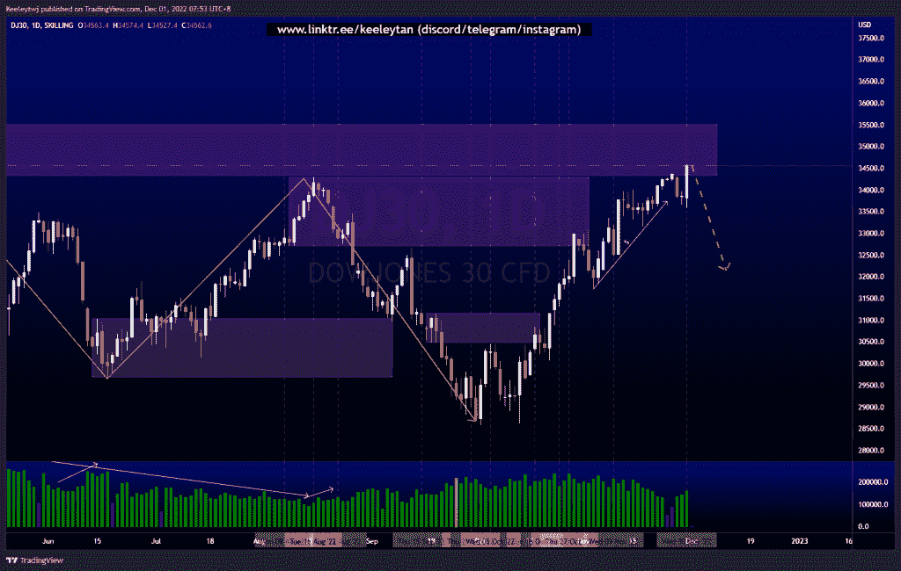

# 股票技术分析#AMZN #MSFT #DJ30

> 原文：<https://medium.com/coinmonks/stocks-technical-analysis-amzn-msft-dj30-2a59a3dd16b?source=collection_archive---------38----------------------->

在这里了解更多关于我的信息(YouTube/insta gram/Telegram):[https://www.linktr.ee/keeleytan](https://www.linktr.ee/keeleytan)

如果你觉得我的帖子有帮助，如果你能在这个帖子上给我一个赞，并关注我以后的类似帖子，我将不胜感激。如果您有任何意见/反馈，请随时使用上面的谷歌表单链接。

不和谐的免费信号服务正式启动。如果有兴趣，请到我的不和谐来看看！

#AMZN

根据上周的分析，价格正在上涨。价格在 91.65 填补了公允价值缺口，并从那里反弹。随着交易量的上升，我的预期没有改变。此举的下一个合理目标将是填补 109.77 的公允价值缺口。

[https://www . trading view . com/chart/AMZN/T6 RHS isa-AMZN-Analysis/](https://www.tradingview.com/chart/AMZN/T6RHsISa-AMZN-Analysis/)

#MSFT

根据上周的分析，价格表现良好。价格正在缓解 251.94 的看跌点，最有可能填补 260.40 的公允价值缺口。流动性池创建于 237.39，在填补上述公允价值缺口后可能会被取出。

[https://www . trading view . com/chart/MSFT/64 lntjql-MSFT-Analysis/](https://www.tradingview.com/chart/MSFT/64LntJQl-MSFT-Analysis/)

#DJ30

价格并没有像上周分析的那样发挥作用。价格使看跌点 32713.6 失效。在看跌点 34343.2，价格目前处于最高溢价水平。如果价格使这一点无效，我们可以看到市场再次走高。我预计价格在缓解后会走低，因为随着交易量的增加，价格上涨得不到支持，流动性池在上涨过程中形成。

[https://www . trading view . com/chart/DJ30/uful 0 vtd-DJ30-Analysis/](https://www.tradingview.com/chart/DJ30/ufUl0VtD-DJ30-Analysis/)

如果你持有这些公司中的任何一家，就可以点赞、分享和评论！

让我知道，如果你有任何你想让我分析的行情。

一定要在其他社交平台上看看我，我在交易、分析和心理学上发布内容。看看我这里:[https://www.linktr.ee/keeleytan](https://www.linktr.ee/keeleytan)

*原载于 2022 年 11 月 30 日 http://2minutesliteracy.wordpress.com***。**

> *交易新手？试试[加密交易机器人](/coinmonks/crypto-trading-bot-c2ffce8acb2a)或者[复制交易](/coinmonks/top-10-crypto-copy-trading-platforms-for-beginners-d0c37c7d698c)*